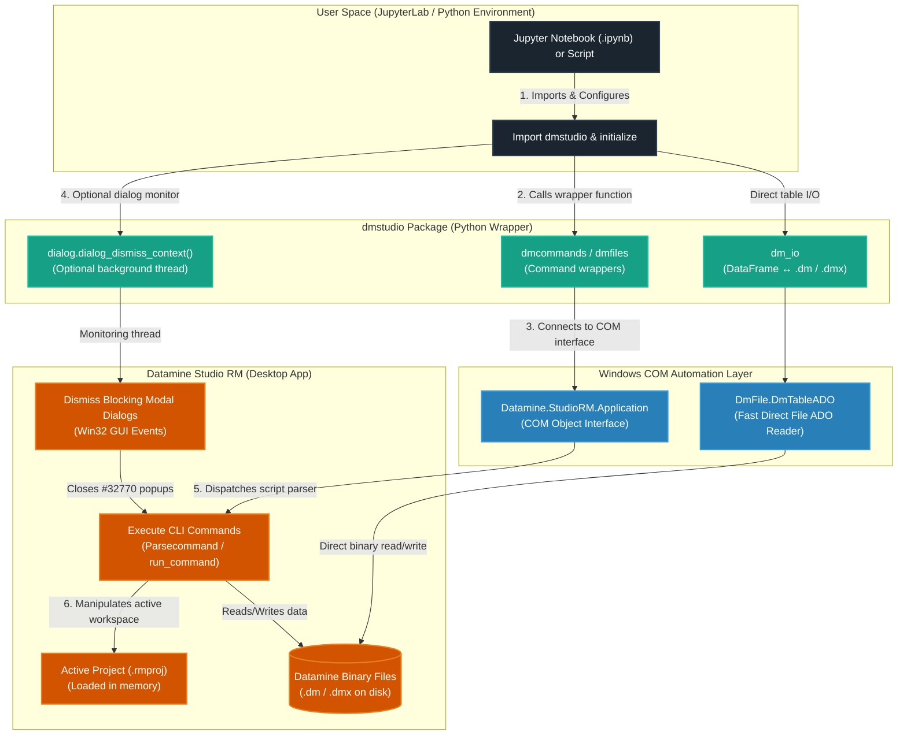

# dmstudio-rm: Python wrappers for Datamine Studio RM with AI capabilities

<p align="center">
  <a href="https://www.python.org/"></a>
  <a href="https://img.shields.io/badge/version-2.0.0b4-purple.svg" alt="Version"></a>
  <a href="LICENSE.txt"></a>
  <a href="https://www.dataminesoftware.com/"></a>
</p>

**dmstudio** is a user-friendly Python package designed for geologists and engineers to automate **Datamine Studio RM** workflows. It translates complex Datamine macro syntax into readable, interactive Python commands. The entire workflow is designed to run in interactive **JupyterLab** (or Jupyter Notebooks), where you can run processes and analyze results step-by-step.

> **Unofficial Disclaimer & Licensing**  
> This is a community-maintained library and is **NOT** an official product of Datamine Software. Datamine Software does not provide support or warranties for this package.
>
> This library uses official Datamine COM Automation APIs (`Datamine.StudioRM.Application` and `DmFile.DmTableADO`) which are built into Studio RM. To run the automation, you **must already own a valid, licensed instance** of Datamine Studio RM running on your system. This library does not bypass or clone any Datamine proprietary code.

For deep developer and AI-agent guidance (full module map, COM engineering rules, generators, code style), see **[AGENTS.md](AGENTS.md)**.

---

## 🏗️ Architecture & How It Works

`dmstudio` acts as a Pythonic bridge to the desktop instance of Datamine Studio RM using Windows COM automation APIs. Command wrappers build Studio CLI strings and dispatch them through `Parsecommand`; table I/O can also go directly through the ADO file reader without exporting via a process.



---

## 📖 User Guide

This section is for geologists and engineers who want to install, run, and automate workflows in Datamine using Python.

### 📋 Prerequisites & Environment Preference

Before setting up `dmstudio`, please ensure your computer has the following:

1. **Windows OS**: Datamine Studio RM runs exclusively on Windows.
2. **Datamine Studio RM**: Installed and licensed on your machine.
3. **Python Environment (Anaconda/Miniconda Preferred)**:
   * **Preference**: We highly recommend installing **Anaconda** or **Miniconda** (from [docs.conda.io](https://docs.conda.io/en/latest/miniconda.html)) as it simplifies managing virtual environments and package installations for geological data analysis.
   * **Alternative (Vanilla Python)**: Download the installer from [Python.org](https://www.python.org/downloads/windows/). **IMPORTANT**: During installation, check the box that says **"Add Python to PATH"** (usually at the bottom of the installer window).
   * **Also supported**: [uv](https://github.com/astral-sh/uv) for a fast virtual environment workflow.

Open your Datamine project (e.g. `MyProject.rmproj`) in Studio RM before running any script that uses COM automation.

---

### 🛠️ Installation

Clone or download this repository into a dedicated folder (for example `C:\path\to\dmstudio-rm`). Keep your geological project data in its own project folder so library source code does not clutter production workspaces.

#### Option A: Using Conda (Recommended)

Use the provided `environment.yml` to create a dedicated conda environment:

```cmd
# Open Anaconda Prompt / Terminal and navigate to the repo folder
cd C:\path\to\dmstudio-rm

# Create the environment
conda env create -f environment.yml

# Activate the environment
conda activate dmstudio

# Install the dmstudio package in editable mode
pip install -e .
```

#### Option B: Using uv

Create and install dependencies instantly using [uv](https://github.com/astral-sh/uv):

```cmd
cd C:\path\to\dmstudio-rm
uv venv
.venv\Scripts\activate

# Install dependencies and the package
uv pip install -r requirements.txt
uv pip install -e .
uv pip install jupyterlab
```

#### Option C: One-Click Windows Setup (Vanilla Python)

If you are using vanilla Python:

1. Open **Datamine Studio RM** and load your active project file (e.g. `MyProject.rmproj`).
2. Open the repository folder `C:\path\to\dmstudio-rm`.
3. Double-click **`setup_env.bat`**. This creates a virtual environment (`.venv`), installs required libraries (including Pandas and JupyterLab), and links `dmstudio` in editable mode. PowerShell alternative: `.\setup_env.ps1`.
4. Double-click **`start_jupyter.bat`** to launch JupyterLab in your browser. Keep the command prompt window open while you work.

---

### ⚠️ Directory Alignment: Connecting Python & Datamine

> [!IMPORTANT]
> **Working Directory Mismatch**  
> Datamine commands execute relative to your **active Datamine project folder**, but Python runs code relative to the directory where your **Jupyter Notebook file** is opened.
>
> If you start JupyterLab directly in the repository root while your data lives elsewhere, Python will be unable to read or write files generated by Datamine in your project directory.

#### Best Practice for Aligning Directories

Always open or create your Jupyter Notebooks **inside your Datamine project folder** (e.g. `C:\path\to\MyMineProject`).

Since `dmstudio` is installed in editable/development mode, it is available in your environment from any working directory. You can start JupyterLab from your project folder as follows:

1. Create a script named `start_project.bat` in your **Datamine Project Folder**.
2. Add these lines (pointing at the environment in your repository folder):
   ```bat
   @echo off
   call C:\path\to\dmstudio-rm\.venv\Scripts\activate.bat
   jupyter lab
   ```
   *(For Conda, replace the activate call with `call conda activate dmstudio`.)*
3. Double-click `start_project.bat` to launch JupyterLab inside your project directory. All Python code and Datamine actions will then share the same working folder.

---

### 🚀 Running the Included Tutorials

The repository comes with pre-packaged tutorial data and workflows.

> [!NOTE]
> **Automatic Directory Alignment**  
> Unlike custom user scripts, the included tutorial notebooks automatically align Python's working directory to the active Datamine sandbox folder using `initialize_sandbox()`. You do not need to create or run any manual directory alignment scripts to use them.

#### Option A: Running from a Local Git Repository

1. In Datamine Studio RM, open the tutorial project **`tutorials\test_sandbox\Project.rmproj`** under your clone (e.g. `C:\path\to\dmstudio-rm\tutorials\test_sandbox\Project.rmproj`).
2. Start JupyterLab from the repository root (`start_jupyter.bat`) or from the folder of the notebook you intend to run.
3. In the JupyterLab sidebar:
   * **Case Studies (`tutorials/case_studies/`)**: Start with `holes3d_desurvey/Holes3D_Tutorial.ipynb` for de-surveying, or `grade_estimation/Grade_Estimation_Examples.ipynb` for block modeling. Advanced examples live in `studio_rm_examples/`.
   * **Process Collections (`tutorials/collections/`)**: Dedicated sandboxes for individual commands under `processes/` (~268 commands) and `files/` (~32 file commands).
   * **Custom Notebooks (`tutorials/custom_notebooks/`)**: Hand-tuned examples (e.g. protom, estima, cokrig).

#### Option B: Downloading Tutorials Dynamically (For pip/conda Installs)

If you installed `dmstudio` without cloning this repository, you can download the tutorials folder into your workspace:

```python
import dmstudio

# Download and extract the tutorials folder (implemented in dmstudio.bootstrap)
dmstudio.download_tutorials(r'C:\path\to\workspace')
```

This downloads and extracts the tutorials workspace structure. Open Datamine Studio RM, load the downloaded `tutorials/test_sandbox/Project.rmproj`, and start JupyterLab in that directory.

---

### 💡 Basic Scripting Example

Here is a typical automation script inside a Jupyter Notebook:

```python
from dmstudio import dmcommands

# 1. Connect to your open Studio RM session (automatically detects version)
cmd = dmcommands.init()

# 2. Sort drillhole assays by Hole ID (BHID) and Depth (FROM)
cmd.mgsort(in_i='assays', out_o='sorted_assays', keys_f=['BHID', 'FROM'])

# 3. Filter for samples with gold grade (AU) greater than 1.5
cmd.copy(in_i='sorted_assays', out_o='high_grade_assays', retrieval='AU > 1.5')
```

#### Suffix Naming Convention Guide

To translate Datamine's command arguments into Python parameters:

| Suffix | Meaning | Example |
|--------|---------|---------|
| `_i` | **Input File** | `in_i='assays'` |
| `_o` | **Output File** | `out_o='sorted_assays'` |
| `_f` | **Field Name** | `keys_f=['BHID']` |
| `_p` | **Parameter Value** | `allrecs_p=1` |

---

### 🔍 Advanced Python Utility Modules

Beyond running standard processes, `dmstudio` provides helper tools for high-speed data analysis and safer automation.

**Prefer the canonical modules below.** Older notebooks may still use `from dmstudio import agent` — that module **re-exports** the same helpers for backward compatibility and is not the implementation home.

#### Direct File Reading into Pandas DataFrames

Instead of running a Datamine command to export files, you can read Datamine binary tables (`.dm` / `.dmx`) directly into a Pandas DataFrame using the ADO COM interface:

```python
from dmstudio import dm_io

# Read Datamine file directly into a pandas DataFrame
df = dm_io.read_datamine('high_grade_assays.dm')

# Perform standard pandas data analysis
print(df.head())
print(df['AU'].describe())

# Write a DataFrame back when needed
dm_io.to_datamine(df, 'from_pandas.dm')
```

#### Handling Blocking Dialog Modals

Datamine runs script commands on its main thread. If a command prompts a modal dialog (warning, overwrite, or error popup), the script can hang indefinitely. Wrap risky sequences in the dialog dismisser:

```python
from dmstudio import dmcommands, dialog

cmd = dmcommands.init()

with dialog.dialog_dismiss_context():
    # Warning dialogs are auto-closed in the background
    cmd.copy(in_i='nonexistent', out_o='temp')
```

Command discovery for AI tools and scripts (`list_commands`, `get_command_schema`, `search_commands`) lives in `dmstudio.command_registry`. See [AGENTS.md](AGENTS.md) for the full package surface.

---

### ⚠️ Important Scripting Rules & Pitfalls

Datamine COM scripting has specific rules. Keep these in mind to avoid common errors:

1. **No Backslashes or Spaces in Command Paths**  
   Datamine's internal parser splits strings by spaces and treats backslashes abnormally. Passing a path like `in_i="C:\My Data\file"` will crash the parser.
   * *Best Practice*: Work entirely within your project folder and use simple filenames (`in_i="assays"`).
   * *Solution*: Register the file in Datamine first using the logical path mechanism:
     ```python
     # Add external file to Datamine workspace
     cmd.oScript.ActiveProject.AddFile(r'C:\My Data\file.dm')

     # Now call the command using the registered file name (no path)
     cmd.mgsort(in_i='file', out_o='sorted')
     ```

2. **In-Memory Scratch Files**  
   Files with a leading underscore (e.g. `_sorted`) are kept by Datamine in RAM and are **never** written to disk. Use them for temporary steps. If you need to verify output files on disk, use normal names without a leading underscore.

3. **Handling Blocking Dialog Modals**  
   Use `dialog.dialog_dismiss_context()` as shown above (also available as `agent.dialog_dismiss_context` for older scripts). Full COM checklist: [AGENTS.md](AGENTS.md).

---

### 🤖 AI Integration Capabilities

#### Using AI Coding Assistants

Modern workspace AI coding assistants (such as **Cursor**, **VS Code Copilot**, or **Claude Code**) can help you write Python automation scripts. Because `dmstudio` is fully documented and structured, AI agents can read the repository files and auto-generated command wrappers to write valid scripting code for you.

* **Contextual Feeding**: Attach this `README.md` and/or [AGENTS.md](AGENTS.md) to your prompt, or point the assistant at the `dmstudio` package directory.
* **Canonical helpers**: Prefer `command_registry`, `dm_io`, and `dialog` for new work. The `agent` module remains a compatibility re-export for existing notebooks and examples.

#### Model Context Protocol (MCP) Server Setup

To expose Datamine automation tools to external desktop clients (like Claude Desktop or Google Antigravity):

1. **Register the Server in Claude Desktop**  
   Open `%APPDATA%\Claude\claude_desktop_config.json` and add `dmstudio` (replace with **your** clone path):

   ```json
   {
     "mcpServers": {
       "dmstudio": {
         "command": "C:\\path\\to\\dmstudio-rm\\.venv\\Scripts\\python.exe",
         "args": ["C:\\path\\to\\dmstudio-rm\\mcp_server.py"]
       }
     }
   }
   ```

2. **Restart Claude Desktop**. You can prompt the desktop AI to explore project files, look up command schemas, search commands, preview Datamine tables, and build Jupyter notebooks programmatically.

MCP tools exposed by `mcp_server.py`:

- `list_commands`
- `get_command_schema`
- `search_commands`
- `read_datamine_file`
- `create_jupyter_workflow`

Full registration notes and module details: [AGENTS.md](AGENTS.md).

---

## 🛠️ Developer & Contributor Guide

For developers looking to contribute, run validation tests, or regenerate package wrappers. Depth lives in **[AGENTS.md](AGENTS.md)**; the essentials are below.

### 🧪 Running Test Suites

Before pushing any changes, verify the package using these test scripts:

#### 1. No Datamine License / COM Instance Required

These run smoke tests on Python structures without starting Datamine:

```cmd
.venv\Scripts\python tests\quick_test.py
.venv\Scripts\python tests\test_workflow.py
```

#### 2. Active Datamine Session Required

These tests require Datamine Studio RM to be open with a loaded project:

```cmd
.venv\Scripts\python tests\diagnose_project.py
.venv\Scripts\python tests\stress_test.py
.venv\Scripts\python tests\integration_test.py
.venv\Scripts\python tests\run_sandbox_tests.py
```

### ⚙️ Developer Helper Scripts

* **`tests/generate_wrappers.py`**: Regenerates `dmstudio/dmcommands.py` wrapper classes from StudioRM help XML.
* **`tests/generate_collections.py`**: Regenerates the ~300 individual sandbox notebooks under `tutorials/collections/`.
* **`tests/restructure_case_studies.py`**: Case-study layout helper.
* **`dmstudio.notebook_builder.NotebookBuilder`**: Programmatic Jupyter Notebook builder for auditable agent workflows:

  ```python
  from dmstudio.notebook_builder import NotebookBuilder
  nb = NotebookBuilder('workflow.ipynb', title='My Workflow')
  nb.add_markdown('## Step 1')
  nb.add_code("cmd.mgsort(in_i='collars', out_o='sorted', keys_f=['BHID'])")
  nb.save()
  ```

Changelog: **[CHANGELOG.md](CHANGELOG.md)**. Domain vocabulary: **[CONTEXT.md](CONTEXT.md)**.

---

## ⚖️ License & Attribution

Original work Copyright (c) 2018 Sean D. Horan — released under [MIT License](LICENSE.txt).  
Modifications and new contributions Copyright (c) 2026 Achmad Nazar Abrory.

The MIT license permits modification and redistribution provided the original copyright notice is preserved. See [LICENSE.txt](LICENSE.txt) for full terms.
