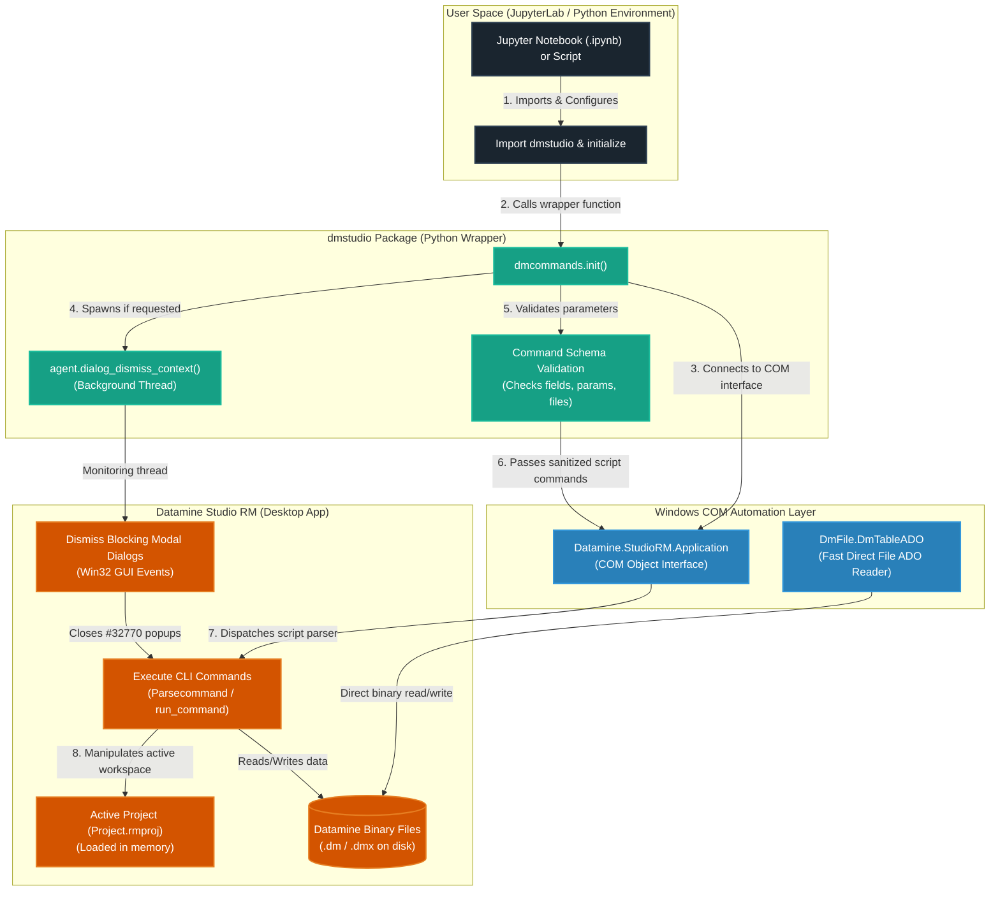

# dmstudio: Datamine Studio RM Python Scripting

<p align="center">
  <a href="https://www.python.org/"></a>
  <a href="LICENSE.txt"></a>
  <a href="https://www.dataminesoftware.com/"></a>
</p>

**dmstudio** is a user-friendly Python package designed for geologists and engineers to automate **Datamine Studio RM** workflows. It translates complex Datamine macro syntax into readable, interactive Python commands. The entire workflow is designed to run in interactive **JupyterLab** (or Jupyter Notebooks), where you can run processes and analyze results step-by-step.

> **Unofficial Disclaimer & Licensing**  
> This is a community-maintained library and is **NOT** an official product of Datamine Software. Datamine Software does not provide support or warranties for this package. 
> 
> This library uses official Datamine COM Automation APIs (`Datamine.StudioRM.Application` and `DmFile.DmTableADO`) which are built into Studio RM. To run the automation, you **must already own a valid, licensed instance** of Datamine Studio RM running on your system. This library does not bypass or clone any Datamine proprietary code.

---

## 🏗️ Architecture & How It Works

`dmstudio` acts as a Pythonic bridge to the desktop instance of Datamine Studio RM using Windows COM automation APIs.



---

## 📋 Step-by-Step Setup: Starting from Scratch

If you have a Datamine working folder and want to use this scripting framework, follow this step-by-step guide.

### Step 1: Open Your Datamine Project
1. Open **Datamine Studio RM** on Windows.
2. Load your project. If you are starting fresh, create a new project and save it to a folder on your drive (e.g., `C:\DatamineProjects\MyMineProject`).
3. Make sure you know the absolute path of this working directory.

### Step 2: Keep the Repository in a Single Separate Folder
To prevent cluttering your actual project folder with library source code, configuration files, and setup scripts:
1. Clone or download this repository into a separate folder on your machine (e.g., `C:\DatamineTools\dmstudio-rm3`).
2. Keep your own Datamine project files and actual geological database inside your own clean project folder (e.g., `C:\DatamineProjects\MyMineProject`).
3. This ensures your project folder remains clean, like this:
   ```
   C:\DatamineProjects\MyMineProject\   <-- Your actual project folder (pristine & tidy)
   ├── MyProject.rmproj                 (Your Datamine project file)
   ├── high_grade_assays.dm             (Your output/input data files)
   └── sorted_assays.dm
   ```

### Step 3: Install the Package in Your Environment
By installing the library in **editable mode** (`-e`), the Python environment will link to the repository source folder. This allows scripts running in any directory (such as your clean project folder) to import `dmstudio` without copying any package files. Any changes you make to the package code are immediately available.

1. Open your terminal or Command Prompt.
2. Navigate to the folder where you cloned this repository:
   ```cmd
   cd C:\DatamineTools\dmstudio-rm3
   ```
3. Choose one of the environment options below (assuming you have Conda or `uv` installed):

#### Option A: Using Conda (Recommended)
Use the provided `environment.yml` to create a dedicated environment with all dependencies and JupyterLab:
```cmd
# Create the environment from environment.yml
conda env create -f environment.yml

# Activate the environment
conda activate dmstudio

# Install the dmstudio package in editable mode
pip install -e .
```

#### Option B: Using uv (Fast Alternative)
Create a virtual environment and install dependencies instantly using [uv](https://github.com/astral-sh/uv):
```cmd
# Create and activate a virtual environment
uv venv
.venv\Scripts\activate

# Install dependencies, JupyterLab, and the package in editable mode
uv pip install -r requirements.txt
uv pip install jupyterlab
uv pip install -e .
```

### Step 4: Run the Connection Diagnostic
Before scripting, verify that Python can talk to your running Studio RM session:
1. Make sure your Datamine project is open and active in Studio RM.
2. Open your terminal (with your environment active) and run:
   ```cmd
   python tests/diagnose_project.py
   ```
3. If it outputs `[SUCCESS] Project found!`, you are fully prepared to automate your workflow.

---

## 🚀 Running JupyterLab & Tutorials

Because the repository is kept in a separate folder (`C:\DatamineTools\dmstudio-rm3`) from your actual project workspace (`C:\DatamineProjects\MyMineProject`), you should run JupyterLab from the correct directory depending on your goal:

### 1. Running the Included Tutorials
To run the library's built-in tutorials and explore sample Datamine database files:
1. **Open Datamine Studio RM**: Open the tutorial project **`C:\DatamineTools\dmstudio-rm3\tutorials\Project.rmproj`** in Datamine Studio RM. (Do not use your own project for running tutorials, as they rely on the included sample databases).
2. **Open Terminal**: Navigate to the **repository folder**:
   ```cmd
   cd C:\DatamineTools\dmstudio-rm3
   ```
3. **Activate Environment**: `conda activate dmstudio` or `.venv\Scripts\activate`.
4. **Start JupyterLab**:
   ```cmd
   jupyter lab
   ```
5. **Run a Case Study Tutorial**: Open `tutorials/case_studies/` in the JupyterLab sidebar. Start with **`holes3d_desurvey/Holes3D_Tutorial.ipynb`** for a complete drillhole de-surveying workflow, or **`grade_estimation/Grade_Estimation_Examples.ipynb`** for a full block-model grade estimation workflow.
6. **Explore Process Examples Collection**: Inside `tutorials/collections/` you will find two subfolders:
   - **`processes/`** — Dedicated sandbox notebooks for each of the ~268 `dmcommands` wrappers (e.g. `copy`, `mgsort`, `desurv`).
   - **`files/`** — Dedicated sandbox notebooks for each of the ~32 `dmfiles` wrappers (e.g. `protom`, `inpfil`, `scrfmt`).
   
   Each process folder is a self-contained workspace with its own `Project.rmproj` and a template notebook (`*_example.ipynb`) demonstrating how to run the process end-to-end.

### 2. Scripting in your own Project Folder
To write and run notebooks for your own geological databases:
1. **Open Datamine Studio RM**: Open your own project file (e.g. `C:\DatamineProjects\MyMineProject\MyProject.rmproj`) in Datamine Studio RM.
2. **Open Terminal**: Navigate to your **clean project folder**:
   ```cmd
   cd C:\DatamineProjects\MyMineProject
   ```
3. **Activate Environment**: `conda activate dmstudio` or `.venv\Scripts\activate`.
4. **Start JupyterLab**:
   ```cmd
   jupyter lab
   ```
5. **Script your Workflow**: Create a new notebook (`.ipynb`) here. Since `dmstudio` is installed in editable mode, you can import it directly and run commands:
   ```python
   from dmstudio import dmcommands
   cmd = dmcommands.init(version='StudioRM')
   ```
   Datamine will automatically read/write files in your project directory.
> [!IMPORTANT]                                                                                                
> **Keep Datamine and Python Workspaces Aligned**  
---

## 💡 How it Works (Simple Python Example)

Instead of complex Datamine scripting, you write clear, self-explanatory Python commands inside your notebook cells:

```python
from dmstudio import dmcommands

# 1. Connect to your open Studio RM project
cmd = dmcommands.init(version='StudioRM')

# 2. Sort drillhole assays by Hole ID (BHID) and Depth (FROM)
cmd.mgsort(in_i='assays', out_o='sorted_assays', keys_f=['BHID', 'FROM'])

# 3. Filter for samples with grade greater than 1.5
cmd.copy(in_i='sorted_assays', out_o='high_grade_assays', retrieval="AU > 1.5")
```

### Suffix Guide for Datamine Users
* `_i` = **Input File** (e.g. `in_i='assays'`)
* `_o` = **Output File** (e.g. `out_o='sorted_assays'`)
* `_f` = **Fields** (e.g. `keys_f=['BHID']`)
* `_p` = **Parameters** (e.g. `interval_p=2.0`)

---

## 🤖 How to Use the AI Capabilities

You can use agentic AI assistants to automate Datamine scripting, inspect file structures, and build Jupyter Notebook workflows for you.

### Option A: VS Code Coding Agents & Terminal Tools (Easiest & Recommended)
If you are using modern AI coding agents that run directly in your workspace or terminal (such as **GitHub Copilot**, **Cursor**, **Roo Code**, or terminal agents like **Antigravity CLI** or **Claude Code**):

1. **No Complex Setup Needed**: Since these agents run directly in your project workspace, they do not require an MCP server setup. They automatically read `AGENTS.md` and `README.md` to understand how to interact with Datamine.
2. **Workspace Data Exploration**: You can ask the agent to inspect files before writing code. For example:
   > *"Import `dmstudio.agent` and read the first 5 rows of `_vb_assays.dmx` to see what columns we have."*
3. **Workflow Generation**: Ask the agent to build workflows:
   > *"Create a Jupyter Notebook `my_flow.ipynb` that loads the survey database, runs MGSORT on BHID, and performs DESURV."*
   The agent will generate the `.ipynb` file in your workspace using the `NotebookBuilder` utility.
4. **Execution & Auditing**: Open the generated notebook in VS Code or JupyterLab, choose your environment kernel (`dmstudio` conda environment or `.venv`), and run the cells step-by-step to inspect and execute the Datamine commands.

---

### Option B: Model Context Protocol (MCP) Server (Advanced)
If you are using external desktop AI clients (like **Claude Desktop** or external **Google Antigravity** configurations), you can expose Datamine commands as tools via MCP:

#### Step 1: Register the MCP Server

##### For Claude Desktop:
1. Open the Claude Desktop configuration file:
   `%APPDATA%\Claude\claude_desktop_config.json`
2. Add `dmstudio` to the `mcpServers` list. Use absolute paths to your python executable and `mcp_server.py` **located inside your repository folder** (e.g., `C:\DatamineTools\dmstudio-rm3`):
   ```json
   {
     "mcpServers": {
       "dmstudio": {
         "command": "C:\\DatamineTools\\dmstudio-rm3\\.venv\\Scripts\\python.exe",
         "args": ["C:\\DatamineTools\\dmstudio-rm3\\mcp_server.py"]
       }
     }
   }
   ```
   *(For Conda, replace the command path with your Conda environment python path, e.g. `C:\\Users\\<username>\\miniconda3\\envs\\dmstudio\\python.exe`)*
3. Restart Claude Desktop. The plug icon indicates the `dmstudio` tools are loaded.

##### For Google Antigravity:
Add the server config to `%USERPROFILE%\.gemini\config\antigravity.json` using the same JSON format shown above.

#### Step 2: Open Your Datamine Project
1. Open Datamine Studio RM.
2. Load your project (e.g., `Project.rmproj`). Keep it open in the background.

#### Step 3: Ask the AI to Automate Workflows
Prompt the external AI client to interact with Datamine:
* *"What Datamine commands are available in this repo?"*
* *"Show me the parameters required for the MGSORT command."*
* *"Create a Jupyter notebook workflow called `desurvey_flow.ipynb` that loads `_vb_collars` and `_vb_surveys`, runs the DESURV command, and saves the output to `dholes`."*

The AI will call the `create_jupyter_workflow` tool to write the notebook file directly to your project directory. Open the notebook in JupyterLab and run the cells step-by-step.

---

## ⚖️ License & Attribution

Original work Copyright (c) 2018 Sean D. Horan — released under [MIT License](LICENSE.txt).  
Modifications and new contributions Copyright (c) 2025 nazabrory contributors.

The MIT license permits modification and redistribution provided the original copyright notice is preserved. See [LICENSE.txt](LICENSE.txt) for full terms.
