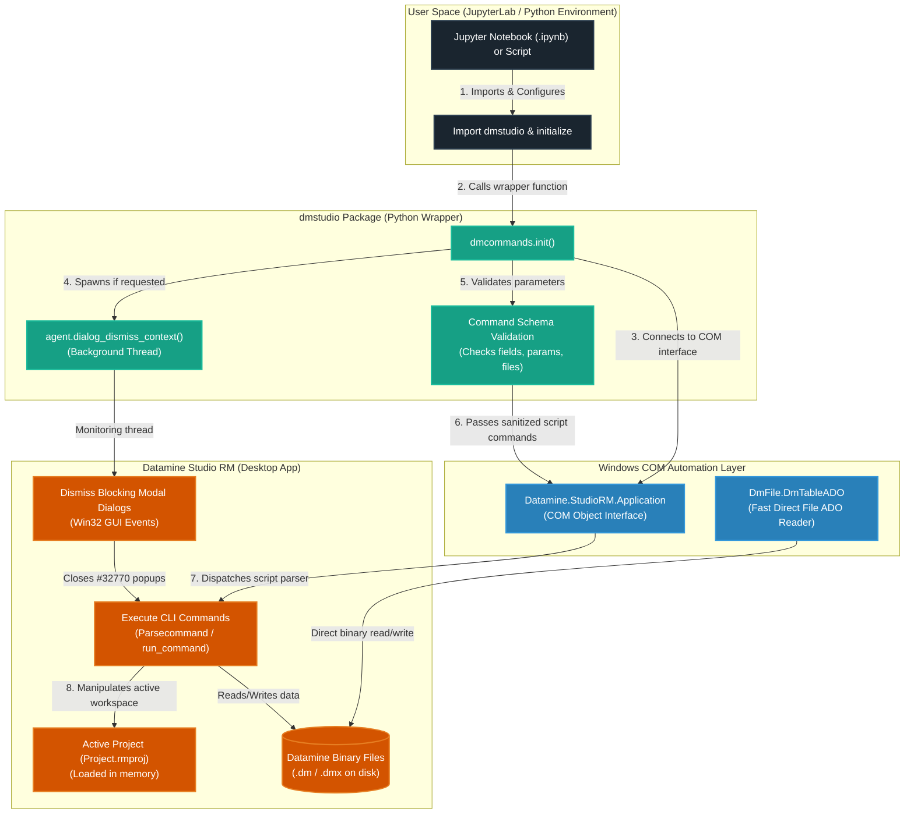

# dmstudio: Datamine Studio RM Python Scripting

<p align="center">
  <a href="https://www.python.org/"></a>
  <a href="LICENSE.txt"></a>
  <a href="https://www.dataminesoftware.com/"></a>
</p>

**dmstudio** is a user-friendly Python package designed for geologists and engineers to automate **Datamine Studio RM** workflows. It translates complex Datamine macro syntax into readable, interactive Python commands. The entire workflow is designed to run in interactive **JupyterLab** (or Jupyter Notebooks), where you can run processes and analyze results step-by-step.

> **Unofficial Disclaimer & Licensing**  
> This is a community-maintained library and is **NOT** an official product of Datamine Software. Datamine Software does not provide support or warranties for this package. 
> 
> This library uses official Datamine COM Automation APIs (`Datamine.StudioRM.Application` and `DmFile.DmTableADO`) which are built into Studio RM. To run the automation, you **must already own a valid, licensed instance** of Datamine Studio RM running on your system. This library does not bypass or clone any Datamine proprietary code.

---

## 🏗️ Architecture & How It Works

`dmstudio` acts as a Pythonic bridge to the desktop instance of Datamine Studio RM using Windows COM automation APIs.



---

## 📖 User Guide

This section is for geologists and engineers who want to install, run, and automate workflows in Datamine using Python.

### 📋 Prerequisites & Environment Preference

Before setting up `dmstudio`, please ensure your computer has the following:

1. **Windows OS**: Datamine Studio RM runs exclusively on Windows.
2. **Datamine Studio RM**: Installed and licensed on your machine.
3. **Python Environment (Anaconda/Miniconda Preferred)**:
   * **Preference**: We highly recommend installing **Anaconda** or **Miniconda** (from [docs.conda.io](https://docs.conda.io/en/latest/miniconda.html)) as it simplifies managing virtual environments and package installations for geological data analysis.
   * **Alternative (Vanilla Python)**: Download the installer from [Python.org](https://www.python.org/downloads/windows/). **IMPORTANT**: During installation, check the box that says **"Add Python to PATH"** (usually at the bottom of the installer window).

---

### ⚡ One-Click Windows Setup (For Vanilla Python)

If you are using vanilla Python, follow these simple steps to set up the library and launch your notebooks:

#### Step 1: Open Your Datamine Project
1. Open **Datamine Studio RM** on Windows.
2. Load your active project file (e.g., `MyProject.rmproj`).

#### Step 2: Keep the Repository in a Separate Folder
To prevent library source code from cluttering your actual project folders:
1. Clone or download this repository into a dedicated folder (e.g., `C:\DatamineTools\dmstudio-rm3`).
2. Keep your own geological data files inside your clean project folder (e.g., `C:\DatamineProjects\MyMineProject`).

#### Step 3: Install via setup_env.bat
1. Open the repository folder `C:\DatamineTools\dmstudio-rm3`.
2. Double-click the **`setup_env.bat`** file.
3. This script will automatically create a virtual environment (`.venv`), install all required Python libraries (like Pandas and JupyterLab), and link `dmstudio` in editable mode.

#### Step 4: Run JupyterLab via start_jupyter.bat
1. Once setup is complete, double-click **`start_jupyter.bat`** in the repository root.
2. A command prompt window will open, and JupyterLab will automatically launch in your default web browser.
3. *Note*: Keep this command prompt window open while you are working in JupyterLab.

---

### 🛠️ Advanced & Conda Installation Options (Preferred)

If you are using **Anaconda** or **Miniconda**, use these manual installation options:

#### Option A: Using Conda (Recommended)
Use the provided `environment.yml` to create a dedicated conda environment:
```cmd
# Open Anaconda Prompt / Terminal and navigate to the repo folder
cd C:\DatamineTools\dmstudio-rm3

# Create the environment
conda env create -f environment.yml

# Activate the environment
conda activate dmstudio

# Install the dmstudio package in editable mode
pip install -e .
```

#### Option B: Using uv
Create and install dependencies instantly using [uv](https://github.com/astral-sh/uv):
```cmd
# Create and activate environment
uv venv
.venv\Scripts\activate

# Install dependencies and the package
uv pip install -r requirements.txt
uv pip install jupyterlab
uv pip install -e .
```

---

### ⚠️ Directory Alignment: Connecting Python & Datamine

> [!IMPORTANT]
> **Working Directory Mismatch**  
> Datamine commands execute relative to your **active Datamine project folder**, but Python runs code relative to the directory where your **Jupyter Notebook file** is opened.
> 
> If you start JupyterLab directly in the `dmstudio-rm3` repository root folder, Python will be unable to read or write files generated by Datamine in your project directory.

#### Best Practice for Aligning Directories:
Always open/create your Jupyter Notebooks **inside your Datamine project folder** (e.g., `C:\DatamineProjects\MyMineProject`). 

Since `dmstudio` is installed in editable/development mode, it is globally available in your environment. You can start JupyterLab directly from your project directory:

1. Create a script named `start_project.bat` in your **Datamine Project Folder** (e.g., `C:\DatamineProjects\MyMineProject`).
2. Add these three lines to the file (pointing to the environment in your repository folder):
   ```bat
   @echo off
   call C:\DatamineTools\dmstudio-rm3\.venv\Scripts\activate.bat
   jupyter lab
   ```
   *(For Conda, replace the activate call with `call conda activate dmstudio`)*
3. Double-click `start_project.bat` to launch JupyterLab inside your project directory. All Python code and Datamine actions will now automatically share the same working folder.

---

### 🚀 Running the Included Tutorials

The repository comes with pre-packaged tutorial data and workflows.

#### Option A: Running from Local Git Repository
1. In Datamine Studio RM, open the tutorial project **`C:\DatamineTools\dmstudio-rm3\tutorials\Project.rmproj`**.
2. Run `start_jupyter.bat` in the repository root folder.
3. In the JupyterLab sidebar:
   * **Case Studies (`tutorials/case_studies/`)**: Start with `holes3d_desurvey/Holes3D_Tutorial.ipynb` for de-surveying, or `grade_estimation/Grade_Estimation_Examples.ipynb` for block modeling.
   * **Process Collections (`tutorials/collections/`)**: Dive into dedicated sandboxes for individual commands under `processes/` (~268 commands) and `files/` (~32 file commands).

#### Option B: Downloading Tutorials Dynamically (For pip/conda Installs)
If you installed `dmstudio` via `pip` or `conda` (and did not clone this repository), you can download the tutorials folder directly into your working workspace using Python:
```python
import dmstudio

# Download and extract the tutorials folder directly into your workspace
dmstudio.download_tutorials("C:/DatamineProjects")
```
This will automatically download and set up the tutorials workspace structure for you. Open Datamine Studio RM, load the newly downloaded `tutorials/Project.rmproj` file, and start JupyterLab in that directory.

---

### 💡 Basic Scripting Example

Here is a typical automation script inside a Jupyter Notebook:

```python
from dmstudio import dmcommands

# 1. Connect to your open Studio RM session (automatically detects version)
cmd = dmcommands.init()

# 2. Sort drillhole assays by Hole ID (BHID) and Depth (FROM)
cmd.mgsort(in_i='assays', out_o='sorted_assays', keys_f=['BHID', 'FROM'])

# 3. Filter for samples with gold grade (AU) greater than 1.5
cmd.copy(in_i='sorted_assays', out_o='high_grade_assays', retrieval="AU > 1.5")
```

#### Suffix Naming Convention Guide
To translate Datamine's command arguments into Python parameters:
* **`_i`** = **Input File** (e.g. `in_i='assays'`)
* **`_o`** = **Output File** (e.g. `out_o='sorted_assays'`)
* **`_f`** = **Field Name** (e.g. `keys_f=['BHID']`)
* **`_p`** = **Parameter Value** (e.g. `allrecs_p=1`)

---

### 🔍 Advanced Python Utility Modules

Beyond running standard processes, `dmstudio` provides helper tools for high-speed data analysis:

#### Direct File Reading into Pandas DataFrames
Instead of running a Datamine command to export files, you can read Datamine binary tables (`.dm`/`.dmx`) directly into a Pandas DataFrame using direct ADO COM interfaces for plotting or manipulation:

```python
from dmstudio import agent

# Read Datamine file directly into a pandas DataFrame
df = agent.read_datamine('high_grade_assays.dm')

# Perform standard pandas data analysis
print(df.head())
print(df['AU'].describe())
```

---

### ⚠️ Important Scripting Rules & Pitfalls

Datamine COM scripting has specific rules. Keep these in mind to avoid common errors:

1. **No Backslashes or Spaces in Command Paths**:
   Datamine's internal parser splits strings by spaces and treats backslashes abnormally. Passing a path like `in_i="C:\My Data\file"` will crash the parser.
   * *Best Practice*: Work entirely within your project folder and use simple filenames (`in_i="assays"`).
   * *Solution*: Register the file in Datamine first using the logical path mechanism:
     ```python
     # Add external file to Datamine workspace
     cmd.oScript.ActiveProject.AddFile(r"C:\My Data\file.dm")
     
     # Now call the command using the registered file name (no path)
     cmd.mgsort(in_i="file", out_o="sorted")
     ```
2. **In-Memory Scratch Files**:
   Files with a leading underscore (e.g., `_sorted`) are kept by Datamine in RAM and are **never** written to disk. Use them for temporary steps. If you need to verify output files on disk, use normal names without a leading underscore.
3. **Handling Blocking Dialog Modals**:
   Datamine runs script commands on its main thread. If a command prompts a modal dialog box (like a warning, overwrite, or error popup), the script will hang indefinitely.
   * *Solution*: Wrap your calls in the background dialog dismisser thread context:
     ```python
     from dmstudio import agent

     with agent.dialog_dismiss_context():
         # Commands here will have warning dialogs auto-closed in the background
         cmd.copy(in_i='nonexistent', out_o='temp')
     ```

---

### 🤖 AI Integration Capabilities

#### Using AI Coding Assistants
Modern workspace AI coding assistants (such as **Cursor**, **VS Code Copilot**, or **Claude Code**) can help you write Python automation scripts. Because `dmstudio` is fully documented and structured, AI agents can read the repository's files and auto-generated command wrappers to write valid scripting code for you.

* **Contextual Feeding**: To help your AI assistant write correct code, attach this `README.md` file to your prompt or point the assistant to the `dmstudio` package directory.
* **Specialized Agent Helpers**: If you want to experiment or write scripts that build custom AI agent skills for specific workflows, refer to `dmstudio/agent.py`. It contains helpers specifically designed for AI interfaces (fuzzy search for commands, schema descriptors, and background thread execution).

#### Model Context Protocol (MCP) Server Setup
To expose Datamine automation tools to external desktop clients (like Claude Desktop or Google Antigravity):

1. **Register the Server in Claude Desktop**:
   Open `%APPDATA%\Claude\claude_desktop_config.json` and add `dmstudio`:
   ```json
   {
     "mcpServers": {
       "dmstudio": {
         "command": "C:\\DatamineTools\\dmstudio-rm3\\.venv\\Scripts\\python.exe",
         "args": ["C:\\DatamineTools\\dmstudio-rm3\\mcp_server.py"]
       }
     }
   }
   ```
2. **Restart Claude Desktop**. You can now prompt the desktop AI to explore your active project files, look up command schemas, and build Jupyter notebooks programmatically.

---

## 🛠️ Developer & Contributor Guide

For developers looking to contribute, run validation tests, or regenerate package wrappers.

### 🧪 Running Test Suites

Before pushing any changes, verify the package using these test scripts:

#### 1. No Datamine License / COM Instance Required
These run smoke tests on Python structures and dataframes without starting Datamine:
```cmd
# Run basic imports and structure test
python tests/quick_test.py

# Run verification on commands schema parsing & mock workflows
python tests/test_workflow.py
```

#### 2. Active Datamine Session Required
These tests require Datamine Studio RM to be open with a loaded project (`Project.rmproj`):
```cmd
# Verify connection to Studio RM
python tests/diagnose_project.py

# Perform full COM Stress Test
python tests/stress_test.py

# Run the integration test suite
python tests/integration_test.py

# Run sandbox tests (runs all tutorial collection notebooks sequentially)
python tests/run_sandbox_tests.py
```

---

### ⚙️ Developer Helper Scripts

* **`tests/generate_wrappers.py`**:
  Regenerates `dmstudio/dmcommands.py` wrapper classes. It parses the Datamine Help XML schema database (`StudioRM.chm` exported XMLs) to map every command's inputs, fields, and parameters.
* **`tests/generate_collections.py`**:
  Regenerates the ~300 individual sandbox notebooks inside `tutorials/collections/` based on the compiled command schemas in `dmcommands.py` and `dmfiles.py`.
* **`tests/restructure_case_studies.py`**:
  Cleans and reorganizes notebook structures for case studies.
* **`dmstudio.notebook_builder.NotebookBuilder`**:
  Programmatic Jupyter Notebook (`.ipynb`) builder used by AI agents to output auditable workflows:
  ```python
  from dmstudio.notebook_builder import NotebookBuilder
  nb = NotebookBuilder('workflow.ipynb', title='My Workflow')
  nb.add_markdown('## Step 1')
  nb.add_code("cmd.mgsort(in_i='collars', out_o='sorted', keys_f=['BHID'])")
  nb.save()
  ```

---

## ⚖️ License & Attribution

Original work Copyright (c) 2018 Sean D. Horan — released under [MIT License](LICENSE.txt).  
Modifications and new contributions Copyright (c) 2026 Achmad Nazar Abrory.

The MIT license permits modification and redistribution provided the original copyright notice is preserved. See [LICENSE.txt](LICENSE.txt) for full terms.
