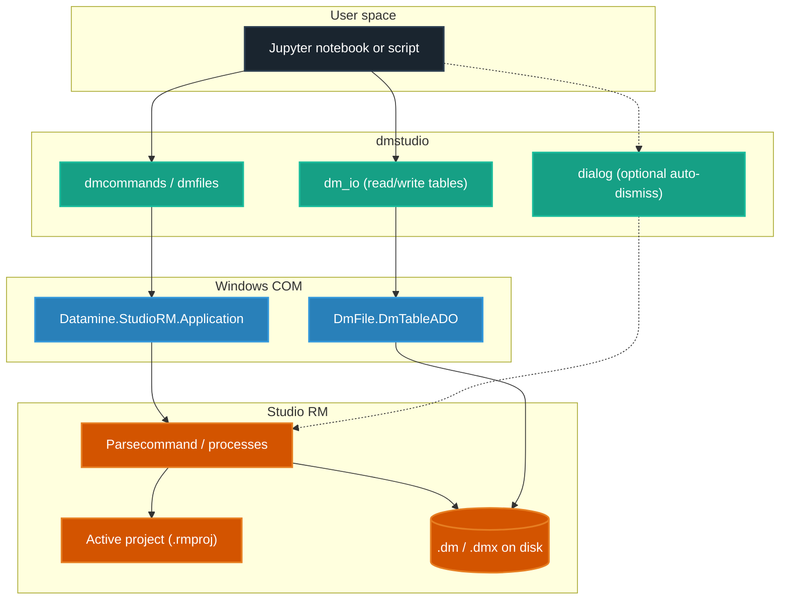

# dmstudio-rm: Python wrappers for Datamine Studio RM with AI capabilities

<p align="center">
  <a href="https://www.python.org/"></a>
  <a href="https://img.shields.io/badge/version-2.0.0b4-purple.svg" alt="Version"></a>
  <a href="LICENSE.txt"></a>
  <a href="https://www.dataminesoftware.com/"></a>
</p>

**dmstudio** is a Python package for geologists and engineers who automate **Datamine Studio RM** workflows. It wraps Studio’s COM automation APIs so you can run processes from Python (especially **JupyterLab**), inspect `.dm` / `.dmx` files as pandas DataFrames, and optionally expose tools to AI clients via MCP.

> **Unofficial & licensed Studio required**  
> Community-maintained — **not** an official Datamine product. Uses official COM APIs (`Datamine.StudioRM.Application`, `DmFile.DmTableADO`). You need a valid, licensed Studio RM install; this package does not replace or bypass Datamine software.

For agent/developer depth (module map, COM rules, generators, style), see **[AGENTS.md](AGENTS.md)**.

---

## How it works

`dmstudio` talks to a **running** Studio RM desktop session over Windows COM.



---

## Prerequisites

1. **Windows** — Studio RM is Windows-only.
2. **Datamine Studio RM** — installed and licensed.
3. **Python 3.9+** — Conda/Miniconda recommended; vanilla Python or `uv` also fine.

Open your project (e.g. `MyProject.rmproj`) in Studio RM before running scripts that use COM.

---

## Install

Clone the repo, then pick one path.

### Option A: Conda (recommended)

```cmd
cd path\to\dmstudio-rm
conda env create -f environment.yml
conda activate dmstudio
pip install -e .
```

### Option B: uv

```cmd
cd path\to\dmstudio-rm
uv venv
.venv\Scripts\activate
uv pip install -r requirements.txt
uv pip install jupyterlab
uv pip install -e .
```

### Option C: One-click Windows helpers

From the repo root: double-click `setup_env.bat` (creates `.venv`, installs deps + editable package), then `start_jupyter.bat` to launch JupyterLab. PowerShell: `.\setup_env.ps1`.

---

## Directory alignment

> [!IMPORTANT]
> Datamine processes use the **active Studio project folder**. Python’s cwd is where you started Jupyter/Python. Keep them aligned.

**Best practice:** put notebooks inside your Datamine project folder and start Jupyter from that folder (activate the same env you installed into).

Example project launcher (`start_project.bat` in your project folder):

```bat
@echo off
call C:\path\to\dmstudio-rm\.venv\Scripts\activate.bat
jupyter lab
```

For Conda: `call conda activate dmstudio` instead of the `.venv` line.

---

## Quick example

```python
from dmstudio import dmcommands

cmd = dmcommands.init()  # connects to open Studio RM

cmd.mgsort(in_i='assays', out_o='sorted_assays', keys_f=['BHID', 'FROM'])
cmd.copy(in_i='sorted_assays', out_o='high_grade_assays', retrieval='AU > 1.5')
```

### Parameter suffixes

| Suffix | Meaning | Example |
|--------|---------|---------|
| `_i` | Input file | `in_i='assays'` |
| `_o` | Output file | `out_o='sorted_assays'` |
| `_f` | Field name | `keys_f=['BHID']` |
| `_p` | Parameter | `allrecs_p=1` |

---

## Utilities

Prefer **canonical modules**. Older notebooks may still use `from dmstudio import agent` — that module **re-exports** the same helpers for compatibility.

```python
from dmstudio import dmcommands, dm_io, dialog
import dmstudio

cmd = dmcommands.init()

# .dm / .dmx ↔ pandas
df = dm_io.read_datamine('high_grade_assays.dm')
dm_io.to_datamine(df, 'from_pandas.dm')  # write path when you need it

# Optional: auto-dismiss blocking Studio modals during a block of commands
with dialog.dialog_dismiss_context():
    cmd.copy(in_i='assays', out_o='assays_copy')

# Tutorials zip into a folder (if you installed without a full clone)
dmstudio.download_tutorials(r'C:\path\to\workspace')
```

Command discovery for agents/scripts lives in `dmstudio.command_registry` (`list_commands`, `get_command_schema`, `search_commands`). Details: [AGENTS.md](AGENTS.md).

---

## Scripting pitfalls (top three)

1. **No raw paths with backslashes or spaces in command args** — the Studio parser mishandles them. Prefer project-local names (`in_i='assays'`), or register first:
   ```python
   cmd.oScript.ActiveProject.AddFile(r'C:\My Data\file.dm')
   cmd.mgsort(in_i='file', out_o='sorted')
   ```
2. **Leading underscore = scratch (in-memory)** — names like `_temp` are not written to disk. Use a non-`_` name for on-disk output.
3. **Blocking dialogs hang scripts** — wrap risky sequences in `dialog.dialog_dismiss_context()` (or the `agent` re-export of the same helper).

Full COM checklist: [AGENTS.md](AGENTS.md).

---

## Tutorials

With a git clone:

1. In Studio RM, open `tutorials\Project.rmproj` (or the project next to the notebook you run).
2. Start Jupyter from the repo or project folder.
3. Work through:

| Path | What it is |
|------|------------|
| `tutorials/case_studies/holes3d_desurvey/` | Drillhole desurvey workflow |
| `tutorials/case_studies/grade_estimation/` | ESTIMA / COKRIG grade estimation |
| `tutorials/case_studies/studio_rm_examples/` | Studio RM 3.1+ scripting examples |
| `tutorials/collections/processes/` | One sandbox per process command (~268) |
| `tutorials/collections/files/` | One sandbox per file command (~32) |
| `tutorials/custom_notebooks/` | Hand-tuned examples (e.g. protom, estima, cokrig) |

Without a clone: `dmstudio.download_tutorials(target_dir)` extracts the tutorials tree into `target_dir`.

---

## AI & MCP (short)

- **In-repo assistants** (Cursor, Copilot, Claude Code, etc.) can read this package and [AGENTS.md](AGENTS.md) to generate valid scripts.
- **MCP server** (`mcp_server.py`): `list_commands`, `get_command_schema`, `search_commands`, `read_datamine_file`, `create_jupyter_workflow`.

Example Claude Desktop entry (use **your** clone path):

```json
{
  "mcpServers": {
    "dmstudio": {
      "command": "C:\\path\\to\\dmstudio-rm\\.venv\\Scripts\\python.exe",
      "args": ["C:\\path\\to\\dmstudio-rm\\mcp_server.py"]
    }
  }
}
```

Full registration notes: [AGENTS.md](AGENTS.md).

---

## Developer

No Studio license required:

```cmd
python tests\quick_test.py
python tests\test_workflow.py
```

Active Studio + loaded project:

```cmd
python tests\diagnose_project.py
python tests\stress_test.py
python tests\integration_test.py
```

Generators, sandbox runners, code style, versioning: **[AGENTS.md](AGENTS.md)**. Changelog: **[CHANGELOG.md](CHANGELOG.md)**. Domain terms: **[CONTEXT.md](CONTEXT.md)**.

---

## License & attribution

Original work Copyright (c) 2018 Sean D. Horan — [MIT License](LICENSE.txt).  
Modifications and new contributions Copyright (c) 2026 Achmad Nazar Abrory.

See [LICENSE.txt](LICENSE.txt) for full terms.
