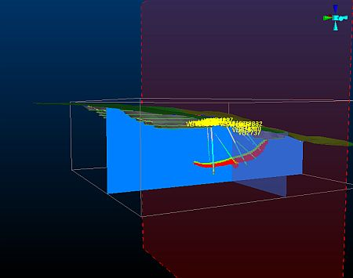
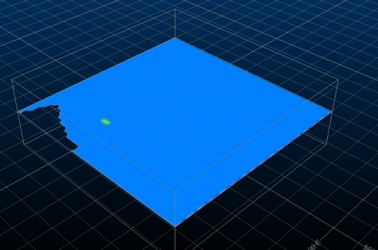
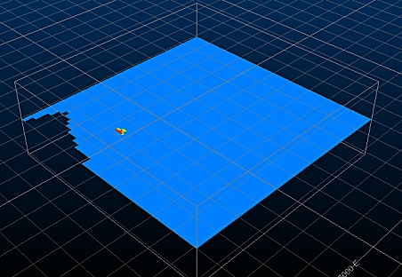
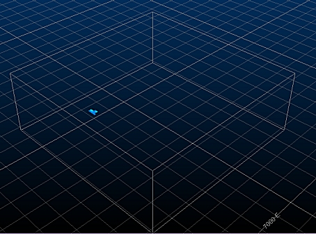
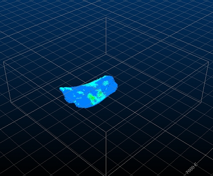
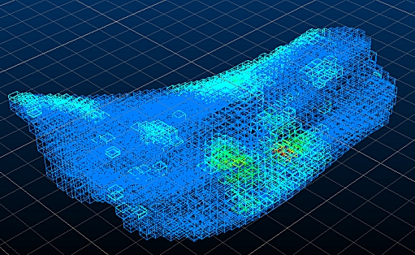
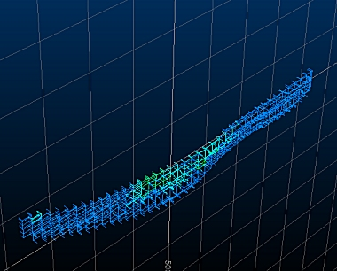
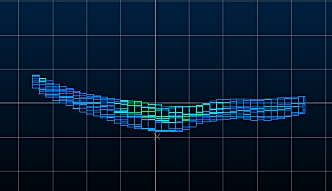

 |  Clipping Data Various methods to clip data  
---|---  
  
# Clipping Data

   

It is often useful to show a cross-section through your data, as in many cases, the interesting stuff can be encapsulated or hidden by other data in view. Data clipping is really easy in Studio RM and can be applied using a variety of methods. Generally, clipping is applied in relation to the active section, and the clipping extents (in front of, behind or outside of the section 'corridor') will be honored regardless of how the section definition is modified, including its position and orientation in space. This is true even when a section is modified in real-time, for example, when using Studio RM's section widgets - you'll get to play with these later.

The display of drillhole data and 3D objects may be restricted within the limits of the section definition. The extent of data clipping is controlled by clipping limits, which are independent of the view direction, although this is only apparent when the view direction is not perpendicular to the section azimuth.

## Prerequisites

  * You have completed [Creating a New Project](<../VR_Tutorial/creating_a_new_project.md>)

  * Files required for the exercise

  *     * _vb_mod1.dm

## Exercise: Clipping Block Model Data

  1. Unload any data that may already be loaded into memory. Ensure only a single 3D window is displayed.
  2. Drag the following file into the 3D window from the Project Files control bar:  
  
_vb_mod1.dm  
  
(If you are shown a notice indicating the file is read-only, click Yes to continue).
  3. Your model is currently shown as a 'Quick Section', that is, a rapidly generated view of the block model where is passes through the currently defined Default Section.  
  
In essence, the data is already 'clipped' to only show a cross section, but in the rest of this exercise you will see how to a) create a clearer cross-section and b) create a slice of model data that is 50m thick.  
  
For now, you should see something like this:  
  
  

  4. To create a true 'Intersection' display of the block model, open the Sheets control bar and expand the Block Models folder.
  5. Select the Intersection Display Type and check that the [Default Section] description is shown in the Intersection Section drop-down list. Click Apply. The view of the data should now appear slightly sharper:  
  
  

  6. Select [CU] using the Column drop-down list, then click the button to the right of this list to select the default Legend for that column. Click Apply:  
  
  

  7. So that's the intersection method - now the 'clipped data' approach; set the Display Type to Blocks.
  8. Set the Exaggeration to '80%' (this reduces the size of the cuboids to better indicate the gaps between them - it will have no effect on subsequent operations other than a visual one).
  9. Disable the Show Fill check box and enable the Show Edges check box. Click OK.
  10. You should now be able to see the full orebody model, as shown below:  
  
  

  11. Use the view ribbon and click Zoom Area to drag a rectangle around the orebody - this will zoom in to show a clearer view:  
  
  

  12. Using the Sheets control bar, expand the Sections folder and double-click Default Section.
  13. Click North-South and ensure the Use Dimensions check box is cleared.
  14. Set the Clipping to Outside and click OK \- a 10m section corridor is created, with all data clipped outside it:  
  
  
  

  15. Using the View ribbon, select Zoom Fit | Zoom West:  
  
  
  

  16. Finally - open up the Section Properties dialog again and use the left and right Position arrows to slice through the orebody at intervals of 10m (it will always be the sum of the Front and Back clipping distances):  
  
  
  
  
You'll find out more about sections in later exercises - they are invaluable during designing and visualization operations.  

****Top of page