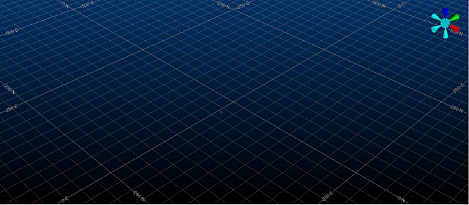
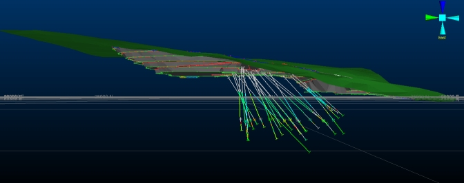
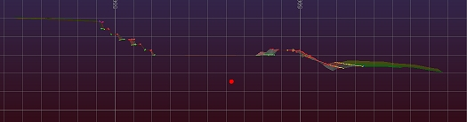
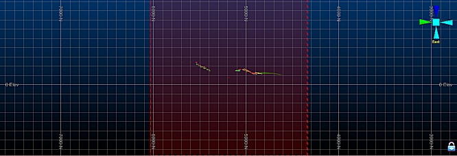
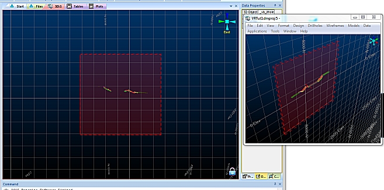
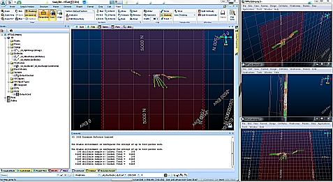

 |  Views and More Views Spawning multiple external views of your data  
---|---  
  
# Working with External 3D Windows

In this part of the tutorial you are going to see how to create multiple, linked 3D viewing windows, based on the contents of data in memory.

## Prerequisites

  * Files required for the exercises on this page:

  *     * _vb_itsurfacept

    * _vb_itsurfacetr

    * _vb_itblastholes

    * _vb_itholes

    * _vb_itpitstrings

# Exercises

## Exercise: Working with External Views

In this exercise you re going to load some tutorial data, lock its view into position and then spawn some external 3D windows, then modify them.

  1. Unload any data that may already be loaded from a previous exercise.
  2. Make sure that a single 3D view is displayed. You should see a default grid, but no other object overlays:  
  
  

  3. Load the following objects into the 3D window (use any method you like):  

_vb_itsurfacetr

_vb_itblastholes

_vb_itholes

_vb_itpitstrings

  4. Activate the View ribbon and select Zoom Fit | Zoom East. You should now see the following:  
  

  5. As shown in the [previous exercise](<Clipping%20Data.md>), you're going to clip the data to show a 50m slice of data in a North-South direction (remember - you are viewing from the East so the section will be orthogonal to the view)  
  
In the Sheets control bar, expand the Sections folder then enable the display of the Default Section overlay.

  6. Double-click the Default Section item.

  7. In the Section Properties dialog, click North-South

  8. To make sure the section goes through the data, set the Section Ref Point fields as follows:  
  
X: 6145  
Y: 5080  
Z: 70

  9. Make sure the Use Dimensions check box is disabled, and that both Front and Back Section Width fields are set to '25'.

  10. Set the Clipping option Outside (meaning "clip all data outside of my section") and click OK \- you should see this:  
  

  11. Lock this section in place by selecting the Lock toggle on the View toolbar (you will see a small padlock icon appear in the bottom-right corner of the data window:  
  

  12. Activate the Home ribbon and expand the Show drop-down list to select the New External 3D option. A new window appears. Rearrange your desktop so that both the locked and external window can be seen together (you can also resize the external window), e.g.:  
  

  13. Left click inside the external view and rotate the camera - note how the other window is unaffected (this would be the case even if it wasn't locked).

  14. Left click inside the main window, then re-open the Section Properties dialog for the Default Section item.

  15. Increase the section widths for both Front and Back values to '45'. Click OK and watch the external view - note how it updates in line with the main window?

  16. Try selecting drillhole data in the main window and see how it is highlighted in all displayed windows (the same is true the other way around - each external window is interactive; you can select data in any window).

  17. Open 3 more external views using the Home ribbon's Show menu and arrange them to show difference view angles:  
  

  18. Close down all external windows and unload all data.

 |  External data views are very similar to the main 3D data window, but there are some small restrictions with how they can be used, by comparison. What you can do in an external view:

  * Change the view orientation
  * Resize the external window, reposition it (e.g. separate monitor)
  * Change the zoom settings
  * Select data
  * Digitize or modify data points (you can use a combination of multiple windows within the same digitizing operation if you wish - true 3D designing!)
  * Use the axis indicator to change view directions
  * Access environment settings (which will be applied to all windows)
  * Access the 3D window context-menu system to access properties dialogs, select/deselect data etc.
  * Use the view as a location into which data files can be dragged/dropped for loading.
  * Access context-sensitive help
  * Use quick-keys to access Datamine commands

What you can't do in an external view:

  * Independently change environmental settings only for that view
  * Use the View or other ribbon commands
  * Independently format data object overlays for a specific view - these overlay properties are currently applied to all views.  
  

  
---|---