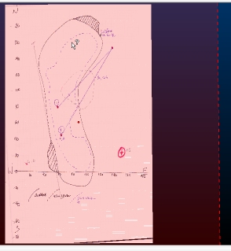
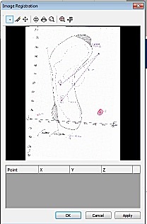
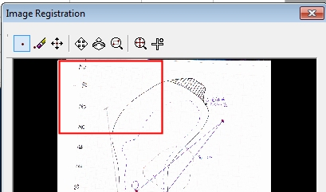
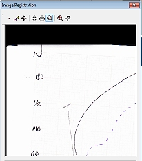
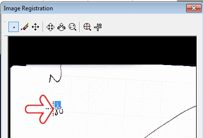
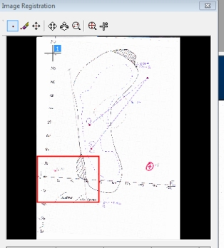
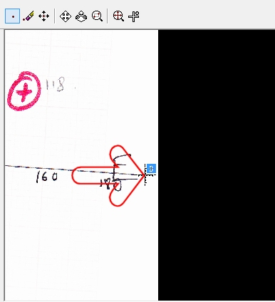
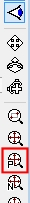

 |  Image Registration Taking full control of image draping.  
---|---  
  
# Image Registration

## Prerequisites

  * Created a new project and added all the required tutorial files i.e. the exercise on the [Creating a New Project](<../VR_Tutorial/Creating_a_New_Project.md>) page.

  * Loaded the required data i.e. the exercises on the [Loading Data into the 3D Window](<../VR_Tutorial/Loading_Data_Into_VR.md>) page.

  * [Files](<../VR_Tutorial/Tutorial_Files_List.md>) required for the exercises on this page:

  *     * _vb_itsurfacetr

Aligning a Hand-drawn Plot to a Flat Surface

The following topic provides an example of texture application using the Image Registration dialog.

This example uses the installed demonstration image data located on your local system. Details regarding the location of data are provide below.

## Exercise - Creating a 3D Plot in Correct Geospatial Coordinates

In this example, you are going to load an image representing a hand-drawn plot, and use the coordinates found on that document to create a correctly-aligned wireframe in 3D space. This could then be used as a basis for digitizing, for example, or comparing against other loaded data from a related data set.

This example assumes that your application is running and licensed on the host system and that you can see the Sheets |3D folder (Studio and Studio 5D Planner) or the Workspace in "Group by Type" mode (InTouch or EPS InTouch).

This example is common to all applications which support the Image Registration feature.

  1. Unload any data that may be loaded from previous exercises.

  2. In the Sheets control bar, right-click the Wireframes top-level folder and select Load Image Wireframe...

  3. Navigate to your sample data folder (C:\Database\DMTutorials\Data\VBOP\Pics).

  4. Double-click the IMG_PLOT.jpg file.

  5. The Image Registration dialog is shown with a preview of the loaded image:  
  

  6. Next, you need to define 3 points on the image to which you wish to align the 3D wireframe surface. To make it easier to select the first point, select the Zoom Area button at the top of the dialog:  
  

  7. Left-click and drag a rectangle represented by the area shown below:  
  
  

  8. The texture preview will zoom to the selected area:  
  
  

  9. Select the Add Point button at the top of the dialog:  
  

  10. Left-click to add an alignment point directly above the "1" on the "180" description, i.e.:  
  
  
  
The red arrow is shown for indication purposes only.

  11. The next point will be added at the intersection of the graph axes. Zoom the preview to show the area shown below:  
  

  12. Select Add Point mode and click on the very beginning of the horizontal axis to position the second point, e.g.:  
  

  13. Finally, maximize the view and use the zoom commands to position a third point at the end of the horizontal access (this represents the "190" value position, even though it isn't shown in text, e.g.:  
  

  14. The table below now contains 3 rows (one for each digitized point). The values for X, Y and Z are all currently zero. This is because none of the digitized points have been 'assigned' to a point in 3D space yet. As the coordinates are known (they are on the chart), you will need to enter them into the table below, manually.  
  
For the purpose of this demonstration, you can assume that the elevation that is relevant to the plot is 250 meters. In other words; all points have a Z value of 250.  
  
Configure the table at the bottom of the screen so it appears as shown:  
  

  15. Click OK and your image will be applied to an automatically-generated wireframe. If you can't see anything in your data display window, right-click the [IMG_PLOT.jpg] entry that has now appeared in your Wireframes folder and select Look At.

  16. Finally, click the Plan View icon on the View toolbar:  
  

  17. This will orient your wireframe to the view window. Note how the chart axes, although scanned incorrectly, now appear in the correct orientation:  
  
