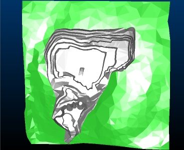
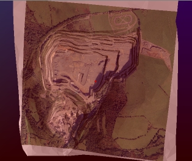
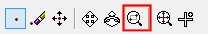
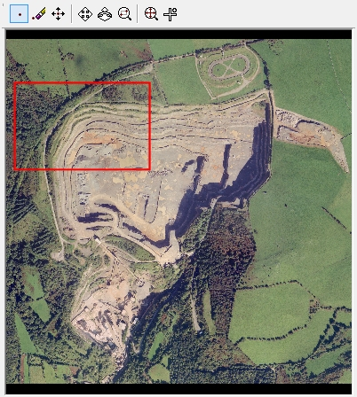
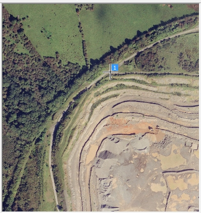
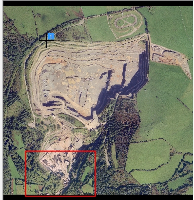
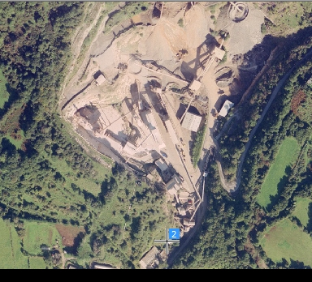
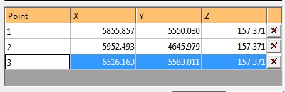
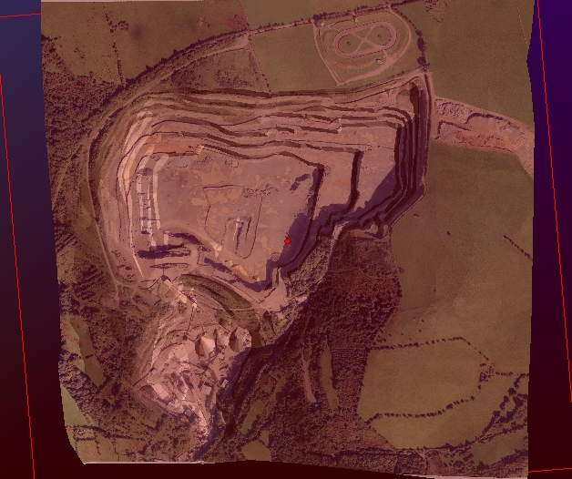

 |  Importing and Aligning Images Importing a texture file into Studio RM and aligning it.  
---|---  
  
# Overview

The following topic provides an example of texture application using the Image Registration dialog.

## Prerequisites

  * Created a new project and added all the required tutorial files i.e. the exercise on the [Creating a New Project](<../VR_Tutorial/Creating_a_New_Project.md>) page.

  * Loaded the required data i.e. the exercises on the [Loading Data into the 3D Window](<../VR_Tutorial/Loading_Data_Into_VR.md>) page.

  * [Files](<../VR_Tutorial/Tutorial_Files_List.md>) required for the exercises on this page:

  *     * _vb_itsurfacetr

## Exercise: Aligning an Image with a 3D Topography

In this example, you will load existing 3D topography data and use the Image Registration function to align an image with known reference points. To ensure the points are applied to the same elevation, a section will be created above the topography for alignment purposes.

  1. Unload any data that may be loaded from a previous exercise.

  2. Using Windows Explorer, navigate to C:\Database\DMTutorials\Data\VBOP\Datamine.

  3. Left-click and drag the file _vb_itsurfacetr.dm into the 3D window.

  4. Using the View ribbon, click Zoom Fit | Zoom Plan.

  5. The aim is to display the open pit design in plan view, maximized to the screen, as shown (must be like an old friend now, this wireframe):  
  
  

  6. In the Sheets | 3D |Wireframes folder, right-click the _vb_itsurfacetr/_vb_itsurfacept (wireframe) item and select _vb_itsurfacetr/_vb_itsurfacept (wireframe)Properties.

  7. Select the ellipsis button (...) on the right of the Texture field.

  8. In this folder, navigate to C:\Database\DMTutorials\Data\VBOP\Pics and double-click the file _vb_ITPhoto_Texture_rotated.jpg.

  9. Click OK and the texture is applied to the wireframe - note the suspect alignment:  
  
  

  10. Right-click the loaded wireframe in the Sheets control bar and select Texture Drape Settings.

  11. In the Texture Drape Settings dialog, click Use Points....

  12. The Image Registration dialog is displayed, showing a preview of the loaded image:  
  

  13. You will now define 3 points on the image that will be aligned with 3 landmark positions on the 3D wireframe surface.

  14. Select the Zoom Area icon:  
  

  15. Left-click to drag a rectangle represented by the area shown below:  
  

  16. The view should now be similar to the following:  
  
  
  
It does not have to be completely accurate, provided that most of the supply road is visible.  

 |  You can use the mouse wheel at any time to zoom the image preview in and out.  
---|---  
  17. Select the Add Point button at the top of the dialog:  
  

  18. Left-click the junction of the main supply road and pit access lane, as shown below. Get as close to the specified point as possible - a reference point crosshair and "1" indicator will be displayed:  
  
  

 |  Note that a new row has been added to the table below - this will be explained in more detail below.  
---|---  
  19. Use the Zoom Fit icon to maximize the texture to the screen:  
  

  20. Next, magnify the area detailed below, using the Zoom Area function as previously demonstrated:  
  

  21. Use the Add Point function to left-click at the point shown below:  
  

  22. Use the Zoom Fit icon to maximize the texture to the screen:  
  

  23. Zoom to show the full image again, and zoom into the final area:  
  

  24. Add a third and final point at the position specified below:  
  

  25. The table at the bottom of the screen currently shows zero values for X, Y and Z for each point. This is the result of reference points being assigned to the image but not currently matched to a point in 3D space.
  26. The coordinates for the digitized points are known. The table shown below should be edited to show the figures provided:  
  

  27. Click OK to close the Image Registration dialog.
  28. Click OK to close the Texture Drape Settings dialog.
  29. The textured wireframe should now be visible in plan view, with a correctly aligned texture:  
  
