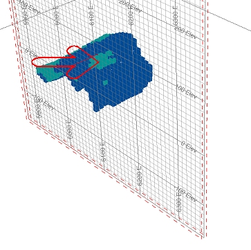
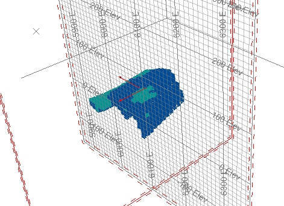

 |  Multiple Templates When one display section just isn't enough....  
---|---  
  
# Overview

## Prerequisites

  * This exercise continues from [Using Section Widgets](<Section%20Widgets.md>) \- you will need to have completed this exercise, with the same data loaded.

## Exercise: Adding a Second Section to your Scene

  1. You should be looking at data from the completion of the [previous exercise](<Section%20Widgets.md>):  
  

  2. Currently, the model data is clipped in an East-West plane. You're going to add another section, this time in a North - South alignment.  
  
Right-click the 3D | Sections folder and select New.
  3. Left click roughly as indicated below:  
  

  4. Select the North - South option in the dialog that is shown, then click OK.
  5. Right-click the 'Section' item that has just appeared in the Sheets control bar and rename it to 'North-South'
  6. Double click the North-South section to display the properties dialog.
  7. Select the Use Dimensions field to apply a 500x500 size to the section.
  8. Select the Back clipping option.
  9. In the Section Plane group, disable the Fill check box and enable the Lines option. Click OKto display the two sections in an 'X' alignment.  
  

  10. Note how the data is now clipped in two directions? You may also have noticed that the second section does not have a grid overlay - this is because the current Default Grid item is only associated with the Default Section, not the one that you have just created (you'll learn more about section grids later in this tutorial).
  11. Right-click the North-South section and select Edit Interactively. Select the various widgets and drag them to new positions - you will find that the Default Section position and clipping remains static, whereas the second section applies additional clipping dynamically:  
  

****Top of page