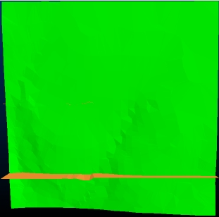
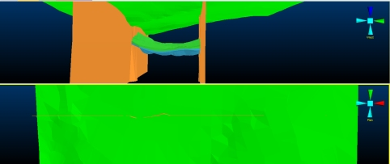
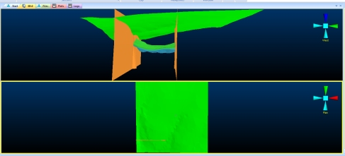
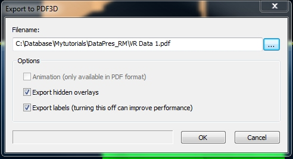

 |  Export to PDF3D Sharing your 3D reports with PDF3D.  
---|---  
  
# Sharing your Work

In this part of the tutorial you are going to view a simulation using the previously defined haul truck and flythrough simulations.  

## Prerequisites

  * Attached the texture image to the topography surface i.e. the exercise on the [Attaching a Texture Image](<../VR_Tutorial/Attaching_a_Texture.md>) page.

  * Files required for the exercises on this page:

  *     * _vb_holes(drillholes)

    * _vb_faulttr/_vb_faultpt (wireframe)
    * _vb_mintr/minpt (wireframe)
    * _vb_stopotr/stopopt (wireframe)

## Exercise: Exporting 3D Data to a 3D PDF File

 |  The main uses for and characteristics of these interactive 3D formats include:

  * distribution, collaboration and sharing of interactive spatial data in a standard, high quality, compressible format, by both engineering and non-engineering staff
  * no need to have specialized 3D visualization software i.e. commonly available, simple to operate PDF viewers can be used to view these files
  * embedding in PowerPoint presentations without the need for plug-ins
  * inclusion in technical reports.

  
---|---  
  
In this exercise, you are going to create a 3D *.pdf format file from the data loaded in the VR window, using the PDF3D export function; this file will then be viewed using Adobe Acrobat. This includes the following tasks:

  * Displaying and Formatting Loaded Data
  * Deleting and Creating New Viewpoints
  * Creating the 3D PDF File
  * Viewing the 3D PDF File.

**Displaying and Formatting Loaded Data**

  1. Select the 3D window.
  2. Unload any data that may be loaded from previous exercises.
  3. Using the Project Files control bar and drag the following files into the 3D window:

  * _vb_holes(drillholes)
  * _vb_faulttr/_vb_faultpt (wireframe)
  * _vb_mintr/minpt (wireframe)
  * _vb_stopotr/stopopt (wireframe)

  4. In the Sheets control bar, fully expand the 3D folder.
  5. Turn ON the display of only the following Overlays (i.e. check the boxes to the left of each item):  
  

     * _vb_holes(drillholes)
     * _vb_faulttr/_vb_faultpt (wireframe)
     * _vb_mintr/minpt (wireframe)
     * _vb_stopotr/stopopt (wireframe)  
  
| Make sure that all other overlays, including 3D Objects are not displayed.  
---|---  
  6. Use the View ribbon to select Zoom Fit | Zoom Plan.
  7. Compare your 3D view with that shown below:  
  
  

**Deleting and Creating New Viewpoints**

  1. Using the View ribbon select Viewpoints | Store.
  2. Select Zoom Fit | Zoom West.
  3. Compare your 3D view with that shown below:  
  

  4. Using the View ribbon select Viewpoints | Store.
  5. In the Sheets control bar, 3DObjects folder, check that the two new viewpoints, i.e. Viewpoint 1 and Viewpoint 2, are listed.

  6. Select Split Horizontally.

  7. Select the lower window and choose [Viewpoint 2] from the drop-down list.

  8. Select the upper window and choose [Viewpoint 1] from the drop-down list.

  9. Check your results against the data shown below:  
  

  10. Note how the view alignment corresponds to the original view settings, but the data is not automatically scaled to fit the confines of the split window. This is expected behaviour for a view definition - the zoom factor will be applied as per the original data scale (when the viewpoint was created). If you wish to create a view that is zoomed to show all data in a horizontal split window, you will need to zoom the data in each window (either re-run the Zoom Fit commands or manually zoom) then save 2 new viewpoints; one for each 'half window', e.g.:  
  

  11. Go back to a single view, ready for a PDF3D export (click the Split Horizontal button again).

Creating the 3D PDF File

  1. With the 3D window displayed, activate the Data ribbon and select Data | Export PDF3D.

  2. In the Export to PDF3D dialog, Filename field, click Browse.

  3. In the Save As dialog, select your tutorial folder, define the file name as 'VR Data 1', select the Save as type [.pdf], click Save:  
  

  4. Back in the Export to PDF3D dialog, Options group, select Only export visible objects(theExport labelscheck box is enabled by default, but there are no labels to display so this setting is not relevant), click OK:  
  

Viewing the 3D PDF File

 |  General The following steps show the use of Adobe Acrobat™ for viewing the 3D PDF file. Other PDF viewers work in a similar manner. Please note that Adobe Acrobat or any other PDF 3D content viewer is not provided nor supported by Datamine. Depending on what PDF viewer you have installed and what program is by default associated with the 3D PDF file types (.pdf, .u3d, .prc), the exported file is automatically opened with the default viewer. If this does not happen, then using Windows Explorer, browse to your project folder and open the exported file. Double-sided Rendering In the 3D window, wireframes are by default displayed as double-sided surfaces (see the Wireframe Properties dialog, General tab, Face Direction group). InAdobe Acrobat, the double-sided rendering option is by default turned OFF. If your exported file is displayed as shown below (i.e. the green topography surface and part of the orange fault surface appear to be 'missing'), then the double-sided rendering is currently disabled:  To turn it on (for the current and future sessions), use the following procedure:

  * In Adobe Acrobat , select Edit | Preferences,
  * In the Preferences dialog, 3D & Multimedia tab, Renderer Options group, select the Enable double-sided rendering option, click OK.

  
---|---  
  
  1. In the Adobe Acrobat dialog, compare your view of the data to that shown below:   
  

  2. In the main window, use click-and-drag to rotate the view, <Shift> \+ click-and-drag to zoom and <Ctrl> \+ click-and-drag to pan the view.

  3. In the 3D toolbar, Views drop-down, select the saved viewpoint [Viewpoint 1]:  
  

  4. Compare your view to that shown below:  
  

  5. Open the Model Tree control bar and expand the Wireframes and Strings folders and confirm that the displayed overlays have been exported:  
  

  6. Right-click on different model objects and explore the various context menu options.

  7. Close the Adobe Acrobat dialog when you have finished viewing the 3D model.

Thank you for completing the Datamine 3D Window tutorial.

Hopefully it has given you some insight into the basic functionality available within your application for reporting your data in an immersive and compelling way.

The commands and functions covered in this tutorial barely scratch the surface of what can be achieved in full - some of the items not covered in this tutorial, but readily available in your software are:

  * Many, many more visualization options than described in this tutorial

  * Animated visualization export

  * A raft of additional data formatting options

  * ...plus a raft of other topics that make your application the world's best-in-field for visualization.

If any of the above items are of interest to you - don't hesitate to contact your local Datamine office for more information about training courses in your area.