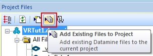
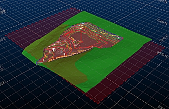
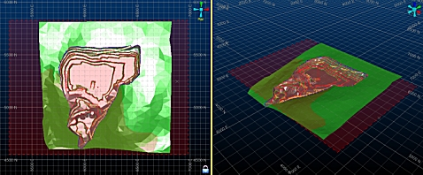

 |  Section Definition Files Loading and understanding 'secdef' files.  
---|---  
  
# Section Definition Files

## Prerequisites

  * You have read the [Sections and Views](<../VR_Tutorial/Navigation_Controls.md>) principles page.

  * You have completed the exercise [Creating a New Project](<../VR_Tutorial/creating_a_new_project.md>)

  * You have completed the exercise [Managing Multiple Sections](<Multiple%20Sections.md>)

  * Files required for the exercises on this page:

  *     * _vb_stopotr.dm

    * _vb_itpitstrings.dm

    * _vb_itholes.dm

    * _vb_viewdefs.dm

A Section Definition is a numerical representation of the current section/view of your data. A section definition file is a table containing references to one or more section/view arrangements (for example, a variety of views of a multi-pit wireframe with associated drillhole data.

The 3D window supports the import of section definition tables and will automatically detect if one is found in memory - allowing you to select any of the stored section definitions and apply them to the current 3D section.

Note that you can only have one section definition file loaded at any one time. Attempts to load another file will result in the current one being closed.

In this exercise, you will load an existing section definition file and use it to dynamically update the view of data in a locked data window.

# Exercises

## Exercise: Loading a Section Definition File

  1. Unload any data that may be loaded from a previous exercise.

  2. A section definition file is just like any other table (it doesn't even have to be a Datamine .dm file). For this exercise, drag the following items into the 3D window from the Project Files control bar:  
  

_vb_surfacetr.dm

_vb_itpitstrings.dm

_vb_itholes.dm

  3. The section definition file is not in your project folder - you need to add it. Using the Project Files control bar, select the Add Existing Files to Project icon:  
  
  

  4. Navigate to the following folder: C:\Database\DMTutorials\Data\VBOP\Datamine

  5. Select the file _vb_viewdefs.dm (double-click) to add it to the Project Files control bar. Confirm this in the following dialog.

  6. Drag this new file from the All Files folder into the 3D window.

  7. Use the View ribbon to select Split Vertically.

  8. With the left-hand window selected (highlighted), open the Sheets control bar.

  9. Expand the 3D | Sheets | Sections folder - you will see that the _vb_viewdefs item has been created automatically - this is the 3D object containing all of the loaded section definitions.

  10. Right-click the _vb_viewdefs item to rename it to "Section Table" - this will rename the overlay and not the underlying data file.

  11. Right-click and Delete the Default Section item.

  12. Double-click Section Table to show the Section Properties dialog.

  13. Click the Left and Right arrow buttons and watch both views update to show the new position of the section each time - each new position represents a unique definition held within the external file. The Section Properties dialog will also update dynamically to show the values associated with each section that is defined therein.

  14. Click the left/right arrows until you see a flat (horizontal) section as shown below:  
  
  

  15. Click OK to dismiss the Section Properties dialog.

  16. With the left-hand window still selected, use the View ribbon to enable the Lock icon. The view will automatically update to show a plan view (that is - orthogonal to the selection section within the loaded section file).

  17. You should now be looking at something like the following:  
  

  18. Re-open the Section Properties dialog for the Section Table. Move the dialog so the left-hand window is in view.

  19. Use the left and right arrow buttons to select different sections within the loaded table - this time, the left-hand window will automatically update to show a view that is orthogonal to each section.

  20. You may have seen that some of the views in the left hand window seem very similar - this is because the sections are defined to be in the same orientation, but a different Easting to each other. This is best demonstrated using clipping.  
  
In the Section Properties dialog, select the Outside clipping option and use the left/right buttons to traverse through each of the section definitions:  
  

  21. Left-click inside either of the two data windows and use the Data ribbon to select Load | Unload | Unload All.  
  
The Section Definition file and the associated overlay ("Default Section") is unloaded along with all other visual data, and the Default Section is reinstated.