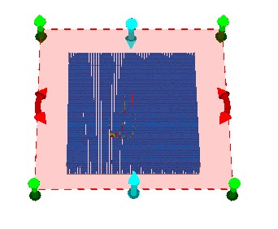
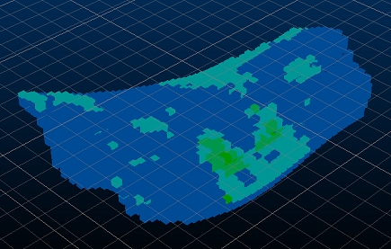
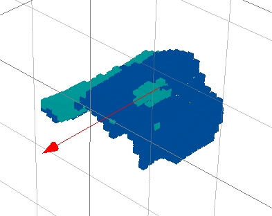
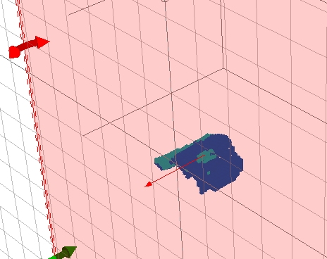
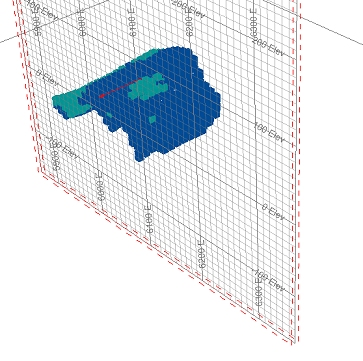
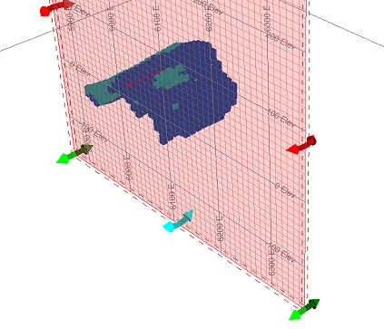

 |  Section Widgets Widgets, wonderful widgets....  
---|---  
  
# Using Section Widgets

## Prerequisites

  * You have read the [Sections and Views](<../VR_Tutorial/Navigation_Controls.md>) principles page.

  * Files required for the exercises on this page:

  *     * _vb_mod1

Studio RM introduces an interactive approach to editing and positioning display sections in the 3D window.

By default, sections are displayed without 'widgets' (control handles), which when displayed, surround the currently active section.

The section editing tool is a temporary mode; if you enter another command in your application (or even click outside of the application) you will automatically disable the widget display.

There are three types of widget available, and all are used to reposition the active section in real-time, honoring any existing clipping settings that are associated with the section.

 | Adjusts the reference point of the section in the direction of the normal of the section plane.  
---|---  
 |  Changes the azimuth of the active section.  
 |  Changes the dip/inclination of the active section.  
  
# Exercises

## Exercise: Modifying Sections with Widgets

In this exercise, you're going to load a demonstration block model and clip data in front of the active section. Following that, you will modify the section position, azimuth and dip using on-screen widgets. You also get to play with the widgets in subsequent exercises as they are an efficient way of moving the section in relation to loaded data.

  1. Unload any data that may be loaded from previous exercises
  2. Load the following files into the 3D window using one of the methods demonstrated [here](<../VR_Tutorial/Loading_Data_Into_VR.md>):  

_vb_mod1.dm

  3. Format the block model as blocks, with an 80% Exaggeration (you did something similar here but this time, leave the Show Fill and Show Edges properties as they are).
  4. Use the Block Model Properties dialog to display a default legend for the [CU] data column.
  5. Zoom in and fill the screen with the Copper grade model.
  6. You're aiming for something like this:  
  
  

  7. Double click an empty part of the 3D screen to change the background color to a solid white.
  8. Using the Sheets control bar, turn on the display of the Default Section.
  9. Double-click the Default Section item to display the Section Properties dialog.
  10. Click the East-West button and Apply to change the orientation of the section automatically to an inclination of -90 degrees.
  11. Ensure the Use Dimensions check box is disabled.
  12. Set the Clipping to Front and click Apply.
  13. In the Section Plane group, disable the Fill check box and enable the Lines option. Click OK \- one clipped model:  
  

  14. Using the View ribbon toggle ON the Edit Interactively button - widgets are added...however...  
  
Depending on your zoom factor, some (or even all) of the widgets may be hidden as the section limit may extend beyond the edges of the screen, e.g.:  
  

  15. All is not lost - you can change the extents of the section by going back into the Section Properties dialog and enabling the Use Dimensions check box. The default 500x500 dimensions will be fine for this exercise. Click OK and the section limits will update:  
  
  
  

  16. Click Edit Interactively again - now you should be able to see at least one widget of each color:  
  

  17. Move your mouse over the visible widgets (don't click yet). Each widget will expand as the mouse moves across it, to show that it is selectable.
  18. Widgets are available in the three flavors indicated at the start of this topic; move your mouse over one of the green widgets, left-click and hold the mouse button down. Now drag the section backwards/forwards - the section and clipped data will update in real time:  
  

  19. Reset the position, and this time move the Red widget to alter the azimuth of the section:  
  
  

  20. Finally, try the Blue widget to alter the dip:  
  

  21. Go back into the Section Properties dialog and reset the section to an East-West alignment. Click OK

So far, you've used a single section to manage the display of data. In the next exercise (which continues from this one), you will apply a second section and manage the two together.

 |  Related Topics  
---|---  
| [Related Topic link 1](<../TOPIC 1>)[  
Related Topic link 2](<../TOPIC 2>)[  
Related Topic link 3](<../TOPIC 3>)