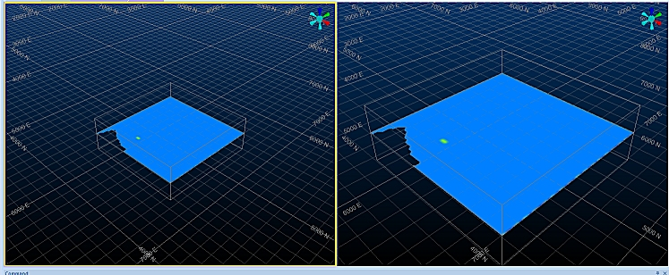
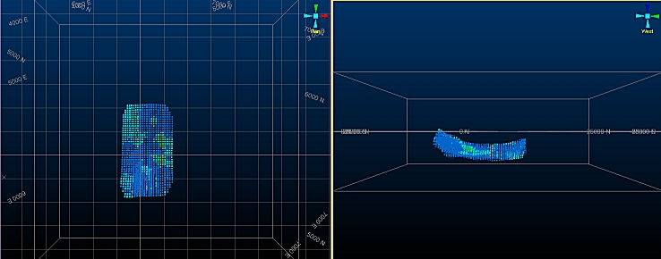

 |  Splitting Windows A non-destructive way of splitting windows  
---|---  
  
# Splitting 3D Windows

## Prerequisites

  * Files required for the exercises on this page:

  *     * _vb_mod1

The 3D window can be split into either two (vertical or horizontal) or four panes. These individual panes can be used for design, visualization and presentation work the same way as is done using a single 3D window. The advantage of split windows is that they provide additional working views of the data without the need to keep adjusting the view as would be the case when using a single window. The highlighted pane (its border is highlighted yellow) is the active pane and the one that will respond to a command. Any pane can be selected to be the active plane; moving between planes can be done using either the cursor or <Tab> key. The split window boundaries can also be resized.

 | 

  * The view location and orientation can be defined differently for each split window; these controls are located in the 3DView toolbar.
  * Section orientations are the same across all split windows.

  
---|---  
  
 |  Use a split3Dwindow when modeling or designing complex 3D data sets. This will allow the data to be viewed simultaneously from different orientations and thus make it easier to check the location or placement of data e.g. when selecting an item, drawing a string while snapping to objects.  
---|---  
  
# Exercises

## Exercise: Creating a Split Window

  1. Unload all data (confirm if required) and load the file _vb_mod1.dm into the 3D window.

  2. Select the View ribbon's Split Vertically command.

  3. Check that the 3D window has been split vertically:  
  

  4. Note that the left window has a yellow border. This means something; it means that the left-hand window is currently the active window. If you run a non-interactive command that changes the view, e.g. Zoom Fit | Zoom Plan, it will be applied to the left window only. This becomes more important when you make use of a locked section as shown later in this tutorial.  
  
Some commands will affect the display of all windows, however, regardless of their current 'Active' setting, e.g. any changes to the Environment settings will automatically be applied to all windows, as will changes to any object data or overlays.

  5. Double-click the _vb_mod1 overlay in the Sheets | 3D | Block Models folder.

  6. Use a Display Type of Blocks with an Exaggeration of 60%, click OK.

  7. Set the Legend Column to [CU] and use the Default Legend column (click the button on the right).

  8. Click OKand.both window splits should update to show the model cuboids.

  9. Select Zoom Fit | Zoom Plan and see how the left-hand window updates.

  10. Select the right-hand window, then Zoom Fit | Zoom East. You should now have two distinct standard views:  
  

  11. With the left-hand window selected, select Zoom Area and drag a rectangle around the orebody in the right-hand view - as this command is interactive, the right-hand window is automatically activated when you drag a rectangle within it. The same applies for all interactive commands (including digitizing).

  12. Zoom into the left hand orebody view using the same technique.

  13. Left-click and hold the 'bar' separating the two windows, now move the mouse to resize them.

  14. Remove the vertical split by selecting the Split Vertically button again.