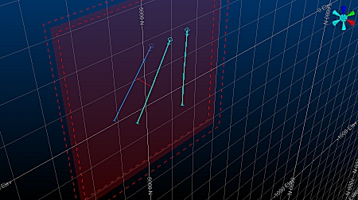
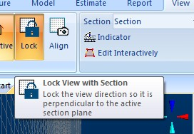
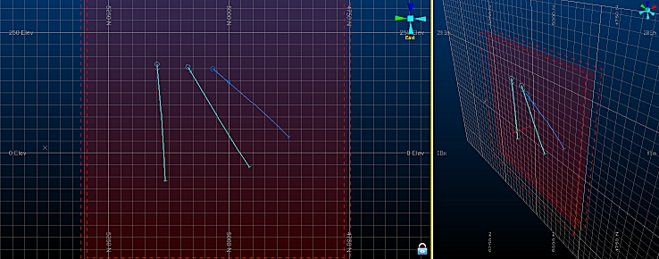
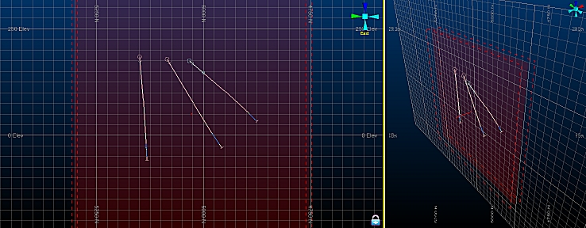
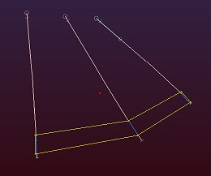
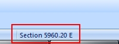
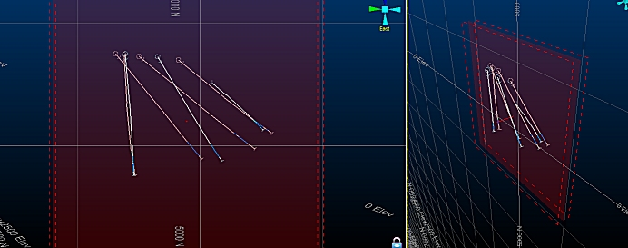
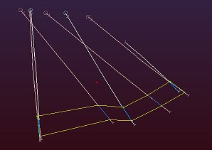

 |  Digitizing Onto 3D Sections Mastering sections in the 3D window.  
---|---  
  
# Digitizing Onto 3D Sections

## Prerequisites

  * You have read the [Sections and Views](<../VR_Tutorial/Navigation_Controls.md>) principle page.

  * Files required for the exercises on this page:

  *     * _vb_holesc.dm

    * _vb_minst.dm (control data for comparison)

    * _mintr.dm (control data for comparison)

Studio 3 introduced the concept of a 'Design Plane'; a flat plane, always orthogonal to the view, that could be used as a basis for digitizing and editing. It was also a basis for clipping data. Over time, Studio's VR window evolved to support more and more of the commands traditionally associated with the Design window.

Studio RM takes the 'design plane' concept a big step further in providing a 3D environment that is suitable for both rich visualization and accurate CAD-style drafting. It achieves this through the introduction of a variety of new view management functions, extended support for commands previously only available to the Design-window users. One of the most important of these advancements is the extension of functionality available via the 3D Section.

This part of the tutorial takes you through the process of using both locked and freeform sections, across multiple windows in order to digitize a series of closed orebody strings, representing the outlines of each distinct zone as indicated by initial exploration drillhole data.

Take your time going through this one - working effectively with sections is a key win for users of Studio RM.

Because the requirements for 3D visualization and CAD-style drafting are different, the 3D window offers two separate modes of operation, both of which can be displayed and used simultaneously:

  * Locked: in this mode, a 3D data window is "Locked" into a position so that the active section is orthogonal to the current camera position. Whilst in this mode, it is not possible to rotate the view although panning and zooming are still possible. The active section can be visible or invisible, clipped or un-clipped, and data can be digitized directly onto the section, or snapped to data according to your current settings.  
  
You can lock more than one 3D view if you wish, although you can only lock those views to the same active section. It is possible, however, to align any view to any section without locking it (see the examples below).  

  * Freeform: this is the default setting, and lends itself towards a more dynamic digitizing and visualization environment. In this mode, all view editing commands are available (rotate, view, pan). You will still digitize onto the active section or snap to the relevant data points, but the section may not be face-on to the camera.

Both operating modes permit the same access to data formatting commands, and you can use a combination of locked and freeform views for digitizing if you wish.

 |  Note that an external 3D view cannot be locked - only views that reside within the main application may be locked.  
---|---  
  
# Exercises

## Example: Locked and Clipped Section plus 3D Free-form View  

In this example, all views will be 'internal' to your application (no 3D External Views), and a simple 2 screen setup is performed, with the left screen being locked. Digitizing will only be performed within the locked view.

Remember, this is just a basic example of what you can do, using low-resolution data and a selection of the options available - similar procedures can be used for 4-split windows, external windows, data imported from non-native sources and far more complex digitizing operations.

  1.      1. Unload any data that may be loaded from a previous exercise.

     2. Enable the display of the Default Section, if not already displayed, using the Sheets | 3D | Sections folder.

     3. Load the following files into the 3D window:  
  
_vb_holes.dm

     4. Using techniques gained from previous exercises [such as this one](<Clipping%20Data.md>), configure theDefault Sectionso it is set toNorth-Southalignment.

     5. Data is to be clipped with a section corridor of25meither side of the section, and clipping is set to "Outside". Clear theUse Dimensionscheck box if it is enabled.

     6. The section reference point should be set as follows:   
  
X: 5930  
Y: 5028  
Z: 50

     7. Click OK \- you're aiming to see a view similar to this:  
  

     8. Next, split the window into 2 portions using the View ribbon's Window | Split Vertically option.

     9. Move the window splitter right by dragging it to cover approximately 2/3 of the screen - the left hand window is the intended 'locked' section.

     10. As hinted at above, use theViewribbon'sLocktoggle to lock the left hand window:  
  
  
  
Note how the view automatically aligns so the section is orthogonal to the view direction.

     11. Use the rotate, pan and zoom commands to set up your free-form window (the one on the right) to end up with something roughly equivalent to this:  
  
  
  
In the example above, the right-hand view has been set up so that the section indicator is enabled, and the position of the section in 3D is easily seen.

     12. Use the Drillholes Properties dialog to set the display column to [CU] with a default legend. Once applied, both views will update:  
  

     13. Make sure the locked section is active (surrounded by a yellow highlight - if not, click inside it).

     14. Next, digitize a closed (using the "ns" shortcut) to encompass the non-absent data, digitizing into the left-hand locked view. For the purposes of this tutorial, left-click the string points - don't snap.  
  

     15. The section is moved (using the freeform view) to expose drillholes further into the sample set; as before, click into the left window to activate it, and select the View ribbon's Interactive Section Editor (Edit Interactively Command) to display the section widgets.

     16. Use the Green widget and left-click-move the section so that you reach an Easting of approximately 5960E.  
  
It's a lot easier than it sounds - keep your eye on the status bar of the application as the Easting value will be updated dynamically:  
  
  
  
  
The previous digitized string will (just) disappear. Why does it disappear? Because the section corridor in this example is 25m in front and behind of the section centre line. As the section was moved from 5930E to 5960E (a movement of 30m), the data digitized within the previous section position is now clipped (30m > 25m):  
  

     17. Again, digitize a closed string around non-absent data (clicking inside the locked section first to activate it, then using "ns"):  
  

     18. Continuing the move-digitize-move steps above, a series of closed strings are digitized throughout the sample data set. In this example, a manual section movement of 30m is performed each time (for greater accuracy, the Section Properties dialog could be used to manually set the required Easting, instead of a manual movement)

     19. you're left with a series of outlines that can be used as a basis for linking and subsequent model development (window below is split horizontally and vertically).  
  

Tips and Guidance

With multiple 3D views and a locked section, the process of designing in 3D can be more rapid, accurate and informative than previous 2.5D operations. Here are some tips that may help your transition to 3D digitizing more satisfying:

  1.      * Set up your 3D views and Design Sections in advance of digitizing.

     * If you're using multiple monitors, try using the external 3D view option to spawn multiple windows on one monitor whilst keeping the 'parent' application in the other. All views will update in real-time.

     * Don't forget that just because a view is locked, the section itself is still available for reformatting (positioning, clipping, display format etc.)

     * The padlock icon is your indicator that a view is locked

     * If you need to position your design section at a specific point, double-click the section in the Sheets control bar to define the orientation, reference point, dimensions and/or plane width. There is no need to unlock a view to do this

     * Use your data snapping options to ensure right-click digitizing behaviour is as expected, prior to digitizing.

     * You can use data zooming/panning commands in any view, locked or otherwise, even in the middle of a digitizing command. Zoom/Pan the view and just continue digitizing.

     * 3D grids are a great way to keep an eye on your coordinates - you can create any number of grids in 3D ([find out more...](<../Studio_3_General/TheGridsFolder.md>))