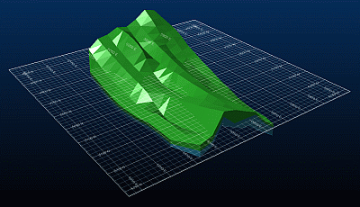
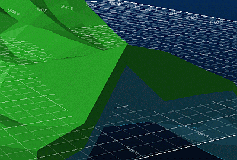
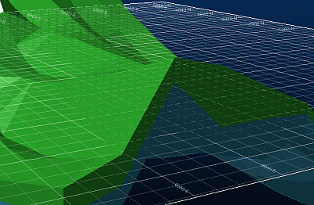

 |  3D Grids Using 3D Grids in the 3D window  
---|---  
  
# 3D Grids

## Creating 3D Grids

Grids allow the overall dimensions of a wireframe object along the X, Y and Z axes to be effectively displayed in the 3D window. Whereas 2D grids make it difficult to interpret the extents of a 3D data object in a direction that is not orthogonal to the view, 3D grids provide more visually-informative feedback of the dimensions of the object using either 3D hulls, or flat grids applied to sections.

3D Grids are created in the Sheets control bar by expanding the VR object, and right-clicking the Grids folder. They can then be configured, and applied to the loaded data in the 3D window, or to a selected section. Any grids that you create are listed in the Grids folder.

 |  Right-clicking a grid in the Grids folder allows you to rename, copy or delete it, as well as access the Grid Propertiesdialog.  
---|---  
  
## Applying 3D Grids

The Grid Type drop-down list in the Grid Propertiesdialog allows you to select a different type of grid. This is applied to the loaded object in the 3D window, or the selected section, when you click Apply. The available options are described in more detail below:

  * 3D Hull: allows the grid axes to be visualized as planar regions, creating a 3D grid that encompasses the extents of the object in the 3D window. The grid can then be configured using the tabs in the Grid Propertiesdialog, and theDisplay Mode drop-down list.  
  

  * Active Section: creates a flat grid in the plane of the active section. The active section is displayed in the drop-down list in the Sections toolbar, in the main menu.

By default, an infinite grid is created, and displayed over the active section. In the following image, the active section has been deselected in the Sections folder in the Sheetscontrol bar, allowing the grid to be displayed more clearly.  
  

  * Section Name: all available sections are displayed in theGrid Typedrop-down list. Select a section, and clickApplyin theGrid Propertiesdialog. The grid is applied to the relevant section.  

 |  To create a grid of finite size, specify its dimensions as follows:
    1. In the Sheetscontrol bar, expand the Sections folder.
    2. Right-click the active section, and select [Section Name] Properties....
    3. In theSection Propertiesdialog,Plane Dimensionsgroup, selectUse dimensions.
    4. In thePlane Sectionsgroup, specify the dimensions of the section plane in theWidth:andHeight:windows.
    5. In theSection Propertiesdialog, clickOK.
The finite grid is displayed in the 3Dwindow, in the plane of the active section:  
  
  
---|---  

## Display Mode

The Display Mode drop-down list allows you to control the way the grid interacts with the loaded object in the 3D window. The following options are available:

  * Normal: displays only the areas of the grid which should be visible in the 3D world:  
  

  * Show Hidden Lines: displays all areas of the grid - areas which should not be visible in the 3D world are shown using a broken line style:  
  

  * Always on Top: displays all areas of the grid using the same line style, regardless of whether they should be visible in the 3D world:  
  
