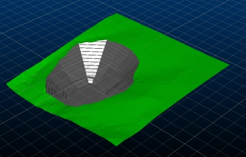
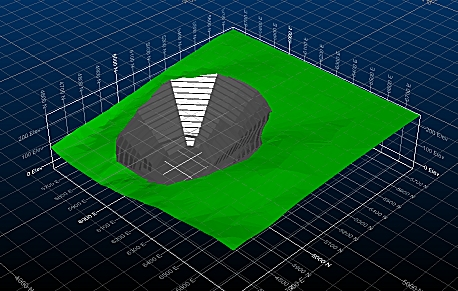
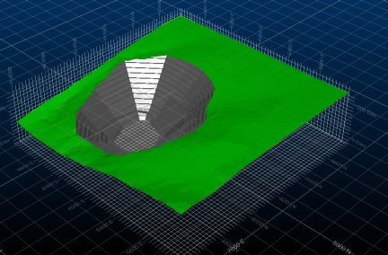

# Adding and Configuring 3D Grids

 |  Adding and Configuring 3D Grids Adding infinite and finite grids to the 3D window, and configuring their properties  
---|---  
  
# Overview

In this part of the tutorial, you will complete two exercises which demonstrate how to add and configure 3D grids in the 3D window.

## Prerequisites

  * Completed the exercise on the [Creating a New Project](<Creating_a_New_Project.md>) page.

  * [Files](<Tutorial_Files_List.md>) required for the exercises on this page:

  *     * _vb_qpittr

    * _vb_qpitpt

## Links to exercises

The following exercises are available on this page:

  * Adding and Configuring 3D Hull Grids

  * Adding and Configuring Flat Grids

## Exercise: Adding and Configuring 3D Hull Grids

In this exercise, you will create a 3D Hull grid, and configure it using the [Grid Name] Properties dialog.

  1. In the 3D window, type "ua" to unload any loaded objects.
  2. In the Project Files control bar, expand the Wireframes Triangles folder, and drag the _vb_qpitmergetr file into the 3D window using the mouse.
  3. In the 3D window, confirm that the open pit design is displayed:  
  
  

  4. In the Sheetscontrol bar, right-click the Grids folder, and select New | 3D Hull.
  5. In theGrids folder, confirm that an object named "Grid" has been created - and a new grid is shown in the 3D window, wrapped around the pit data:  
  
  

  6. In theGridsfolder, right-clickGrid, and selectRename.
  7. In theRename 3D Object Overlaydialog, type "3D Hull" in theName:box, and clickOK.
  8. In theGrids folder, double-click 3D Hull.
  9. In the 3D Hull Properties dialog, Grid Type: drop-down list, confirm that [3D Hull] is selected.
  10. In the Display Mode drop-down list, confirm that [Normal] is selected.
  11. In the Options tab, Line Formatting group, Line type: drop-down list, confirm that [Lines] is selected.
  12. In the Line Formatting group, select Fixed Intervals.
  13. In each Fixed Intervals box below the X, Y and Z check-boxes, specify a value of '20'.
  14. In the Major line every N: box, specify a value of '10'.
  15. In the Annotation group, confirm that Major lines onlyis not selected.
  16. In the Advanced Options tab, Constraints group, confirm that Snap to hull is selected.
  17. In the More Line Formatting tab, Minor line intensity % row, specify a value of '30' in each of the X, Y, Z and Border boxes.
  18. In the 3D Hull Properties dialog, click Apply.
  19. In the 3D window, confirm that the following 3D Hull grid has been applied to the loaded file:
  20. In the 3D Hull Properties dialog, click OK. The hull grid should be updated as follows:  
  
