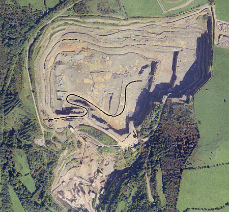

 |  Alignment Strings Alignment strings for guiding your 3D objects.  
---|---  
  
# Alignment Strings

Alignment strings are Strings objects that are used to guide 3D Objects when playing a simulation. The above image shows a single black string that follows the haul-road down into the open pit.

These strings can be used to represent a drive or flight path. The former can be used to define the route along which a vehicle(s) drives. To make a truck move along a road in and out of a pit, the truck must be attached to this string. A flight path string is used to simulate a flythrough; the view will change according to the route of the string.

These strings are created and conditioned using the various design commands which are available in the 3D window.