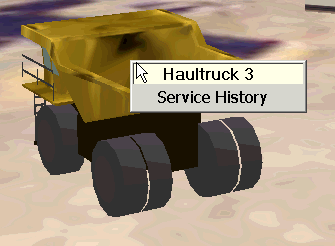
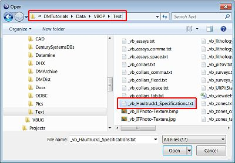
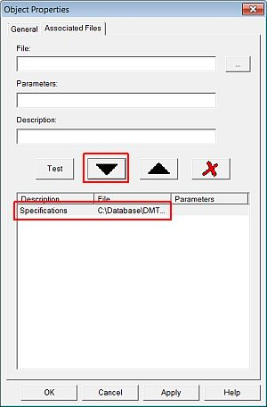
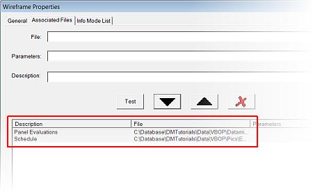
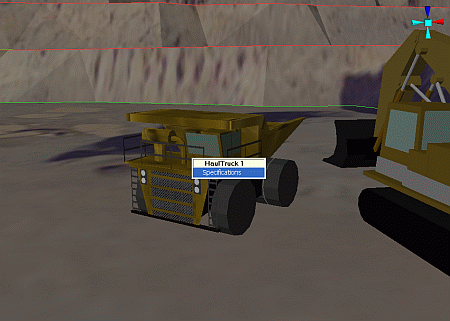
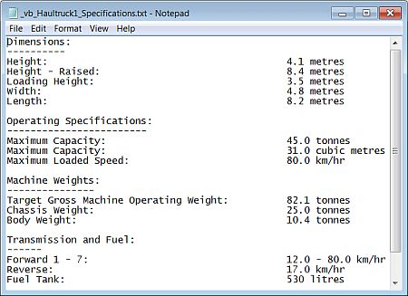
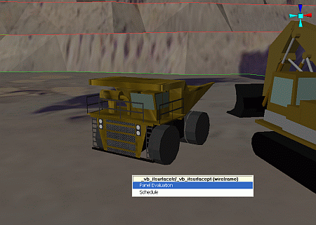
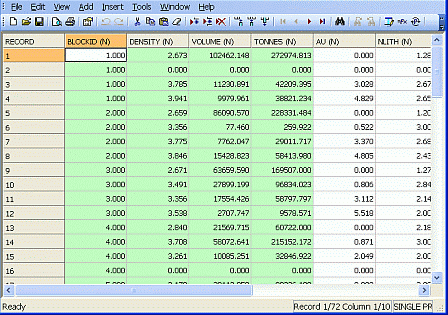
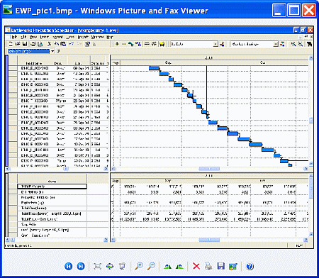

 |  Associating Information Files Associating information files with VR objects in your project.  
---|---  
  
# Overview

In this part of the tutorial you are going to associate information files with VR Objects and then view them in the 3D window.

Every object in the 3D window, i.e. both design objects (e.g. strings, drillholes, wireframes) and VR Objects, can have information files associated with them. Once defined, these associated files can be accessed simply by clicking on an object. For example, information files for objects can include:

  * machines: machine specifications, service history, dumping and loading schedules, maintenance records

  * drillholes: collar, log, assay data

  * ore body models: summary volumes, tonnes and grades or rock mass qualities, seismic images, graphs

  * open pit and underground workings: design and support specifications, planning and scheduling information

## Prerequisites

  * Created a new project and added all the required tutorial files i.e. the exercise on the [Creating a New Project](<creating_a_new_project.md>) page.

  * Created DrillRig 1, Excavator 1 and HaulTruck 1 VR Objects for your project i.e. the exercise on the [Placing and Adjusting VR Objects](<Placing_Adjusting_Viewing_VR_Objects.md>) page.

  * Files required for the exercises on this page:

  *     * _vb_blastmarks

    * _vb_itblastholes

    * _vb_itsurfacept

    * _vb_itsurfacetr

    * _vb_ITPhoto-Texture.jpg

    * _vb_itpitstrings

    * _vb_Haultruck1_Specifications.txt

    * _vb_panel_eval.dm

    * EWP_pic1.bmp

# Exercises

The following exercises are available on this page:

  * Associating Information Files with Objects

  * Viewing Associated Files

 |  Associate information files with objects when:

  * regularly viewing files, probably in a non-Datamine format, which are associated with geological modeling or mine planning objects
  * using VR to present a modeling or mine planning project in which multiple media types are used 

  
---|---  
  
## Exercise: Associating Information Files with Objects

In this exercise you are going to associate information files with both design and VR objects as follows:

  * a specifications text file with the HaulTruck 1 VR Object

  * an evaluation results table and a Gantt chart image with the open pit wireframe.

## Displaying the Exercise Data and Controls

  1. Unload any data that may be loaded as a result of a previous exercise.

  2. Select the Sheets control bar and expand the VRStrings , Wireframes and VR Objects folders.

  3. Load and select only the following objects (i.e. display these objects):  
  

     * _vb_blastmarks (strings)

     * _vb_itpitstrings (strings)

     * _vb_itsurfacetr/_vb_itsurfacept (wireframe)

     * DrillRig 1

     * Excavator 1

     * HaulTruck 1

## Associating a File with a VR Object

  1. In the Sheets control bar, VR Objects folder, right-click HaulTruck 1, select Properties.

  2. In the Object Properties dialog, select the Associated Files tab.

  3. In the File group, click Browse.

  4. In the Open dialog, browse to the folder C:\Database\DMTutorials\Data\VBOP\Text, select _vb_Haultruck1_Specifications.txt, click Open:  
  
  
  

  5. Back in the Associated Files tab, add a Description 'Specifications', click Test.
  6. In the Notepad dialog, check that the selected file is displayed, select File | Exit.
  7. Back in the Associated Files tab, click Add (the large Down Arrow).
  8. Check that a new entry has been added to the Associated Files List, click OK:  
  

## Associating Files with Design Objects

  1. In the Sheets control bar, Wireframes folder, right-click _vb_itsurfacetr/_vb_itsurfacept (wireframe).

  2. In the Object Properties dialog, select the Associated Files tab.

  3. In the File group, browse to the folder C:\Database\DMTutorials\Data\VBOP\Datamine\ISTS, select _vb_panel_eval.dm, click Open.

  4. Back in the Associated Files tab, add a Description 'Panel Evaluations', test and close the link, add the file to the list.

  5. In the File group, browse to the folder C:\Database\DMTutorials\Data\VBOP\Pics, select EWP_pic1.bmp, click Open.

  6. Back in the Associated Files tab, add a Description 'Schedule', test and close the link, add the file to the list.

  7. Check that the two new entries have been added to the Associated Files List, click OK:  
  

## Exercise: Viewing Associated Files

In this exercise, you are going to view the files associated with the HaulTruck 1 and the _vb_itsurfacetr/_vb_itsurfacept (wireframe) objects in the VR window.

 |  This exercise follows on directly from the above exercise and assumes that you have already associated the information files with the objects.  
---|---  
  
  1. In the Sheets control bar, VR Objects folder, right-click HaulTruck 1, select Outside View.
  2. In the 3D window, right-click on the haul truck, in the Information list select [Specifications]:  
  
  

  3. In the Notepad dialog, view the truck specification details, select File | Exit:  
  

  4. In the 3D window, right-click on the open pit wireframe, note that the information list contains two associated file entries, select [Panel Evaluation]:  
  

  5. In the Datamine Table Editor dialog, view the evaluation results, select File | Exit:  
  
  

  6. In the 3D window, again right-click on the open pit wireframe, select [Schedule]:

  7. View the Gantt chart schedule image, close the dialog:  
  

****Top of page