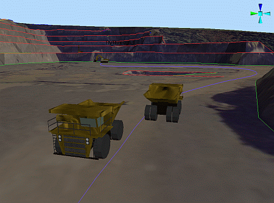
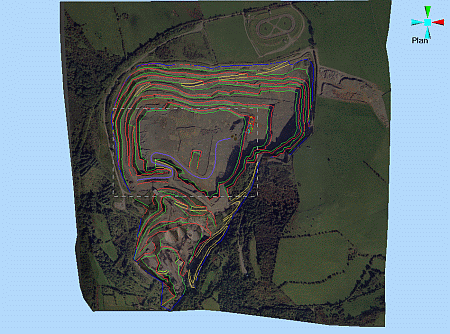
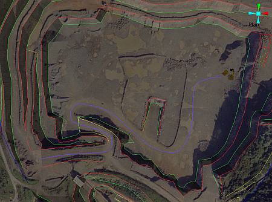
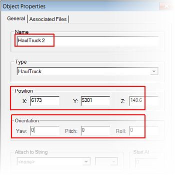
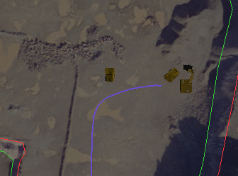
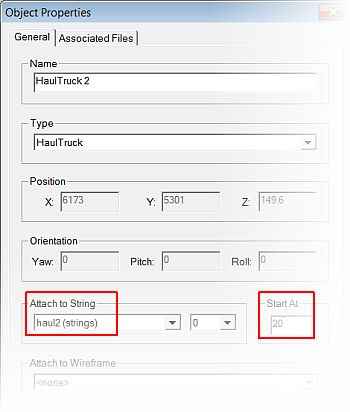
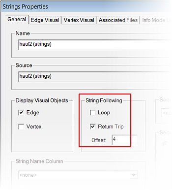
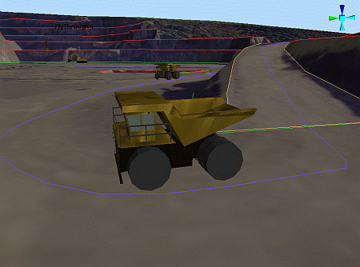

 |  Attaching Multiple Objects to a Path Attaching multiple VR Objects to a drive or flight path.  
---|---  
  
# Overview

In this part of the tutorial you are going to create a simulation with multiple haul truck objects attached to a single drive path.  
  
  

## Prerequisites

  * Created a new project and added all the required tutorial files i.e. the exercise on the [Creating a New Project](<Creating_a_New_Project.md>) page.

  * Attached the texture image to the topography surface i.e. the exercise on the [Attaching a Texture Image](<Attaching_a_Texture.md>) page.

  * Set up a drive simulation i.e. the exercises on the [Setting Up a Drive Simulation](<Settting_Up_a_Drive_Simulation.md>) page.

  * Set up a flythrough simulation i.e. the exercises on the [Setting Up a Flythrough](<Setting_Up_a_Flight_Simulation.md>) page.

  * [Files](<Tutorial_Files_List.md>) required for the exercises on this page:

  *     * _vb_itsurfacept

    * _vb_itsurfacetr

    * _vb_itblastholes

    * _vb_itblastmarks

    * _vb_itholes

    * _vb_itpitstrings

    * Haul2

# Exercises

The following exercises are available on this page:

  * Attaching Multiple VR Objects to a Drive Path

## Exercise: Attaching Multiple VR Objects to a Drive Path

## In this exercise you are going to create a simulation which contains two haul truck objects attached to a single drive path string. This will be done by:  

  * ## Creating a copy of HaulTruck 1

  * ## Defining object path and time delay settings

  * ## Defining the drive path's object offset parameters.

## Displaying the Exercise Data and Controls

  1. Load and select only the following check boxes (i.e. display these objects):  

     * _vb_blastmarks (strings)

     * _vb_itpitstrings (strings)

     * Haul2 (strings)

     * _vb_itblastholes (drillholes)

     * _vb_itsurfacetr/_vb_itsurfacept (wireframe)

     * DrillRig 1

     * Excavator 1

     * HaulTruck 1

 |  It is not necessary to hide any viewpoints, but make sure that any Sections which may interfere with the view are not displayed.  
---|---  
  2. Activate the View ribbon and check that Perspective is toggled ON.

  3. Select Zoom Fit | Zoom Plan

  4. Click Zoom Area and drag a zoom rectangle around the area containing the drive path string, the haul truck and excavator VR Objects, as shown below:  
  
  
  
  

## Creating a Copy of HaulTruck 1

  1. In the Sheets control bar, VR Objects folder, right-click HaulTruck 1, select Copy.

  2. Right-click HaulTruck 1 (1), select Properties.

  3. In the Object Properties dialog, General tab, define the Name, Position and Orientation parameters, as shown below, click Apply:  
  

  4. In the 3D window, check that HaulTruck 2 is positioned approximately 50m to the west of HaulTruck 1:  
  

## 

## Defining Object Path and Time Delay Settings

  1. In the Object Properties dialog, General tab, define the Attach to String and Start At parameters, as shown below, click OK:  
  
  
  

 |  TheStart At time parameter units are in seconds and represents the time delay for starting that object, from the start of the simulation. Multiple objects would thus require incrementally larger Start At time parameters in order to correctly stagger their start times.  
---|---  

## Defining the Drive Path's Object Offset Parameters

  1. In the Sheets control bar, Strings folder, right-click Haul2 (strings) select Properties.

  2. In the Strings Properties dialog, General tab, define the String Following parameters, as shown below, click OK:  
  
  

 |  If Return Trip is selected and multiple objects are attached to a path, defining an Offset parameter is recommended. This will make the vehicle travel at this offset from the string so that vehicles pass one another when travelling in opposite directions if more than one vehicle is attached to the string.  
---|---  

## Checking the simulation

  1. Activate the Report ribbon and select Animate | Start

  2. In the 3D window, check that the HaulTruck 1 and HaulTruck 2 objects are moving along their designated path according to the defined String Following and Start At parameters.  
  

****Top of page