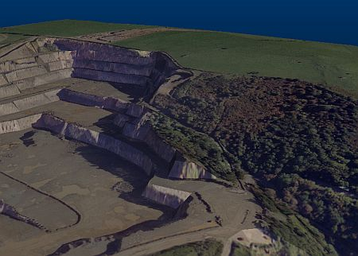
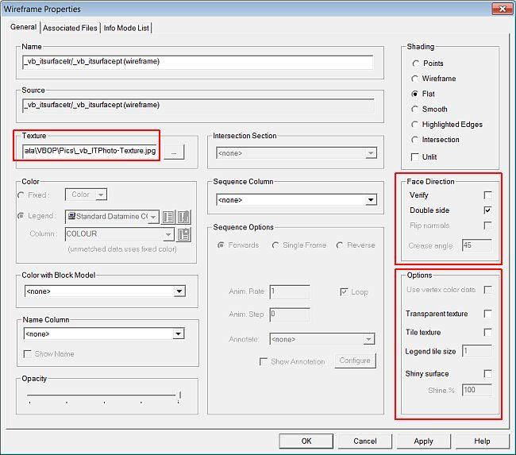
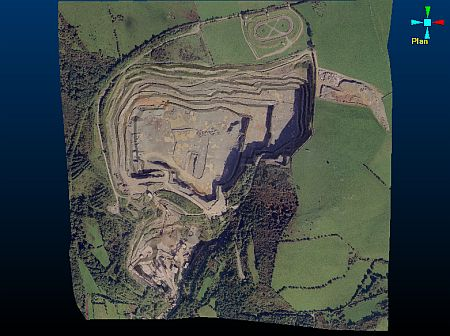

# Attaching a Texture Image

 |  Attaching a Texture Image to a Wireframe Surface Adding a texture image to a wireframe surface in the VR window.  
---|---  
  
# Overview

In this part of the tutorial you are going to apply a texture image to a wireframe surface.  

## Prerequisites

  * Created a new project and added all the required tutorial files i.e. the exercise on the [Creating a New Project](<Creating_a_New_Project.md>) page.

  * Loaded the required data i.e. the exercises on the [Loading Data into the 3D Window](<Loading_Data_Into_VR.md>) page.

  * [Files](<Tutorial_Files_List.md>) required for the exercises on this page:

  *     * _vb_itsurfacetr

## Exercise: Attaching a Texture Image

## In this exercise you are going to attach (and as a result, automatically drape) an aerial photograph image on to the combined open pit and topography surface wireframe.

## Displaying the Exercise Data and Controls

  1. Unload any data that is currently loaded as a result of previous exercises.

  2. Load the following file into the 3D window.

  3. Select the Sheets control bar.

  4. Display only the following object:  

     * _vb_itsurfacetr/_vb_itsurfacept (wireframe)

  5. Using the View ribbon, select Zoom Fit | Zoom Plan.

##  Attaching the Texture Image and Defining Options

  1. In the 3D window, double-click on the combined open pit and topography wireframe i.e. _vb_surfacetr/_vb_surfacept (wireframe) .
  2. In theWireframe Propertiesdialog,Generaltab,Texturegroup, clickBrowse.
  3. In theOpendialog, browse to the folderC:\Database\DMTutorials\Data\VBOP\Pics , select the file _vb_ITPhoto-Texture.jpg, click Open.  
| In order to have the3Dgraphics running a smoothly as possible, a check is made when images are loaded, to see if they are of a size that can be handled easily by the system. If the imported image is of a resolution that would cause operational problems in 3D due to the size of the file, it is automatically modified ('downsampled'). If downsampling is required, a dialog will be displayed in which the image dimensions can be defined.  
  
Make sure the Texture Size is not greater than the Maximum Single Texture Size. If it is, modify the Maximum Single Texture Size Width and Height fields to be the same as the Texture Size settings.  
---|---  
  4. Back in the Wireframe Propertiesdialog,Face DirectionandOptionsgroups, check and define the settings as shown below, clickOK:  
  

  5. In the 3D window, check that the image has been draped on to the wireframe, covering the entire top surface without any gaps e.g. in the corners or without duplication of parts of the image:  
  
  

  6. Select File | Save.

****Top of page