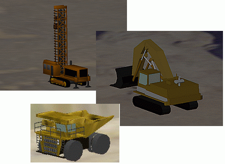
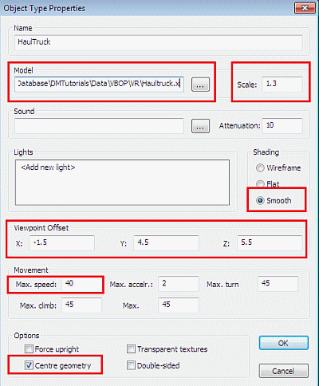
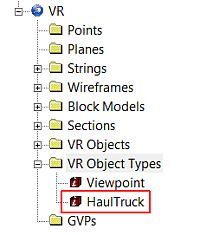
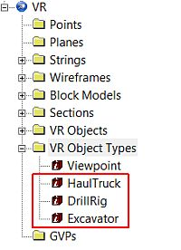
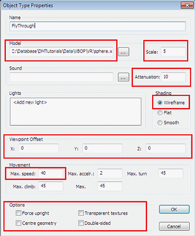
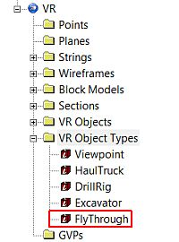

 |  Creating VR Object Types Creating different object categories for your VR project  
---|---  
  
# Overview

In this part of the tutorial you are going to create different Object Types for your project, which will be linked to existing MicroSoft DirectX objects. These will then be used in later exercises to add preformed objects to the 3D environment.  

## Prerequisites

  * Created a new project and added all the required tutorial files i.e. the exercise on the [Creating a New Project](<Creating_a_New_Project.md>) page.

  * Displayed the 3D Window i.e. the exercise on the [Introducing the 3D Window](<The_VR_Window_Principles.md>) page.

  * Loaded the required data i.e. the exercises on the [Loading Data into the 3D Window](<Loading_Data_Into_VR.md>) page.

  * Files required for the exercises on this page:

  *     * Haul truck.x

# Exercises

The following exercises are available on this page:

  * Creating VR Object Types

  * Creating a VR Object Type for Flythroughs

## Exercise: Creating VR Object Types

In this exercise you will create three VR Object Types, i.e. HaulTruck, DrillRig and Excavator, using existing DirectX objects (.x files) that form part of a standard installation, and which are located in the folder C:\Program Files (x86)\Datamine\StudioRM\VR.

## Creating a Haultruck VR Object Type

  1. In the Sheets control bar, right-click the VR Object Types folder, select New.
  2. In the Object Type Properties dialog, define the Name as 'HaulTruck'.
  3. In the Model group, click Browse.
  4. In the Open dialog, browse to the folder C:\Program Files (x86)\Datamine\StudioRM\VR (assuming a default 32-bit installation has been performed), select Haultruck.x , click Open.
  5. In the Object Type Properties dialog, define the Model, Shading, Viewpoint Offset, Movement and Options settings as shown below, click OK:  
  
  
  
| The Viewpoint Offset values are used to offset the Inside View position from the model (VR Object Type) reference point (often located at center of base) by defining offsets along the X, Y and Z object axes; where the Y axis points forward, X axis to the right and Z axis upwards, relative to the center of the object.The above Scale value is used to resize the DirectX model so that it accurately represents the object when it is added to the VR world. In this example, the scale value of 1.3 will create a haul truck approximately 8m long, about the size of a CAT 772 truck.  
---|---  
  6. In the Sheets control bar, VR Object Types folder, check that the new HaulTruck item is listed:  
  

## Creating the DrillRig and Excavator VR Object Types

  1. Using the method shown in the above steps, create a new 'DrillRig' object type, using:  
  

     * the drill rig.x model file
     * a Scale of '1'
     * the Viewpoint Offset vales: X set to '-1.5', Y to '4.5' and Z to '6'
     * a speed of 3.5 km/hr.
  2. Create a new 'Excavator' object type, using:  
  

     * the Excavator.x model file
     * a Scale of '2.5'
     * the Viewpoint Offset values: X set to '-1.5', Y to '4.5' and Z to '6'
     * a speed of 3.0 km/hr.
  3. In the Sheets control bar, VR Object Types folder, check that the new object types are listed:  
  

  4. Save your project using Project button (top left corner) and Save.

 |  Additional DirectX objects can be created using third party software.  
---|---  
  
## Exercise: Creating a VR Object Type for Flythoughs

In this exercise you will create a FlyThrough VR Object Type using the existing DirectX object file sphere.x, which is located in the folder

C:\Database\DMTutorials\Data\VBOP\VR.

## Creating a FlyThrough VR Object Type

  1. In the Sheets control bar, right-click the VR Object Types folder, select New.
  2. In the Object Type Properties dialog, define the Name as 'FlyThrough'.
  3. In the Model group, click Browse.
  4. In the Open dialog, browse to the folder C:\Program Files (x86)\Datamine\StudioRM\VR (assuming a default 32-bit installation has been performed), select sphere.x , and click Open.
  5. Back in the Object Type Properties dialog, define the Scale, Shading, Viewpoint Offset, Movement and Options settings as shown below, click OK:  
  
  
| The Viewpoint Offset values are used to offset the Inside View position from the model (VR Object Type) reference point (often located at center of base) by defining offsets along the X, Y and Z object axes; where the Y axis points forward, X axis to the right and Z axis upwards, relative to the center of the object.The above Scale value is used to resize the DirectX model so that it visible in the VR world.  
---|---  
  6. In the Sheets control bar, VR Object Types folder, check that the new FlyThrough item is listed:  
  

  7. Using the Project button (top left corner) to select Save.

****Top of page