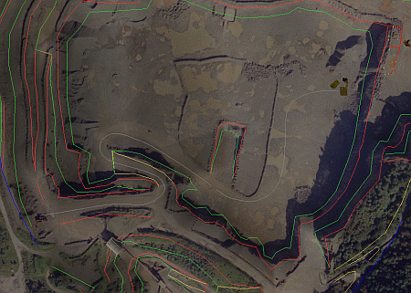
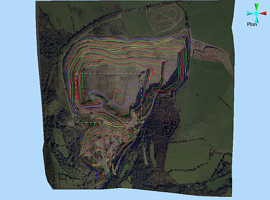
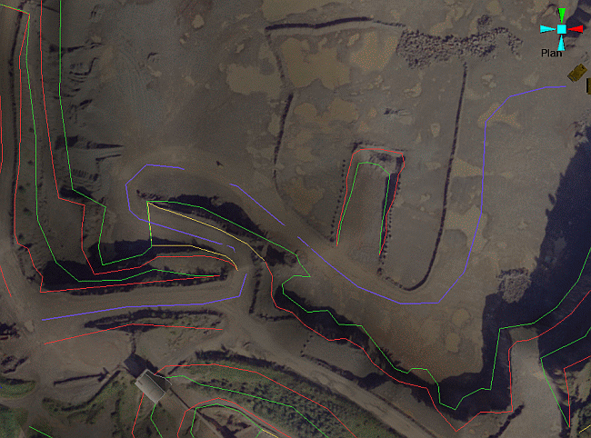

 |  Creating and Conditioning a Drive Path Creating and conditioning a drive path string in the VR window.  
---|---  
  
# Overview

In this part of the tutorial you are going to create and condition a drive path alignment string which will be used in a later exercise to create a drive simulation for a haul truck route in the 3D view.  
  
  

## Prerequisites

  * Created a new project and added all the required tutorial files i.e. the exercise on the [Creating a New Project](<Creating_a_New_Project.md>) page.

  * Attached the texture image to the topography surface i.e. the exercise on the [Attaching a Texture Image](<Attaching_a_Texture.md>) page.

  * Read the [View Modes](<VR_View_Modes_Principles.md>) and [Navigational Controls](<Navigation_Controls.md>) principles pages.

  * Files required for the exercises on this page:

  *     * _vb_itsurfacept

    * _vb_itsurfacetr

    * _vb_itblastholes

    * _vb_itblastmarks

    * _vb_itholes

    * _vb_itpitstrings

## Exercise: Creating a Drive Path String on the Open Pit Wireframe Surface

In this exercise you are going to create a new Strings object Haul2, then draw a drive path string on to the wireframe surface _vb_itsurfacetr/_vb_itsurfacept (wireframe).

## Displaying the Exercise Data and Controls

  1. Select the Sheets control bar and expand the 3D | Strings , Wireframes and VR Objects folders.

  2. Load and select only the following check boxes (i.e. display these objects):  
  

     * _vb_blastmarks (strings)

     * _vb_itpitstrings (strings)

     * _vb_itblastholes (drillholes)

     * _vb_itsurfacetr/_vb_itsurfacept (wireframe)

     * DrillRig 1

     * Excavator 1

     * HaulTruck 1

## Creating a Haul2 Strings Object

  1. In the Current Objects toolbar, select the Object Type [Strings], click Create New Object (default template option).

  2. In the same toolbar, check that the new [New Strings] object is listed in the Object box.

  3. In the Sheets control bar, right-click New Strings, select Rename.

  4. In the New Strings dialog, Properties tab, define the Object Name as 'Haul2'. 

## Drawing a String on the Wireframe Surface

 | Select Plan View before drawing the string. Place the string points so as to realistically represent the path that a haul truck would drive, along the selected route.  
---|---  
  
  1. Activate the View ribbon and select Zoom Fit | Zoom Plan

  2. Click Zoom Area and drag a zoom rectangle around the area shown below:  
  

  3. Activate the Home ribbon and expand the Snapping | Snap To menu - ensure the Wireframes toggle is active.

  4. Click inside the 3D window and type 'ns' to initiate a new-string command

  5. In the Current Objects toolbar, select the Attribute Field [COLOUR], the Attribute Value [7] (i.e. the purple color 7 from the palette).

  6. Using the right-mouse (i.e. snapping), draw string points on the wireframe's surface down the ramps, starting in the west, moving down into the open pit as shown below:  
  

  7. Click Cancel.

  8. Activate the Home ribbon and set the Snap To mode back to Points.

 |  The method used above places string vertices on the wireframe's surface. The lines joining these vertices i.e. the string's segments, will lie on, slightly above or slightly below the surface. The above image shows examples of this - gaps indicate string segments lying below the surface. The location of the lines is determined by the relative location of adjacent string vertex points; if adjacent points lie on the same wireframe triangle surface, then the line will also lie on that surface; if adjacent points lie on different wireframe triangles which have different orientations, then the line segment will lie above or below the surface. The string needs to be projected onto the wireframe surface in order to correct this, if an exact match is required.  
---|---  
  
## Exercise: Conditioning the String

 |  This exercise follows on directly from the one above and assumes that the basic drive path string Haul2 has already been drawn.  
---|---  
  
In this exercise, you are going to condition the drawn drive path string Haul2 in the following ways:

  * smooth it

  * project the smoothed string on to the wireframe surface

  * edit points.

## Smoothing the String

  1. Left click to select the digitized drive path string (if not still selected).
  2. Activate the Edit ribbon and select Condition | Smooth
  3. In the 3D window, check that your smoothed strings looks similar to that shown below i.e. including the gaps:  
  
  

## Projecting the String onto the Wireframe Surface

  1. Left-click the newly-smoothed string in the 3D window so it is highlighted (if not already).

  2. Activate the Edit ribbon and select Project | String to Wireframe

  3. In the 3D window, check that both the smoothed (yellow) and projected (light blue) strings are displayed:  
  

## Setting String Properties

  1. In the Sheets control bar, Strings folder, right-click Haul2, select Properties.

  2. In the Strings Properties dialog, General tab, make sure that the Return Trip check box is enabled.

  3. On the Lines tab, ensure that Display Lines is enabled (the default setting) and press OK.  

 |  Selecting the Return Trip option enables the object(s), that are using this as an alignment string during a simulation, to travel up and down the string in both directions. Loop will make the truck move along the string and when it gets to the end, start again i.e. travel in one direction only. The direction of travel is dictated by the order in which the strings points were digitized. This order can be changed by using the Edit ribbon's Condition | Reverse command.  
---|---  

****Top of page