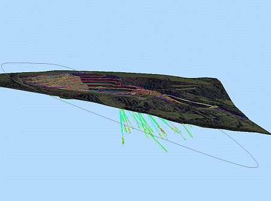
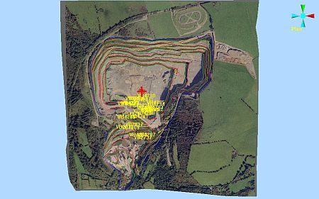
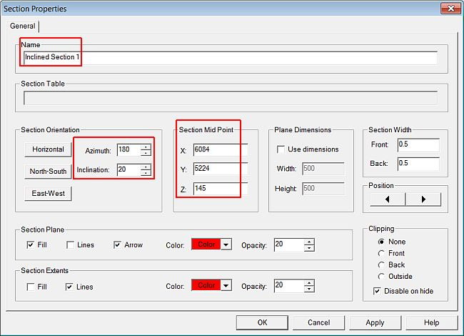
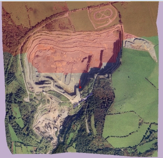
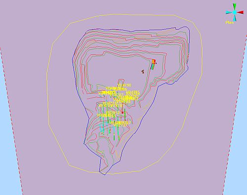
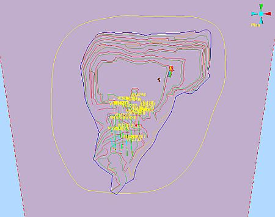
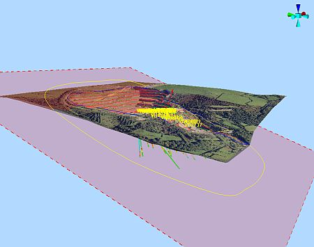

# Creating and Conditioning a Flight Path

 |  Creating and Conditioning a Flight Path Creating a flight path string in the VR window for use in flythroughs.  
---|---  
  
# Overview

In this part of the tutorial you are going to create and condition a flight path alignment string which will be used in a later exercise to create a flythrough simulation.

A flight path string is different from a drive path in that the string is typically not located on the surface of a wireframe, but is positioned above and/or below either the surface topography or mine workings. A Flythrough is typically used to give the impression of flying through the air over the pit or surface topography and for viewing features below the surface e.g. drillholes, the ore body model and underground workings.

## Prerequisites

  * Created a new project and added all the required tutorial files i.e. the exercise on the [Creating a New Project](<Creating_a_New_Project.md>) page.

  * Attached the texture image to the topography surface i.e. the exercise on the [Attaching a Texture Image](<Attaching_a_Texture.md>) page.

  * Read the [VR View Modes](<VR_View_Modes_Principles.md>) and [Navigational Controls](<Navigation_Controls.md>) principles pages.

  * [Files](<Tutorial_Files_List.md>) required for the exercises on this page:

  *     * _vb_itsurfacept

    * _vb_itsurfacetr

    * _vb_itblastholes

    * _vb_itblastmarks

    * _vb_itholes

    * _vb_itpitstrings

# Exercises

The following exercises are available on this page:

  * Creating a Flight Path String on an Inclined Section Plane

  * Conditioning and Setting String Properties

## Exercise: Creating a Flight Path String on an Inclined Section Plane

In this exercise you are going to create a new Strings object Flyby3, then draw a flight path string on an inclined section plane.

## Displaying the Exercise Data and Controls

  1. Select the Sheets control bar and expand the Strings , Wireframes and VR Objects folders.

  2. Select only the following check boxes (i.e. display these objects):  
  

     * _vb_blastmarks (strings)

     * _vb_itpitstrings (strings)

     * _vb_itblastholes (drillholes)

     * _vb_itholes (drillholes)

     * _vb_itsurfacetr/_vb_itsurfacept (wireframe)

     * DrillRig 1

     * Excavator 1

     * HaulTruck 1

## Creating a Flyby3 Strings Object

  1. In the Current Objects toolbar, select the Object Type [Strings], click Create New Object (default template option).

  2. In the same toolbar, check that the new [New Strings] object is listed in the Object box.

  3. In the Sheets control bar, right-click New Strings, select Rename.

  4. In the New Strings dialog, Properties tab, define the Object Name as 'Flyby3'. 

## Defining a New Inclined Section Plane

  1. Use the View ribbon to select Zoom Fit | Zoom Plan.

  2. In the Sheets control bar, right-click the Sections folder, select New.

  3. In the 3D window, right-click (snap) to indicate a point roughly in the centre of the small ramp, located in the middle of the pit, as shown below:  
  
  

  4. In the Orientation dialog, select Horizontal, click OK.

  5. Double click the new Section overlay.

  6. In the Section Properties dialog, define the Name, Section Orientation and Section Mid Point settings shown below, click OK:  
  

  7. In the 3D window, check that the new Inclined Section 1 section plane is visible and orientated as shown below:  
  

## Drawing a String on the Inclined Section Plane

 | Select Zoom Fit | Zoom Plan from the View ribbon before drawing the string. Place the string points so as to realistically represent the path that a haul truck would drive, along the selected route.  
---|---  
  
  1. In the Sheets control bar, Wireframes folder, hide the following objects:

     * _vb_itsurfacetr/_vb_itsurfacept (wireframe)

  2. Use the View ribbon to select Zoom Fit | Zoom Plan

  3. Click inside the 3D window and type 'ns' to initiate a new-string command.

  4. In the Current Objects toolbar, select the Attribute Field [COLOUR], the Attribute Value [7] (i.e. the color 7 from the palette).

  5. In the 3D window, using the left-mouse (i.e. NO snapping), draw an oval shaped string on the section plane, starting in the west, moving around in a clockwise direction, finally snapping (right-click) the last point on to the string start point, to give a closed shape similar to that shown below:  
  

  6. Click Cancel. 

## Exercise: Conditioning and Setting String Properties

 |  This exercise follows on directly from the one above and assumes that the basic flight path string Flyby3 has already been drawn.  
---|---  
  
In this exercise, you are going to condition the drawn flight path string Flyby3 by smoothing it.

## Smoothing the String

  1. In the 3D window, select the drawn flight path string (if not still selected).
  2. Activate the Edit ribbon and select Condition | Smooth
  3. In the 3D window, check that your smoothed string looks similar to that shown below:  
  
  

  4. In the Sheets control bar, Wireframes folder, redisplay the following object:

     * _vb_itsurfacetr/_vb_itsurfacept (wireframe)

  5. In the 3D window, rotate the view and note the position and orientation of the flight path string relative to the wireframe surface:  
  

## Setting String Properties

  1. In the Sheets control bar, Strings folder, right-click Flyby3, select ...Properties.

  2. In the String Properties dialog, General tab, select the Loop check box.  

 |  Selecting the Loop option enables the object(s), that are using this as an alignment string during a simulation, to continuously loop around from the start to the end of the string.  
---|---  
  3. In the String Properties dialog, Lines tab, define the Scale and Color settings:  
  
Scale: 2  
Color: Fixed - select color 56 (Magenta 4)

 |  Increasing the line thickness by setting the Scale factor and changing the color, makes the flight path more visible for presentation purposes. If required, the flight path string can also be hidden by, in the Sheets control bar, 3D | Strings folder, clearing the check box for this object.  
---|---  
  
****Top of page