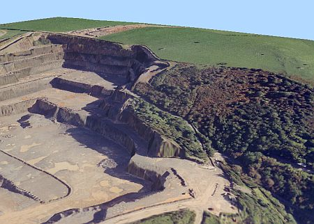
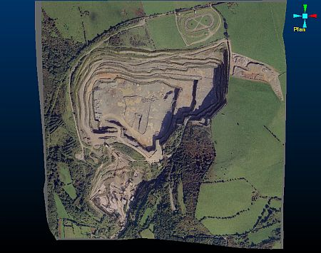
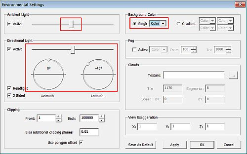
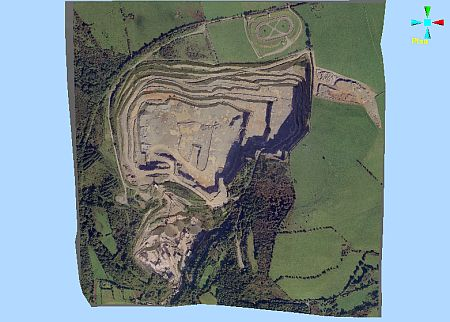

 |  Defining Environment Settings Defining environment settings for the virtual world.  
---|---  
  
# Overview

In this part of the tutorial you are going to define 3D environment settings to simulate a bright sunny day.  

## Prerequisites

  * Created a new project and added all the required tutorial files i.e. the exercise on the [Creating a New Project](<Creating_a_New_Project.md>) page.

  * [Files](<Tutorial_Files_List.md>) required for the exercises on this page:

  *     * _vb_itsurfacept

    * _vb_itsurfacetr

    * _vb_ITPhoto-Texture.jpg

## Exercise: Defining 3D Environment Settings

## In this exercise you are going to set the environment settings to simulate a bright sunny day for a loaded and textured pit and surface topograhy.

## Displaying the Exercise Data and Controls

  1. Unload any data that may be loaded from a previous exercise.

  2. Load the files into the 3D window by dragging them in from the Project Files control bar:  
  
_vb_itsurfacetr/_vb_itsurfacept (wireframe)

  3. Select the Sheets control bar.

  4. Display only the following object and its associated texture image:

     * _vb_itsurfacetr/_vb_itsurfacept (wireframe)

  5. Using the techniques gained from the previous exercise, drape the file _vb_ITPhoto-Texture.jpgonto the surface topography wireframe.

  6. Using the View ribbon, select Zoom Fit | Zoom Plan

  7. In the 3D window check that the environment, is associated with the data is a dark gradient background, as shown below:  
  

##  Defining the Environment Settings

  1. Double-click any empty area of a 3D window to display the Environmental Settings dialog.

  2. In the Environmental Settings dialog, define the Ambient Light, Background Color and Directional Light settings shown below, click OK:  
  
  

  3. In the 3D window, check that the view is as shown below:  
  

  4. Select File | Save.

****Top of page