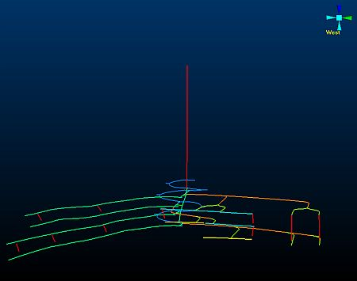
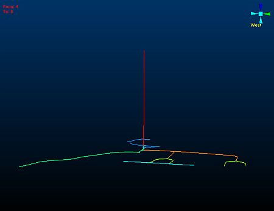

 |  Defining and Viewing a Sequence Animation Setting up and playing a sequence animation.  
---|---  
  
# Overview

In this portion of the tutorial you are going to set up and then view a sequence animation for an underground design strings model.

## Prerequisites

  * Created a new project and added all the required tutorial files i.e. the exercise on the [Creating a New Project](<Creating_a_New_Project.md>) page.

  * Files required for the exercises on this page:

  *     * _vsudesign (strings)

# Exercises

The following exercises are available on this page:

  * Defining a Sequence Animation for an Underground Design Strings Model

  * Viewing a Sequence Animation

## Exercise: Defining a Sequence Animation for an Underground Design String Model

In this exercise, you are going to set up a sequence animation for the underground design strings object _vsudesign , using the data column LEVEL to control the sequence.

## Displaying the Exercise Data and Controls

  1. Select the Sheets control bar and expand the Strings folder.

  2. Load and display only the following check boxes (i.e. display these objects):  

     * _vsudesign (strings)  

 |  It is not necessary to hide any viewpoints, but make sure that all Sections are not displayed.  
---|---  
  3. Right-click _vsudesign(strings), select Properties.

  4. In the Strings Properties dialog, Lines tab, define the following Scale and Color group settings, click OK:  
  
\- Column: select [M4DNUM] and select the default Legend for this column  
\- Scale: "2"

 |  The strings are coloured according to design element type (data column M24DNUM) and the column's default legend. The strings can be colored using either the same or a different data column used to control the sequencing. The Scale factor for the strings has been increased to '2' so as to make the strings more visible.  
---|---  
  
  1. Use the View ribbon to select Zoom Fit | Zoom West

  2. In the 3D window, double-click the background above the strings object.

  3. In the Environmental Settings dialog, Background Color group, select the Gradient option, click OK.

  4. In the 3D window, check that the underground design model is formatted and displayed as shown below:  
  
  

 |  The underground mine design shown above consists of drive centreline strings for both development and stoping excavation types. All of the design elements of a particular type have the same color. The strings can be colored using either the same or a different data column used to control the sequencing.  
---|---  

## Defining Object Sequence Settings

  1. In the Sheets control bar, Strings folder, right-click _vsudesign (strings), select Properties.

  2. In the String Properties dialog, General tab, define the following Sequence Column and Sequence Options settings, click OK:  
  
Sequence Column: select [LEVEL]  
Sequence Options: Select Forward, an Anim. Rate of "0.5", an Anim. Step of "1" and select the Loop Animation check box.  
Annotate: select [LEVEL] and select the Show Annotation check box.  

 |  The selected sequence column (data column) i.e. LEVEL, contains values representing underground working levels within the mine design, which consists of drive centreline strings for both development and stoping. All of the design elements falling within a particular mining level have the same level number.  
---|---  
  3. In the 3D window, check that the default annotation is displayed in the top left corner of the window, as shown below:  
  
  

 |  The values currently displayed to the right of the From and To labels represent the minimum and maximum values in the designated annotation field (data column) LEVEL respectively.  
---|---  

 |  Sequence animations can be defined for the following objects types:

  * Strings
  * Wireframes
  * Block Models

The techniques for setting up animations for these objects are the same as those used in this strings object exercise.  
---|---  
  
## Exercise: Viewing a Sequence Animation

| This exercise follows on from the first exercise on this page i.e. Defining a Sequence Animation for an Underground Design Strings Model.  
---|---  
  
In this exercise, you are going to view a global sequence animation using the underground design strings object _vsudesign and its defined sequence settings.

  1. Activate the Report ribbon and select Animate | Start

  2. In the 3D window, observe the displayed design elements as they are sequenced , starting at LEVEL 4.  
| It takes a while for the animation to progress initially as there are no underground design strings with a LEVEL value < 4.  
---|---  
  3. When the simulation reaches LEVEL 8, click Animate | Pause.
  4. In the 3D window, check that the following is displayed:  
  

  5. ClickAnimate|Pause to resume the animation.
  6. When the simulation has looped twice, click Animate | Stop.

| In this exercise, a global sequence animation was run using the Simulation toolbar. That means that all objects with defined sequence settings will be animated when the animation is started.In order to view sequence animations for individual objects, the object's Sequence Controls context menu option in the Sheets control bar is used.  
---|---  
  
****Top of page