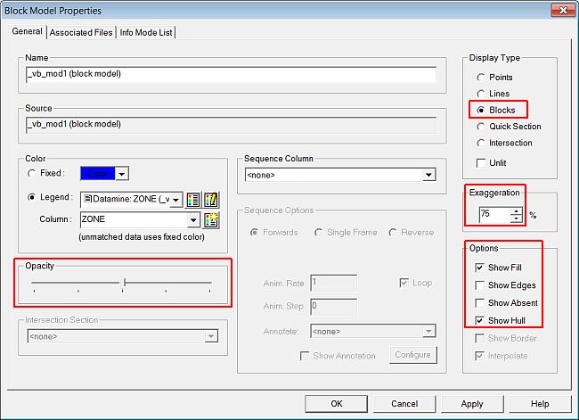
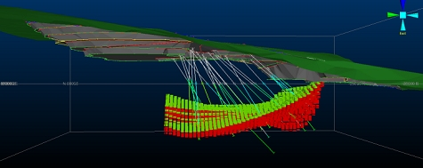
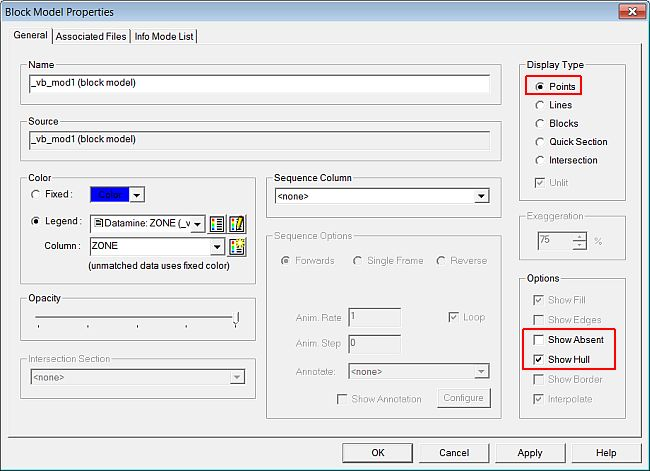
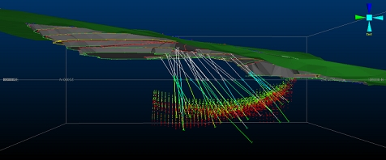
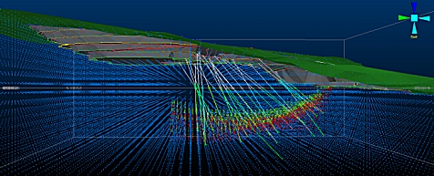

 |  Displaying Block Models Displaying block model data as points or blocks in the 3D window  
---|---  
  
# Overview

In this portion of the tutorial you are going to be introduced to the various point and block methods used to display block models in the 3D window.

## Prerequisites

  * Created a new project and added all the required tutorial files i.e. the exercise on the [Creating a New Project](<Creating_a_New_Project.md>) page.

  * Displayed the 3D Window i.e. the exercise on the [Introducing the 3D Window](<The_VR_Window_Principles.md>) page.

  * Displayed the 3D toolbars i.e. the exercise on the [Displaying the Toolbars](<Displaying_the_Toolbars.md>) page.

  * Loaded the required data i.e. the exercises on the [Loading Data into the 3D Window](<Loading_Data_Into_VR.md>) page.

  * [Files](<Tutorial_Files_List.md>) required for the exercises on this page:

  *     * _vb_itsurfacetr

    * _vb_itholes

    * _vb_itpitstrings

    * _vb_mod1

# Exercises

The following exercises are available on this page:

  * Displaying a Block Model as Blocks

  * Displaying a Block Model as Points

## Exercise: Displaying a Block Model as Blocks

 |  Use this method to:

  * view the full 3D extents of the block model relative to other data
  * view the outer surface of the block model without the need for interior details
  * present block model interpretations and estimates together with other data.

  
---|---  
  
 |  This is the most memory-intensive option, which may affect system performance adversely when viewing high-density block model data in conjunction with a restricted system hardware specification.  
---|---  
  
In this exercise, you are going to display the block model as blocks using a single overlay.

## Displaying the Exercise Data and Controls

  1. Unload any data that may be loaded from previous exercises.

  2. Remove all window splits or external windows to show a single 3D window.

  3. Load the following items into the 3D window by dragging them across from the Project Files control bar:  

_vb_itsurfacetr

_vb_itholes

_vb_itpitstrings

_vb_mod1

  4. Select the Sheets control bar and expand the 3D |Strings , Wireframes, Block Models,andSections folders.

  5. Select only the following objects (i.e. display these objects):  

     * _vb_itpitstrings (strings)

     * _vb_itholes (drillholes)

     * _vb_itsurfacetr/_vb_itsurfacept (wireframe)

     * _vb_mod1 (block model)

  6. Using the View ribbon, make sure the Perspective toggle is ON.

  7. Select Zoom Fit | Zoom Plan

## Displaying a Block Model as Blocks

  1. In the Sheets control bar, Block Models folder, right-click _vb_mod1(block model), select ...Properties.
  2. In the Block Model Properties dialog, General tab, define the following Opacity , Display Type, Exaggeration and Options settings, click OK:  
  
  

  3. Click Zoom Fit | Zoom East
  4. The block model data is now shown as blocks, colored on the ZONE field - most of the useful information is hidden behind the mass of ZONE=0 (blue) blocks. Time to get rid of them, then...
  5. Activate the Format ribbon and select Filter | Models.
  6. Enter the Expression "ZONE != 0" and click OK. The blue blocks are removed, revealing the more interesting ZONE = 1 and ZONE = 2 blocks.
  7. Activate the View ribbon and select Zoom Fit | Zoom East.
  8. Right-click the _vb_mod1 overlay in the Sheets control bar and select Look At:  
  

## Exercise: Displaying a Block Model as Points

 |  Use this method to:

  * view the full 3D extents of a block model as a point cloud, while still being able to easily view the associated drillhole data
  * view the interior details of a block model
  * present block model interpretations and estimates together with other data.

  
---|---  
  
In this exercise, you are going to display the block model as points using a single overlay. 

## Displaying a Block Model as Points

  1. In the Sheets control bar, 3D | Block Models folder, right-click _vb_mod1 (block model), select Properties.
  2. In the Block Model Properties dialog, General tab, define the following Display Type and Options settings, click OK:  
  

  3. In the 3D window, you should now see the following:  
  
  
| In the above image, each point is located at the centre point of each block model cell.  
---|---  
  4. Activate the Format ribbon and select Filter | Erase All - a view reminiscent of Star Wars appears:  
  

Play around with the block model formatting options - the various options will suit some situations more appropriately than others - try playing around the object-specific opacity settings as well as this can also help to improve the view of your data.

****Top of page