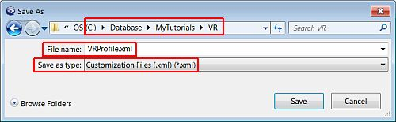

 |  Displaying the Toolbars Displaying the commonly used VR toolbars.  
---|---  
  
# Overview

In this portion of the tutorial you are going to display the commonly used VR window toolbars and create a user profile.

## Prerequisites

  * Created a new project and added all the required tutorial files i.e. the exercise on the [Creating a New Project](<Creating_a_New_Project.md>) page.

  * Displayed the VR Window i.e. the exercise on the [Introducing the VR Window](<The_VR_Window_Principles.md>) page.

  * [Files](<Tutorial_Files_List.md>) required for the exercises on this page:

  *     * none

# Exercises

The following exercises are available on this page:

  * Displaying the VR Toolbars

  * Saving the Toolbar Settings to a Profile

## Exercise: Displaying the VR Toolbars

In this exercise you are going to display the toolbars required for completing the exercises in this tutorial.

## Displaying Additional Toolbars

  1. Select the VR window.

  2. Select View |Customization | Toolbars | Boolean Operations.

  3. Select View |Customization | Toolbars | DTM Creation.

  4. Select View |Customization | Toolbars | Point and String Editing: Advanced.

  5. Select View |Customization | Toolbars | Texture.

  6. Select View |Customization | Toolbars | Wireframe Linking.

  7. Select View |Customization | Toolbars | Wireframe Selection.

  8. Move the toolbars and dock them where required.

 |  The above steps assume that the default toolbars are already displayed. If you are unsure about whether or not all the default toolbars are already displayed, use View | Customization | Customization States | Restore Defaults to restore the Studio 3 default toolbars and control bars.  
---|---  
  
## ****Top of page

## Exercise: Saving the Toolbar Settings to a Profile

In this exercise you are going to create a VR profile by saving the current toolbar, menu and control bar settings to a Customization File. This profile can be shared by users and loaded into Studio 3.

 | 

  * Create different profiles e.g. geological modeling, grade estimation, mine design, VR and save each of them to a separate Customization File (.xml)
  * Use Customization Files to:
  *     * save toolbar settings for different work profiles
    * create, manage and share standard profiles amongst users within your organization

  
---|---  
  
## Saving the Toolbar Settings to a Profile

  1. Select View |Customization | Customization State |Save....

  2. In the Save As dialog, define the path to your tutorial project folder and filename settings shown below, click Save:  
  
  

 | 
     * Each time Studio is exited, the current displayed toolbars, menu and control bars are saved to the default Customization File profile.xml, which is located under C:\Users\Username\AppData\Roaming\Datamine\Datamine Studio.
     * A custom profile can be loaded from a saved Customization File using View |Customization | Customization State |Load...  
---|---  

****Top of page

Checklist:

  1. The topic is stored in the relevant tutorial area of the RoboHelp X5 project.

  2. All topics created with this template are set at TOPIC-LEVEL to the relevant TUTORIAL build tag.

  3. Related topics are not normally required - use BROWSE SEQUENCES instead.

  4. Popups

  5. Browse sequences

  6. Index

  7. TOC

  8. Glossary Items

Also, please check the online Procedures project for more information.

Document History |   
---|---  
Date |  Description  
201106 | 

  * Added to reflect MR20 functionality

  
201202 | 

  * Updated to reflect MR21 functionality