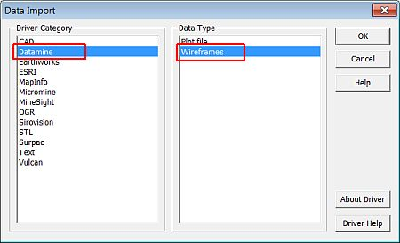
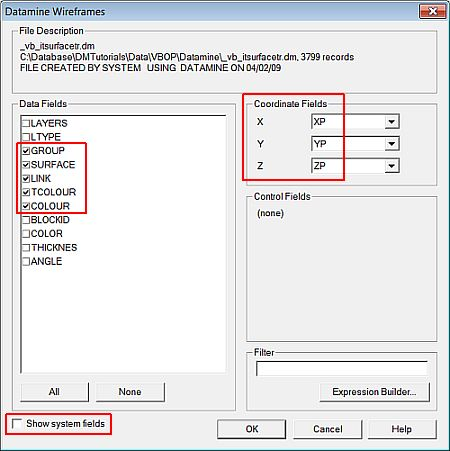
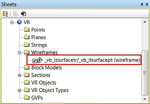
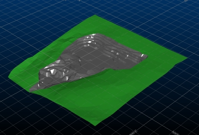
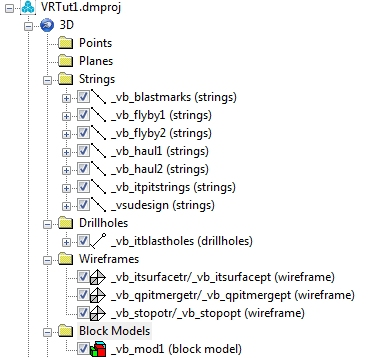
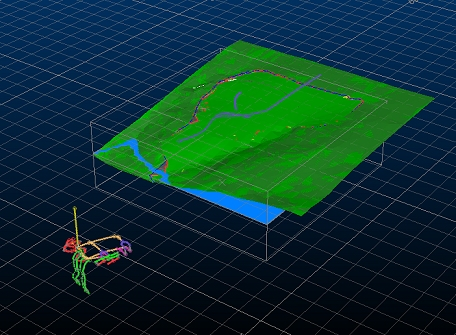

 |  Loading Data into the 3D Window Using different methods to load data into the 3D window  
---|---  
  
# Overview

In this portion of the tutorial you are going to load different types of data into the 3D window using two different methods. These are the Sheets folder context menu Import function and the drag-and-drop method from the Project Files control bar.

## Prerequisites

  * Created a new project and added all the required tutorial files i.e. the exercise on the [Creating a New Project](<Creating_a_New_Project.md>) page.

  * Displayed the 3D Window i.e. the exercise on the [Introducing the 3D Window](<The_VR_Window_Principles.md>) page.

  * [Files](<Tutorial_Files_List.md>) required for the exercises on this page:

  *     * _vb_itsurfacept

    * _vb_itsurfacetr

    * _vb_blastmarks

    * _vb_flyby1

    * _vb_flyby2

    * _vb_haul1

    * _vb_haul2

    * _vb_itblastholes

    * _vb_itholes

    * _vb_itpitstrings

    * _vb_mod1

    * _vb_stopopt

    * _vb_stopotr

    * _vsudesign

# Exercises

The following exercises are available on this page:

  * Importing a Wireframe Using the Sheets Control bar

  * Importing a Wireframe Using the Data Ribbon

  * Loading Data Using Drag-and-drop

## Exercise: Importing a Wireframe Using the Sheets Control Bar

In this exercise you are going to load the combined mined open pit and surrounding topography surface wireframe, files _vb_itsurfacetr.dm and _vb_itsurfacept.dm, into the 3D window. This will be done using the Sheets control bar, 3D | Wireframes folder context menu.

## Loading the Wireframe

 | This exercise shows you how to load data by specifying the drivers for a data import. This is not necessary with Datamine files (*.dm) as they will have default drivers associated with them, allowing them to be simply 'loaded' using alternative, easier functionality. However, an appreciation of data drivers is useful for loading non-Datamine format data files.  
---|---  
  
  1. In the Sheets control bar right-click on the 3D|Wireframes folder, select Load.

  2. In the Data Import dialog, select the Driver Category [Datamine] and the Data Type [Wireframes], click OK:  
  
  

  3. In the Open Source File dialog, browse for and select the wireframe triangles file _vb_itsurfacetr.dm in the folder C:\Database\DMTutorials\Data\VBOP\Datamine, click Open.

  4. In the next Open Source File dialog, select the wireframe points file _vb_itsurfacept.dm from the same folder, click Open.

  5. In the Datamine Wireframes dialog, below the Data Fields list, disable the Show system fields check box.
  6. Select only the following Data Fields, check that the Coordinate Fields are selected, as shown below, click OK:  
  
  
  
  
| This dialog can also be used to define a Filter Expression in theFilterfield, in order to selectively load/import a subset of the defined file's data.  
---|---  

## Checking that the Wireframe Has Been Loaded Correctly

  1. In the Sheets control bar, check that the wireframe object is listed in the Wireframes folder.  

 | When using the 3D window, 3D files containing visual data will always appear in the Sheets control bar immediately after loading. If a non-visual table, e.g. a results file, is loaded into the 3D window, it will not appear in the Sheets | 3D bar until such a time as it is modified so that you can associate a 3D overlay with it - you can find all non-visual data items, however, listed in the Loaded Data control bar.  
---|---  

   

  1. In the 3D window, check that the wireframe of the combined open pit and adjacent topography is displayed:  
  

## Exercise: Importing a Wireframe Using the Ribbon

In this exercise you are going to load the combined mined open pit and surrounding topography surface wireframe, files _vb_itsurfacetr.dm and _vb_itsurfacept.dm, into the 3D window. This will be done using the Sheets control bar, 3D | Wireframes folder context menu's Import function.

## Loading the Wireframe

  1. After all the hard work above - unload everything! Left-click inside the 3D window and type 'ua' to initiate the unload-all command. Click Yes to confirm that you wish to unload data, if it appears.

  2. This time, you're going to perform exactly the same function as above, but using the Data ribbon, so activate it now.

  3. Expand the External menu and select [Wireframe] (as in the above exercise, this is for learning purposes only; normally a .dm file can be loaded without selecting a driver, using the Datamine drop-down menu).

  4. Follow steps 2-6 in the first exercise:  
  
a) [Datamine] Driver Category, [Wireframes] Data Type  
b) Locate and load _vb_itsurfacetr.dm and associated points  
c) Select only GROUP, SURFACE, LINK, TCOLOUR and COLOUR fields

  5. You should see an identical result to before:  
  

## Exercise: Loading Data Using Drag-and-drop

In this exercise you are going to load additional data files into the 3D window by using the drag-and-drop method from the Project Files control bar.

## Loading the Files

 |  The drag-and-drop method can also be used to load files directly from aWindows Explorerdialog, directly into the3Dwindow. This action will , in addition to loading the files, also automatically add them to theProject Files,Loaded DataandSheetscontrol bars.  
---|---  
  
  1. Maintain the loaded data as from the previous exercise (don't unload it).

  2. Select the Project Files control bar, All Tables folder.

  3. Select, drag-and-drop the following files into the 3D window:  

     * _vb_blastmarks

     * _vb_flyby1

     * _vb_flyby2

     * _vb_haul1

     * _vb_haul2

     * _vb_itblastholes

     * _vb_itholes

     * _vb_itpitstrings

     * _vb_mod1

     * _vb_stopotr

     * _vsudesign

 | As an alternative to individually drag-and-dropping each file, use one of the following methods: 

  * <Shift> \+ click to select all the listed tables and <Ctrl> \+ click to deselect unwanted items, then drag-and-drop,
  * <Ctrl> \+ click to select individual files, then drag-and-drop.

  
---|---  
  
## Checking that the Files Have Been Loaded Correctly

  1. In the Sheets control bar, expand all the 3D folders and check that the following overlays are listed:  
  

  2. In the 3D window, check that the following drillholes, strings, wireframes and block model have been loaded:  
  

  3. Finally, as a test of memory, load and display the file _vb_itholes.dm using any of the previously taught methods.

****Top of page