 |  Navigating in the 3D Window How to move around and view data in the 3D window  
---|---  
  
# Overview

In this part of the tutorial you are going to be introduced to the different tools and methods used to view objects in the 3D window.

## Prerequisites

  * Created a new project and added all the required tutorial files i.e. the exercise on the [Creating a New Project](<Creating_a_New_Project.md>) page.

  * Displayed the 3D Window i.e. the exercise on the [Introducing the VR Window](<The_VR_Window_Principles.md>) page.

  * Loaded the required data i.e. the exercises on the [Loading Data into the VR Window](<Loading_Data_Into_VR.md>) page.

  * Read the [View Modes](<VR_View_Modes_Principles.md>) and [Navigational Controls](<Navigation_Controls.md>) principles pages.

  * [Files](<Tutorial_Files_List.md>) required for the exercises on this page:

  *     * _vb_itsurfacept

    * _vb_itsurfacetr

    * _vb_itblastholes

    * _vb_itholes

    * _vb_itpitstrings

# Exercises

The following exercises are available on this page:

  * Viewing Objects Using Basic View Controls

  * Using Viewpoints

  * Moving Around in Floating Mode

## Exercise: Viewing Objects Using Basic View Controls

In this exercise you re going to view objects using:

  * Standard views

  * Pan, Zoom and Spin

  * Look At view mode

 |  Navigation is achieved using the mouse and the arrow keys after a view mode has been selected. The ability to move around in the workspace is essential and will be required later in the tutorial, so spend a few moments getting used to the controls and how they affect the view of the on-screen data. Note that none of the functions described here will affect the loaded data in any way, other than the way it is viewed.   
---|---  
  
## Displaying the Exercise Data and Controls

  1. Select the Sheets control bar and expand all the 3D folders.

  2. Select only the following check boxes (i.e. display only these objects):  
  

     * _vb_itpitstrings (strings)

     * _vb_itblastholes (drillholes)

     * _vb_itholes (drillholes)

     * _vb_itsurfacetr/_vb_itsurfacept (wireframe)

  3. Activate the View ribbon and enable the Control icon:  
  
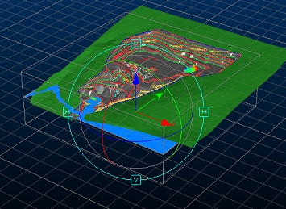

  4. The View Controller allows you to rotate the view around the current anchor point (known as the 'Look At' point). At the moment, the Look At point is set at it's default location, which is the centre of the loaded data.

  5. Left click inside one of the "H" (horizontal) boxes and drag-move the mouse - note how the view rotates in a horizontal plane around the data (remember it is the camera that is moving, not the data).

  6. Now do the same for one of the "V" (vertical) boxes.

  7. Next, click anywhere inside the central 'globe' - this time the movement is not restricted to a particular view axis.

  8. Leave the data view in any orientation and disable the Control toggle on the View ribbon.

## Selecting a Standard View

  1. Using the View ribbon, make sure the Look At mode is enabled:

  2. Expand the Zoom Fit menu and select Zoom Plan and check that the view is in plan i.e. seen from above and that it is fitted to the extents of the data, as shown below:  
  
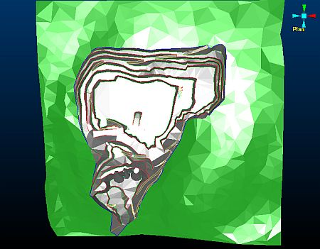

  3. Using the same menu as before, click ZoomWest and check that the view is fitted to the extents of the data and that the view direction is towards the west:  
  
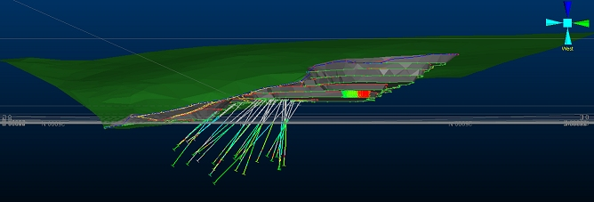  

 | As an alternative to using the standard view buttons shown above, double-click a colored axis (cone) of the Axis Controller displayed in the top right corner of the VR window, in order to align the view along the selected axis.  
---|---  
  4. Using the View ribbon, click Zoom Area drag a zoom rectangle around the drillholes, as shown below:  
  
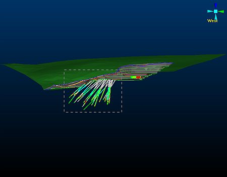

  5. Check that the view is zoomed in to the area shown below:  
  
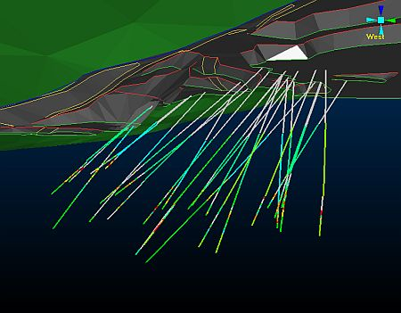

## Using Pan, Zoom View and Spin

  1. Select the View ribbon command - Zoom

  2. In the 3D window, click-and-drag the cursor up to zoom in, click-and-drag the cursor to zoom out.

  3. Select the View ribbon command - Pan

  4. In the 3D window, click-and-drag the cursor to pan (move) the view in the drag direction.

  5. Select the View ribbon command - Spin

  6. In the 3D window, click-and-drag the cursor to spin (rotate) the view about the centre of the view.

## Looking At Objects

  1. Select Zoom Fit | Zoom Plan

  2. In the Sheets control bar, expand the 3D |Strings and Wireframes folders.

  3. In the Strings folder, right-click _vb_itholes (drillholes).

  4. In the context menu select Look At.

  5. In the 3D window, check that your view is as follows:  
  
  

 |  In the above image, the drillholes are located beneath the wireframe surface of the open pit. Only some of the top ends of the drillholes are visible as small dots of color where they intersect or extend very slightly above the open pit (grey) wireframe surface.  
---|---  
  6. In the 3D window, double-click on the green cone of the Axis Controller (top-right corner of the 3D window) to set the view direction to looking south.

  7. In the 3D window, check that your view is now horizontal and that the drillholes are visible, as shown below:  
  
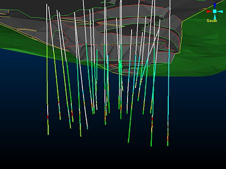  

## Looking At Items within an Object

  1. In the Sheets control bar, Drillholes folder, right-click _vb_itholes (drillholes).

  2. In the context menu select _vb_itholes (drillholes) Properties...

  3. In the Drillholes Properties dialog, General tab, select the Labels tab.

  4. In the Labels tab, select the Display Labels check box and click OK.

  5. Select Zoom Fit | Zoom Plan

  6. In the Sheets control bar, Strings folder, again right-click _vb_itholes (drillholes).

  7. In the context menu select Look At Individual Drillhole.

  8. In the Select String/Drillhole dialog, select [VB4267] from the list, click OK.:  
  
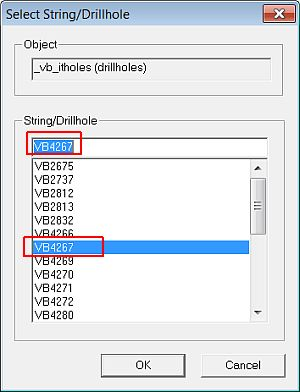  

  9. In the 3D window, check that your view of the drillhole VB 4267 is as shown below:  
  
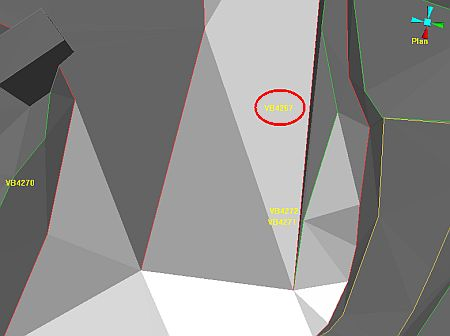  

## Exercise: Using Viewpoints

In this exercise you are going to create and rename two viepoints and then use them to view the data.

## Creating Viewpoints

  1. Click Zoom Fit | Zoom Plan

  2. Using the View ribbon, select Viewpoints | Store:  
  
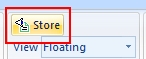

  3. Click Zoom Fit | Zoom West

  4. Click Zoom Area and drag a zoom rectangle around the drillholes, as shown below:  
  
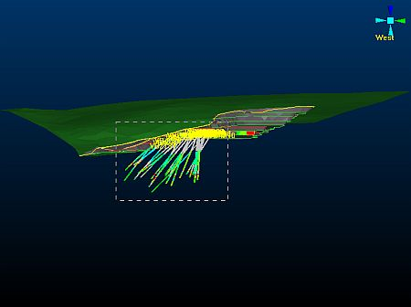  

  5. Using the View ribbon, select Viewpoints | Store:

  6. In the Sheets control bar, VR Objects folder, check that the following two new viewpoints are listed:  
  
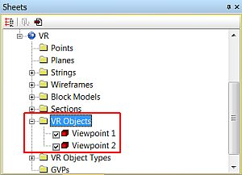

## Renaming the Viewpoints

  1. In the Sheets control bar, expand the VR Objects folder,

  2. Right-click Viewpoint 1.

  3. In the context menu, select Rename.

  4. In the Rename 3D Object Overlay dialog, change the Name to 'Plan View', click OK:  
  
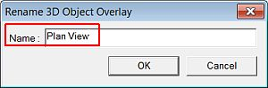

  5. Repeat the above steps for Viewpoint 2, renaming it to 'Drillholes West View'.

  6. In the Sheets control bar, note that the listed viewpoints have been renamed and ordered alphabetically.

## Selecting a Viewpoint

  1. Use the View ribbon to expand the View drop-down list and select [Plan View]

  2. In the 3D window, check that the view is as shown below:  
  
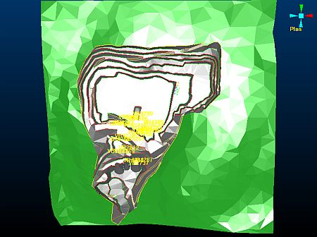  

  3. Select the [Drillholes West View]

  4. In the 3D window, check that the view is now as shown below:  
  
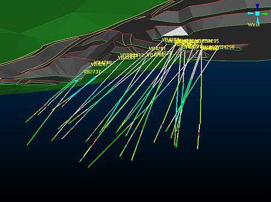  

 | Save all your regularly used views as Viewpoints and rename them using a suitable naming convention. These can then be used to quickly and easily return to required views when:  
  

     * modeling data
     * verifying and viewing data
     * using the 3D window as a means of presenting modeling and mining data to colleagues.   
---|---  

## Exercise: Moving Around in Floating Mode

In this exercise you are going to use the keyboard and mouse controls, when Floating View mode is selected, to move through the virtual world.

## Floating Viewpoint Mode

 |  This enables free movement around the virtual world without being attached to a fixed viewpoint, surface or flight path.  
---|---  
  
  1. Click Zoom Fit | Zoom East.

  2. In the 3D window, check that your starting view is as shown below:  
  
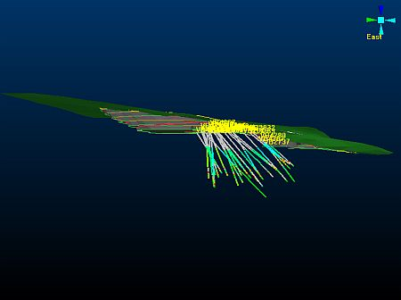  

  3. Disable Look At mode by disabling the toggle on the View ribbon:  
  
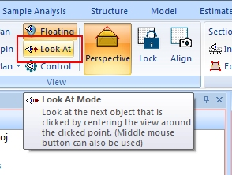

  4. In the 3D window, position the cursor in the middle of the view, using the left mouse button, <Shift> \+ left-click and then drag the cursor up towards the top of the screen.

  5. Observe how your view point (camera position) moves forwards through 3D space in the direction of the drillholes.

  6. <Shift> \+ left-click and drag downwards.

  7. Observe how your view point moves backwards away from the drillholes.

  8. <Shift> \+ left-click and drag the cursor left and then right.

  9. Observe how the view point is moved turning right and then left.

  10. <Shift> \+ right-click and drag the cursor up and then down.

  11. Observe how the view point is moved or panned up and then down.

  12. <Shift> \+ right-click and drag the cursor left and then right.

  13. Observe how the view point is moved or panned left and then right.

****Top of page