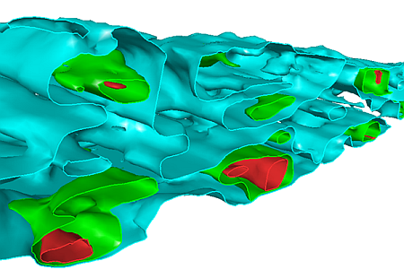
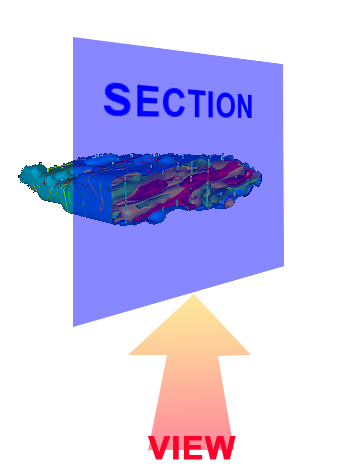

 |  Navigation Controls Changing the view orientation and position in the 3D window.  
---|---  
  
# Sections and Views  
  

The view position and orientation in the 3D window can be changed using standard views or interactive navigation. In addition, regularly used views can be saved as viewpoints, and those viewpoints can be retrieved at any time.

The majority of view-related commands are found on the View ribbon that is available when the 3D window is displayed.

Section vs. View - Whats the Difference?

Sections are working planes in 3D space which have user-definable location, orientation and extents parameters. They can be used for digitizing, slicing objects and viewing data within the3Dwindow. All sections are listed in theSheetscontrol bar, under theSectionsfolder, where their display can be controlled and managed using the context menus (by right-clicking on the folder or a listed section).

The distinction between section and view is important in the 3D window as they are independently managed.

Section |  View  
---|---  
A flat 3D object, the position of which is determined by a central reference point, an azimuth and an inclination value. A section has a definable height and width, and can be visualized in 3D alongside your loaded data. Sections are defined as 'Section Definitions'. One or more sections can be created within the same 3D window. What is a section used for?

  * as a way of creating a section through your data
  * as a way of setting clipping limits in 3D
  * as a plane upon which to design/snap/modify data
  * as a way of fixing the camera to a position orthogonal to your current design plane (e.g. by locking a section).

| An entity that governs from which position you view your data. It is the same as a 'camera' position and is defined by an XYZ position, yaw, pitch and roll. Although it is not a 3D object as such, you can display the position of all viewpoint names in their correct locations in the 3D window. View definitions are stored as 'Viewpoints'. One view can be assigned per data window (both fixed/split and external 3D views can support their own unique view). What is a viewpoint used for?

  * displaying your data from the most informative angle(s)
  * a container to store useful view orientations
  * a way of focussing attention on particular aspects of your data.

  
  
In the 3D window, you can change the orientation of the view of an unlocked section by:

  * Setting a standard (default) view such as those found in the Zoom Fit menu of the View ribbon, for example.
  * Saving a fixed viewpoint and using it later.
  * Importing a table containing a collection of section definitions, and automatically aligning the view to one of them
  * Moving the position of a section in an unlocked view, whereupon a locked view display will update accordingly
  * Freeform mouse movement in Floating mode, using the <SHIFT> key
  * Using any of the View ribbon's Pan, Zoom and Spin options, followed by interactive mouse movement.
  * Locking any view to the currently active section.
  * Selecting a 3D object and electing to 'look at' it.
  * Standing on your head...no wait...