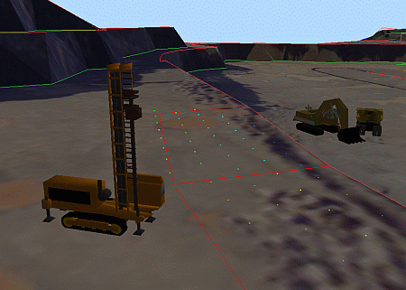
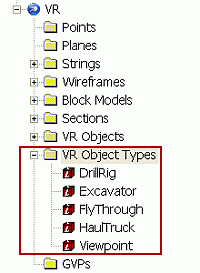
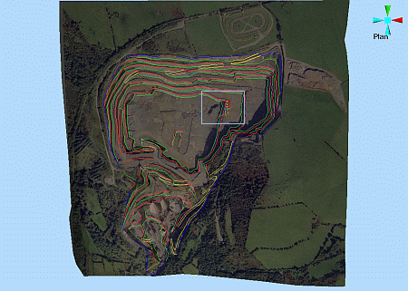
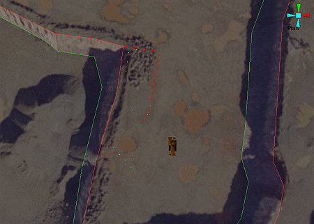
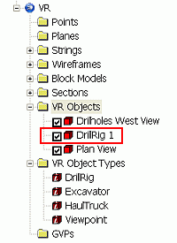
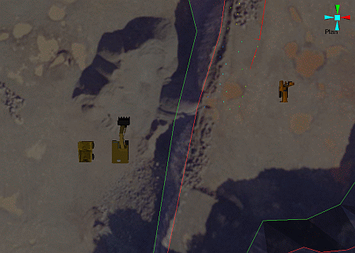
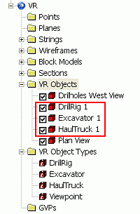
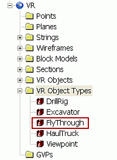
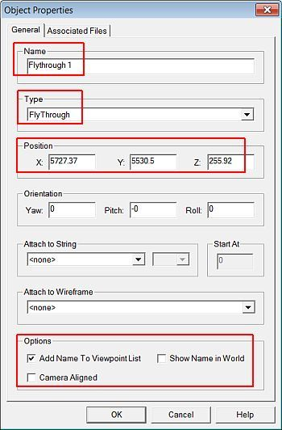

# Placing, Adjusting and Viewing VR Objects

 |  Placing, Adjusting and Viewing VR Objects How to place, move and orientate, then view VR Objects in your project.  
---|---  
  
# Overview

In this part of the tutorial you are going to position different VR Objects on the pit topography surface, using previously-defined VR Object Types.  

## Prerequisites

  * Created a new project and added all the required tutorial files i.e. the exercise on the [Creating a New Project](<Creating_a_New_Project.md>) page.

  * Created DrillRig, Excavator and HaulTruck VR Object Types for your project i.e. the exercise on the [Creating VR Object Types](<Creating_VR_Object_Types.md>) page.

  * Files required for the exercises on this page:

  *     * _vb_blastmarks

    * _vb_itblastholes

    * _vb_itsurfacept

    * _vb_itsurfacetr

    * _vb_ITPhoto-Texture.jpg

    * _vb_itpitstrings

# Exercises

The following exercises are available on this page:

  * Placing Objects

  * Creating a Flythrough Object

  * Adjusting Object Position and Orientation

  * Viewing VR Objects

## Exercise: Placing Objects

In this exercise you are going to interactively place three new VR Objects, at various positions on the wireframe surface, within the open pit. These new objects will be DrillRig 1, Excavator 1 and HaulTruck 1.

 |  Before a VR Object can be added to the 3D window, a VR Object Type needs to have been created for that particular object. This exercise assumes that the following VR Object Types exist in the project:  
  
  
  
---|---  
  
## Displaying the Exercise Data and Controls

  1. Select the Sheets control bar and expand the VRStrings and Wireframe folders.

  2. Load and select only the following objects (i.e. display these objects):  
  

     * _vb_blastmarks (strings)

     * _vb_itpitstrings (strings)

     * _vb_itsurfacetr/_vb_itsurfacept (wireframe) - apply the "_vb_ITPhoto-Texture.jpg" texture to this surface (located at C:\Database\DMTutorials\Data\VBOP\Pics)  

 |  It is not necessary to hide any objects in theVR Objectsfolder e.g. any existing viewpoints.  
---|---  

## Placing DrillRig 1 on the Wireframe Surface

  1. Use the View ribbon to select Zoom Fit | Zoom Plan

  2. Change the background color of the 3D window to a Light Blue (Fixed Color, no Gradient)

  3. Disable the view of the Default Grid.

  4. Click Zoom Area and drag a zoom rectangle around the blast holes on the bench in the north east, as shown below:  
  

  5. In the Sheets control bar, VR Object Types folder, right-click DrillRig, select Place Objects.

  6. In the 3D window, note that the shape of the cursor has changed to the Object Position Cursor.

  7. Left-click off to place a drill rig to the right of the blast holes, in the position shown below:  
  
  

 |  Clicking the left mouse button when placing an object will place the object onto the wireframe surface directly under the cursor.  
---|---  
  8. Right-click to end the place object mode.

  9. In the Sheets control bar, VR Objects folder, check that the new object is listed:  
  
  

 |  The name of the object can be changed using the Object Properties dialog.  
---|---  

## Placing Excavator 1 and HaulTruck 1 Objects on the Surface

  1. Using the methods and tools introduced in the above section, place an excavator and a haul truck on the bench below the drill rig, at the positions shown below:  
  
  

  2. In the Sheets control bar, check that the newly placed VR Objects are listed:  
  

## Exercise: Creating a Flythrough Object

In this exercise you are going to create and position a new object, FlyThrough 1, which will be used in later exercises for setting up and viewing a flythrough simulation.

 |  Before a VR Object can be added to the 3D window, it needs to have been created for that particular object. This exercise assumes that the following VR Object Types exist in the project:  
  
  
  
---|---  
  
  1. In the Sheets control bar, right-click the VR Objects folder, select New.

  2. In the Object Properties dialog, define the Name as 'FlyThrough 1', the Type, Position and Options shown below, click OK:  
  

  3. In the Sheets control bar, check that the new VR Object is listed.

 |  This FlyThough 1 VR Object is currently positioned in the northwest, in the air above the topography surface. This position coincides with the approximate start point of the flight path alignment string which will be created in the exercise on the [Creating a Flight Path](<Creating_and_Conditioning_a_Flight_Path.md>) page. This object is needed for use in creating flythrough simulations.   
  
---|---  
  
****Top of page