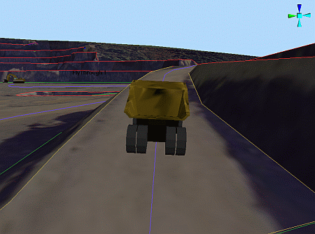
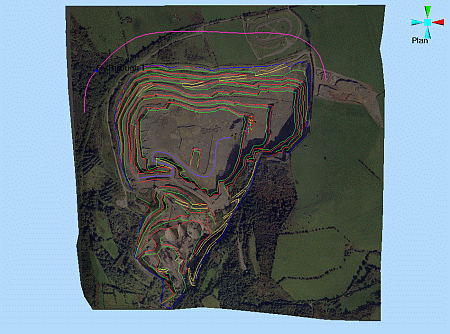
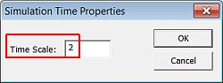

 |  Viewing a Simulation Playing and pausing stimulating simulations in the 3D window.  
---|---  
  
# Simulations

In this part of the tutorial you are going to view a simulation using the previously defined haul truck and flythrough simulations.  
  
  

## Prerequisites

  * Attached the texture image to the topography surface i.e. the exercise on the [Attaching a Texture Image](<Attaching_a_Texture.md>) page.

  * Set up a drive simulation i.e. the exercises on the [Setting Up a Drive Simulation](<Settting_Up_a_Drive_Simulation.md>) page.

  * Set up a flythrough simulation i.e. the exercises on the [Setting Up a Flythrough](<Setting_Up_a_Flight_Simulation.md>) page.

  * [Files](<Tutorial_Files_List.md>) required for the exercises on this page:

  *     * _vb_itsurfacept

    * _vb_itsurfacetr

    * _vb_itblastholes

    * _vb_itblastmarks

    * _vb_itholes

    * _vb_itpitstrings

    * Flyby3

    * Haul2

# Exercises

The following exercises are available on this page:

  * Playing a Simulation

## Exercise: Playing a Simulation

## Displaying the Exercise Data and Controls

  1. Load and display only the following objects (i.e. display these objects):  

     * _vb_blastmarks (strings)

     * _vb_itpitstrings (strings)

     * Haul2 (strings)

     * Flyby3 (strings)

     * _vb_itblastholes (drillholes)

     * _vb_itsurfacetr/_vb_itsurfacept (wireframe)

     * DrillRig 1

     * Excavator 1

     * FlyThrough 1

     * HaulTruck 1

 |  It is not necessary to hide any viewpoints, but make sure that any sections which may interfere with the view are not displayed.  
---|---  
  2. Use the View ribbon to select Zoom Fit | Zoom Plan

  3. In the 3D window, check that the open pit data, VR Objects and alignment strings are displayed, as shown below:  
  

## Playing the Simulation

 |  The following are required in order for object movement to be simulated:

  * one or more objects need to be placed in the 3D window
  * each object requires a defined alignment string (drive or flight path)
  * the alignment string requires appropriate String Following settings
  * each object's VR Object Type needs to have defined speed settings.

  
---|---  
  

  1. Activate the Report ribbon and select Animate | Play

  2. In the 3D window, check that the HaulTruck 1 and Flythrough 1 objects are moving along their designated paths, according to their defined String Following parameters, as shown below:  
  

  3. Click Animate | Pause to pause the simulation.
  4. Again click Animate | Pause to resume the simulation.
  5. Click Animate | Stop to return the objects to their default locations.

## Changing View Position While the Simulation is Running

  1. Restart the simulation.

  2. With the simulation playing in the 3Dwindow,

  3. In the Sheets control bar, VR Objects folder, right-click HaulTruck 1, select Outside View.

  4. In the 3D window, observe how the haul truck drives along the designated route.

  5. In the 3D View toolbar, Viewpoint drop-down, select [FlyThrough 1].

  6. Click View From Inside.

  7. In the 3D window, use <Shift> \+ right-mouse to rotate the view and observe the open pit data as the viewpoint is moving along.

  8. Click Animate | Stop to return the objects to their default locations.

  9. Activate the View ribbon and Zoom Fit | Zoom Plan

 | 

  * The alignment strings can be hidden by clearing the check-boxes associated with each object in the Sheets control bar, Strings folder.
  * The majority of the view controls can be used to select and adjust your view position while the simulation is playing.

  
---|---  
  
##  Adjusting Playback Speed Settings

  1. Activate the Report ribbon again and click Animate | Properties.
  2. In the Simulation Time Properties dialog, define a Time Scale factor of '2', click OK:  
  

  3. Using the techniques described in the sections above, replay, pause and view the simulation with these different settings.

****Top of page