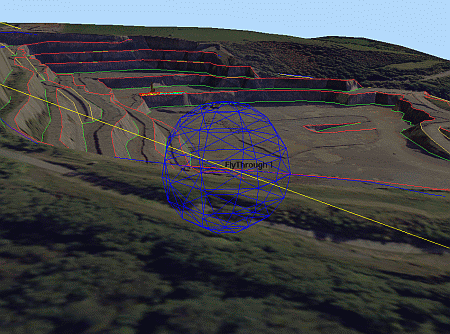
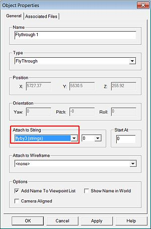
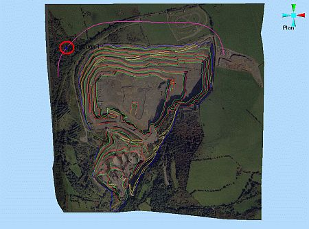

 |  Setting Up a Flythrough Setting up a flythrough simulation in the 3D window.  
---|---  
  
# Overview

In this part of the tutorial you are going to set up a flight simulation or flythrough using an existing flythrough VR Object and a flight path alignment string.  
  

.

## Prerequisites

  * Created a new project and added all the required tutorial files i.e. the exercise on the [Creating a New Project](<Creating_a_New_Project.md>) page.

  * Attached the texture image to the topography surface i.e. the exercise on the [Attaching a Texture Image](<Attaching_a_Texture.md>) page.

  * Added a HaulTruck 1 object i.e. the exercises on the [Placing, Adjusting & Viewing VR Objects](<Placing_Adjusting_Viewing_VR_Objects.md>) page.

  * Created a drive path alignment string i.e. the exercises on the [Creating a Drive Path](<Creating_and_Conditioning_a_Drive_Path.md>) page.

  * Files required for the exercises on this page:

  *     * _vb_itsurfacept

    * _vb_itsurfacetr

    * _vb_itblastholes

    * _vb_itblastmarks

    * _vb_itholes

    * _vb_itpitstrings

# Exercises

The following exercises are available on this page:

  * Setting Up a Flythrough Simulation

## Exercise: Setting Up a Flythrough Simulation

## Displaying the Exercise Data and Controls

  1. Select the Sheets control bar and expand the 3D |Strings , Wireframes and VR Objects folders.

  2. Load and select only the following check boxes in the Sheets control bar (i.e. display these objects only):  
  

     * _vb_blastmarks (strings)

     * _vb_itpitstrings (strings)

     * Flyby3 (strings)

     * _vb_itblastholes (drillholes)

     * _vb_itholes (drillholes)

     * _vb_itsurfacetr/_vb_itsurfacept (wireframe)

     * FlyThrough 1  

 |  It is not necessary to hide any viewpoints, but make sure that any Sections which may interfere with the view are not displayed.  
---|---  

## Specifying the FlyThrough Object's Alignment String

  1. In the Sheets control bar, VR Objects folder, right-click FlyThrough 1, select Properties.
  2. In the Object Properties dialog, Attach to String drop-down, select [flyb3 (strings)], click OK:  
  

  3. Select Zoom Fit | Zoom Plan
  4. In the 3D window, note that the FlyThrough 1 object is positioned approximately at the start of the flight path alignment string flyby3 , as shown below:  
  

 |  It is not necessary for the flythrough object to be positioned exactly on the alignment string, as it will temporarily attach itself to the string when the simulation is run.  
---|---  
  
****Top of page