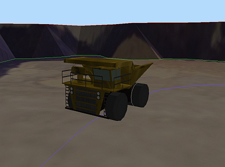
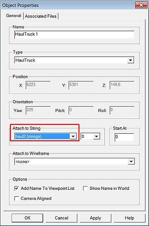
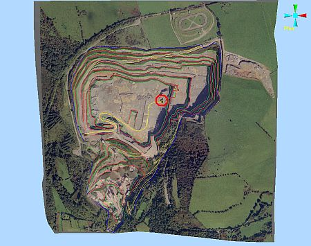

 |  Setting Up a Drive Simulation Setting up a drive simulation in the 3D window.  
---|---  
  
# Overview

In this part of the tutorial you are going to set up a drive simulation using an existing haul truck object and its alignment string.  
  
  

## Prerequisites

  * Created a new project and added all the required tutorial files i.e. the exercise on the [Creating a New Project](<Creating_a_New_Project.md>) page.

  * Added a HaulTruck 1 object i.e. the exercises on the [Placing, Adjusting & Viewing VR Objects](<Placing_Adjusting_Viewing_VR_Objects.md>) page.

  * Created the Haul2 drive path alignment string i.e. the exercises on the [Creating a Drive Path](<Creating_and_Conditioning_a_Drive_Path.md>) page.

  * [Files](<Tutorial_Files_List.md>) required for the exercises on this page:

  *     * _vb_itsurfacept

    * _vb_itsurfacetr

    * _vb_itblastholes

    * _vb_itblastmarks

    * _vb_itholes

    * _vb_itpitstrings

    * Haul2

## Exercise: Setting Up a Drive Simulation

## Displaying the Exercise Data and Controls

  1. Select the Sheets control bar and expand the 3D Strings , Wireframes and VR Objects folders.

  2. Select only the following objects (i.e. display these objects):

     * _vb_blastmarks (strings)

     * _vb_itpitstrings (strings)

     * Haul2 (strings)

     * _vb_itblastholes (drillholes)

     * _vb_itsurfacetr/_vb_itsurfacept (wireframe)

     * DrillRig 1

     * Excavator 1

     * HaulTruck 1

 |  It is not necessary to hide any viewpoints, but make sure that any Sections which may interfere with the view are not displayed.  
---|---  
  3. Using the View ribbon, check that Perspective is toggled ON.

## Specifying the HaulTruck Object's Alignment String

  1. In the Sheets control bar, VR Objects folder, right-click HaulTruck 1, select Properties.
  2. In the Properties dialog, Attach to String drop-down, select [Haul2 (strings)], click OK:  
  
  

  3. Use the View ribbon to select Zoom Fit | Zoom Plan
  4. In the 3D window, note that the HaulTruck 1 object is positioned approximately at the end of the drive path alignment string haul2 , as shown below:  
  
  
  
| It is not necessary for the haul truck to be positioned anywhere exactly on the alignment string, as it will temporarily attach itself to the string when the simulation is run.  
---|---  

****Top of page