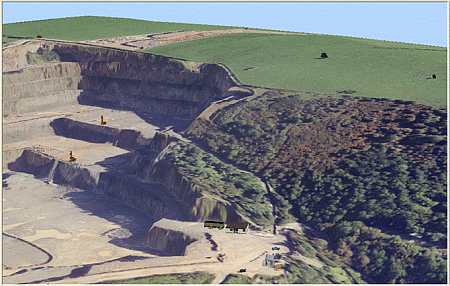

 |  Texture Image Draping An introduction to draping texture images in VR.  
---|---  
  
# Texture Image Draping

To make the wireframe surfaces in the virtual world more realistic, the following texture image types can be attached to a surface:

  * a pattern image e.g. a rock type texture or;

  * a realistic image of a large surface e.g. an aerial photograph, open pit or underground excavation face. 

If a pattern is used the texture image will not need alignment, but if a full surface image is used, alignment with the underlying wireframe is needed.

If an aerial photograph image is used, it is better if the photograph is:

  * Taken from vertically above the surface (it is best to obtain ortho-photographs),

  * taken when the sun is at an angle, so shadows can be used to help alignment ,

  * edited with image processing software such as Adobe® Photoshop or a similar product to manipulate the image size and quality as required.

It is also greatly beneficial if distinguishing features such as benchtoes and crests or other items easily recognised on the photograph are surveyed as strings or points to aid alignment. Use strings that cover a wide area of the image and give the strings a z coordinate value that is above surface level, otherwise the strings will be hidden by the texture.