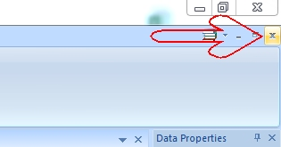
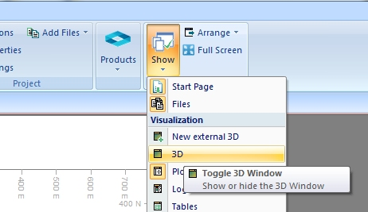
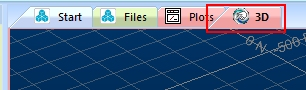
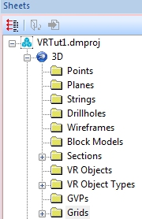
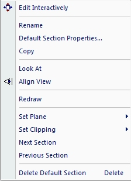

 |  The 3D Window An introduction to the 3D Window  
---|---  
  
# Overview

In this portion of the tutorial you are going to display the 3D window and familiarize yourself with the default toolbars and the Sheets control bar.

## Prerequisites

  * Created a new project and added all the required tutorial files i.e. the exercise on the [Creating a New Project](<Creating_a_New_Project.md>) page.

  * [Files](<Tutorial_Files_List.md>) required for the exercises on this page:

  *     * none

# Exercises

The following exercises are available on this page:

  * Displaying a 3D Window

  * Using the Sheets Control Bar

## Exercise: Displaying a 3D Window

In this exercise you are going to use different methods to display the 3D window. By default, this window will be displayed whenever a project is opened or created - however - it is possible to hide it (say, if you were working on a 2D plot sheet report and 3D data manipulation/visualization wasn't required).

## Displaying by Right-Click

  1. If you have a 3D window displayed, or available as a tab along the top of the viewing area (in which case, select it), use the 'x' in the top-right corner of the main application screen to close it:  
  

  2. Repeat step (1) for any available 3D window until none remain as tabs along the top of the data window. If any external 3D windows are available, close them.

  3. To show a 3D window, activate the Home ribbon and expand the Show drop-down menu to select the 3D option:  
  

  4. Check that the 3D window tab is displayed alongside the other window tabs at the top of the main window:  
  

## Exercise: Using the Sheets Control Bar

In this exercise you are going to familiarize yourself with the layout and functions available in the Sheets control bar.

  1. Select the Sheets control bar tab to display the Sheets control bar.

  2. Expand the 3D folder and all its sub folders, so that all the currently loaded items are listed:  
  

  3. In the Sections folder, right-click the Default Section object.

  4. Note that it has a context sensitive menu which provides a range of general and object specific functions:  
  
  
  
You'll get to explore more of these commands throughout this tutorial - 3D section functions in this menu and the associated properties dialog are used extensively in the 3D window to control not only visualization aspects of your project, but also the design environment in which you create, analyze and manipulate 3D data.

 |  The available context menu options vary according to the object type that has been selected.  
---|---  
  
****Top of page