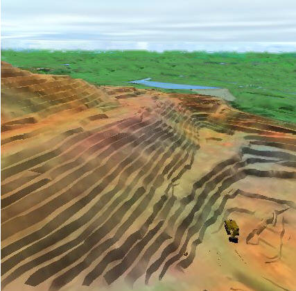

 |  VR Flythroughs Moving a virtual camera through your virtual world along a defined flight path.  
---|---  
  
# Overview

Flythroughs can be used to present your virtual world to others in a dynamic way using an alignment string to define a flight path. These can be used to view data in a controlled manner without the need to manually navigate through the data in Floating mode.

A fylthrough requires a 3D Object attached to a flight path alignment string, just as vehicles are attached to drive path strings. Any 3D Object type (except a Viewpoint) can be attached to a flight path alignment string and if required, hidden from view. When this is done, the flythrough simulation takes place along the flight path but without any visible moving object.