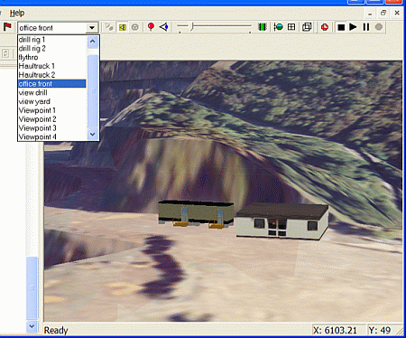

 |  3D Objects Adding preformed objects to your 3D world.  
---|---  
  
# VR Objects

To make the display of your data look more realistic you may need to add objects such as mining equipment, vehicles, buildings, trees etc.

In the image above, the Viewpoint List has been used to view the office object, by selecting [Office Front]. Every object is derived from an object type. 

 |  Each Object Type is a Microsoft DirectX file, (.x). Examples include LandRover, Haultruck, Chair and Laptop.  
---|---  
  
There are various options associated with Object Type. To access these options, right click either on the Object Type folder or the Object Type itself.