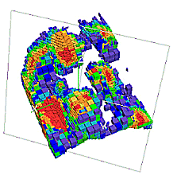
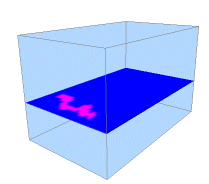
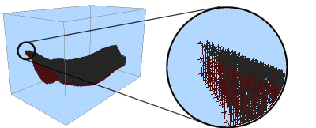
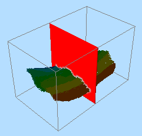

 |  Block Models in 3D Displaying block model data in the 3D window  
---|---  
  
# Displaying Block Model Data in 3D

The 3D window is capable of displaying all standard Datamine block model data i.e both *.dm format and block model data imported from other sources. The main viewing functionality includes being able to:

  * import block model data from a wide variety of sources, using Studio's Data Source Drivers functionality.

  * display block model data as blocks, lines, points, quick sections or intersection sections.

  * animate block model data in a fashion already popular with Studio Visualizer application users; by building up a model set according to a nominated field held within the object's underlying database. You can set any existing object field as a sequencing field for the purposes of animation.

  * interactively and dynamically view cross-sectional data, with graphical output displayed according to whichever legend you require.

  * exaggerate block model cell sizes.

  * access object information using the Information Mode function.

## Block Models Overview

In the mining environment, block models represent three-dimensional shapes, volumes, tonnages and grades of solids such as ore zones, waste zones and other volumes of geological or mineralogical interest. Models are usually designed and made to be manipulated or processed in such a way as to enhance the understanding of the modeled situation.

Block models consist of blocks, which are cubes or cuboids, packed together to fill the defined volume as closely as the block sizing criteria will allow.

## Viewing Options

Several display types are available to you when displaying 3D representations of block models:

Quick Sections

Block model display options are set using an object-sensitive Block Model Properties dialog, accessed from the Project Files control bar (all objects of this type are held in the Block Models sub-folder). Once data is imported, it is viewed by default as a single quick section through the data, e.g.:

You can adjust the position and orientation of this section by right-clicking the block model object in the Project Files control bar and selecting the Section Controls option (note that this option is only available when an object is currently viewed as a quick section). This displays the Section Control dialog, which will allow you to reposition and reorient the section plane. Additional block model overlays can be defined so that multiple quick sections can be displayed with different orientations.

Intersection Sections

This display type uses the default or custom defined section to create an intersection section for the block model with the defined section's plane. Additional block model overlays can be defined so that multiple intersection sections can be displayed with different locations and orientations:

You cannot view block model section data in conjunction with a sequencing animation.

Blocks

You can also view your block model as block model cells, with each block representing the total volume of a block model cell.

Each block model 'block' can be colored according to a legend key, as with all other block model view formats. Block views can also be animated according to a sequencing field (see 'Block Model Sequencing Animations', below, for more information.

 |  This is the most memory-intensive option, which may affect system performance adversely when viewing high-density block model data in conjunction with a restricted system hardware specification  
---|---  
  
Points

It is also possible to view block model data as a cloud of points. These points, as with all viewing formats, are subject to coloring via an applied legend (or fixed color).

Point views of block model data can also be animated according to a sequencing field (see 'Block Model Sequencing Animations', below, for more information.

Lines

Another viewing option is to view your block model as a set of independent lines). Viewing a block model as lines helps to portray more of the geometry of a block model data set with less effect on system resources.

Line views of block model data can also be animated according to a sequencing field (see 'Block Model Sequencing Animations', below, for more information.

## Displaying a Mixture of Formats

It has already been described how to show more than one section of the same block model on screen simultaneously (see "Viewing Multiple Sections Simultaneously"). You can extend this functionality to show each loaded instance of a data object in a different way. To do this:

  1. Load a block model file and view it in format A (e.g as a section view).

  2. Load the same block model file again and view it in format B (e.g as filled blocks).

As each object is independent, you could even filter one object to show a particular type of data only (for example, areas where grade values are above a certain cutoff), and superimpose, say, a points view to give an indication of the full orebody geometry.

Block Model Sequencing Animations

When viewed as blocks, points or strings, it is possible to apply a sequence animation. This animation can be configured and played back entirely from within your InTouch application. You can even record the results to an AVI or WMV video file using the standard simulation recording functions (see Related Topics for more information).

Loading multimedia control...

The Block Model Properties dialog for a data set viewed in this way allows you to select any numeric field, held within the block model database, that can be used to define how the view of the model is built up on screen. For example, if you were to select the IJK field to represent the sequencing order, you could then use the Sequence Control dialog (right-click the block model in the Project Files control bar and select the Sequence Control option - note that this option is only available if a sequencing field has already been defined for the selected object).

This dialog is used to set up the start and end points of the animation, and to control playback on screen. once an animation is setup, you can record the final screen activity to an external AVI or WMV file using the Simulation toolbar controls (for more information, refer to your online Help).

 |  It is not possible to define more than one sequencing field for each loaded object.  
---|---