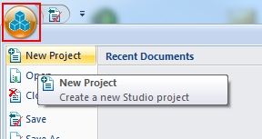
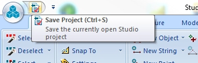

 |  Creating a New Project Creating a new project file for the 3D tutorial.  
---|---  
  
# Overview

In this part of the tutorial you are going to create a new project, add files and save the new project.

## Prerequisites

  * Check that you have the tutorial data folders. These are located (with a standard installation) under C:\Database\DMTutorials. This path should exist and contain two sub-folders; Data and Projects. These contain data and project files that will be used in the various exercises.

  * If you cannot locate these folders, please contact your Datamine support consultant.

  * Read through the pages under the tutorial heading "Principles"

## Exercise: Creating and Saving a New Project

In this lesson, you are going to create a new project "VRTut1" , in a new folder C:\Database\MyTutorials\3D, add the relevant data files and then finally save the project.

## Creating the new Project and Adding Files

  1. (Re)launch your application and click the Project button in the top-left corner of the screen. Select New Project:  
  

  2. If the Studio Project Wizard (Welcome ...) dialog is displayed, click the Next button (The welcome screen isn't shown if the 'Skip this page in future' option was selected the last time a new project was created).

  3. In the Studio Project Wizard (Project Properties) dialog, define the Name as ''VRTut1', new folder Location as 'C:\Database\MyTutorials\3D', select the settings as shown below, click Project Settings...

  4. In the Project Settings dialog, Automatic Project Updates group, set the options shown below, click OK:  

Detect new files in the project folder when the project is opened: selected  
Detect files added to or removed from the project while the project is open: selected  
Automatically update project (no prompts): selected  
  
Leave all other settings in their default state.  

  5. Back in the Studio Project Wizard (Project Properties) dialog, click Next.

  6. In the Studio Project Wizard (Project Files) dialog, click Add File(s)....

  7. In the Select files to add to new project dialog, browse to the folder C:\Database\DMTutorials\Data\VBUG\Datamine,

  8. Select the following file, click Open:  
  

     * _vsudesign.dm

  9. Back in the Studio Project Wizard (Project Files) dialog, again click Add File(s)....

  10. In the Select files to add to new project dialog, browse to the folder C:\Database\DMTutorials\Data\VBOP\Datamine,

  11. Select the following files using <Ctrl>+click, click Open:  
  

     * _vb_blastmarks.dm

     * _vb_flyby1.dm

     * _vb_flyby2.dm

     * _vb_haul1.dm

     * _vb_haul2.dm

     * _vb_itblastholes.dm

     * _vb_itholes.dm

     * _vb_itpitstrings.dm

     * _vb_mod1.dm

     * _vb_qpitmergept.dm

     * _vb_qpitmergetr.dm

     * _vb_stopopt.dm

     * _vb_stopotr.dm

  12. Back in the Studio Project Wizard (Project Files) dialog, again click Add File(s)....

  13. In the **Select files to add to project** dialog, browse to the folder C:\Database\DMTutorials\Data\VBOP\Datamine\ISTS,
  14. Select the following files using <Ctrl>+click, click Open:  
  

     * _vb_panel_eval.dm
  15. Back in the Studio Project Wizard (Project Files) dialog, again click Add File(s)....

  16. In the **Select files to add to project** dialog, browse to the folder C:\Database\DMTutorials\Data\VBOP\Pics,
  17. Set the Files of Type drop-down option to [All Files (*.*)], select the following file(s), click **Open** :  
  

     * _vb_ITPhoto-Texture.jpg
     * EWP_pic1.bmp
  18. Back in the Studio Project Wizard (Project Files) dialog, again click Add File(s)....
  19. In the **Select files to add to Project** dialog, browse to the folder C:\Database\DMTutorials\Data\VBOP\Text,
  20. Set the Files of Type drop-down option to [All Files (*.*)], select the following file(s), click **Open** :  
  

     * _vb_Haultruck1_ Specifications.txt
  21. Back in the Studio Project Wizard (Project Files) dialog, again click Add File(s)....

  22. In the **Select files to add to project** dialog, browse to the folder C:\Database\DMTutorials\Projects\S3VRTut\ProjFiles\Standard,

  23. Set the Files of Type drop-down option to [All Files (*.*)], select the following file(s), click **Open:**  

     * VR-Tutorial3.evr

  24. Back in the Studio Project Wizard (Project Files) dialog, review the list of added files, click Next.

  25. In the Studio Project Wizard (Your project is ready to create) dialog, click Finish.

## Checking and Saving the Project  

  * In the Sheets control bar, check that all of the files, selected in the previous section, have been added to the project and that they are listed in one or more of the various type folders.

  * Use the Quick Access toolbar to select the Save Project icon:  
  

 | 

  * This project file will be used for the remaining exercises in this tutorial
  * The project file can be set to be automatically updated after project changes have been made e.g. importing data, generating legends. This is set in the Options dialog using the Home ribbon's Project | Options command, and then selecting the Project tab and the Automatic Updating sub-tab. Then, selecting both the Detect New Files... and Detect Files Added... check boxes ensure automatic updating is performed
  * For more information on project options, consult your online reference Help project (use the 'stack of books' icon in the top-right corner), or the reference topic (open the Project Options dialog and press <F1> on your Keyboard or click Help)

  
---|---  
****Top of page