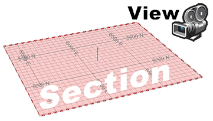
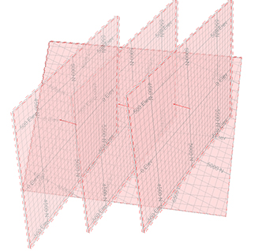
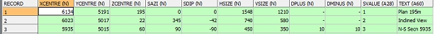
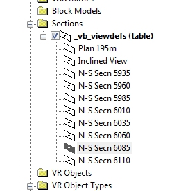
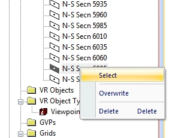
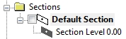
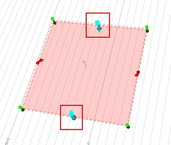

# Create or Modify a 3D Section

3D windows and some managed task windows rely on a view and **section**.

  * A [section](<../VR_Help/Sections.md>) is a plane that is used to provide a cross-section of loaded visual data. It also acts as the active design plane (the digital canvas used for digitizing) unless you snap to data elsewhere. You can have as many sections as you like, but only one of them can be 'active' at once.  
  
A section is defined by its size, center reference point, azimuth and inclination. It also stores **[clipping](<../VR_Help/Clipping-Data.md>)** distances and other properties. These parameters are stored in a **section definition** (see "About Section Definitions", below), which can be exported to a Datamine file (,dm) and transferred to other Studio systems.
  * A view depends on the viewpoint, or 'camera', of your 3D scene. A view pitch, heading and roll represent the view direction. It is this direction that the camera will follow when adjusting the scale (zoom setting) of your 3D scene.

View and Section

Section and view are independent, although they can be forced to align using [Lock](<../command_help/lock-view.md>) and [Align](<../command_help/align-view.md>) commands.

3D sections are also supported by a collection of **[context-sensitive menu commands](<../VR_Help/workspace_sections.md>)**.

## About Section Definitions

A section definition __ stores section parameters. One or more sections can be stored in an [object](<Concept_Current_Object.md>) or file, for example, a mixture of sections in varied orientations showing key zones within a reserves model, like this:

Section definitions can be stored to an external file. Opening a section definition file in **Table Editor** reveals one or more rows, with each record representing a particular section, for example:  
  

Once a section definition file has been loaded, it appears in the [Sheets](<Sheets%20Control%20Bar%20Overview.md>) control bar (and, if your product supports one, a Project Data control bar). You can see loaded section definitions in the Sections sub-folder, with each of the defined sections being displayed below it, e.g.:  
  

In the example above, 10 definitions are available. To select one (and make it active), right-click it and choose Select.

If your current viewing window is [locked](<Section_Locking.md>), it will automatically update the view of the data in relation to the new section (a locked view is always orthogonal to the section definition). Note that you can only set one section to be active at any one time, however, if **[clipping](<../VR_Help/Clipping-Data.md>)** parameters are associated with loaded sections, these can still be honoured, regardless of whether the section is active or not.

To create a new section definition:  

  1. Right-click the 3D | Sections folder and select New to create a new section with default properties. 

  2. If you only require a single section, double-click the new section item and format it using **Section Properties**.

  3. Create a section definition within a parent section by right-clicking the new item and selecting Add Section.  
  
When you create a sub-definition for the first time, it will inherit the properties of the original. Subsequently added definitions will inherit the properties of the previous section. The parent item can then be used to control clipping and visual formatting of all sub-sections

New section definition example:

In the following steps, the default 'flat' section is updated to act as a 'parent' for three sub-sections; 

  * a vertical N-S section

  * an E-W section

  * an inclined section. 

The first two sections are set up using **Section Row Properties** and the third (inclined) section is configured interactively:

  1. Unload all data.
  2. Expand the Sheets or Project Data Bar and expand 3D >> Sections
  3. Right click Default Section. This section is created with all new Studio projects.
  4. Select Look At.
  5. If not already selected, select the visibility check box in the control bar for the default section.
  6. Right-click the default section and select Add Section. A sub-section called 'Section Level 0.00' is created:  
  
  

  7. Right-click the new section and choose Select. See the  indicator? This means the new section definition is now the active definition.
  8. Double-click **Section Level 0.00** to display **[**Section Row Properties**](<SectionRowProperties.md>)**.
  9. Click North-Southand click OK. The screen now updates to show a new alignment.
  10. Right-click and rename the new section to "North-South".
  11. Double-click the parent **Default Section** item - you will see that the properties of **North-South** have been copied to the parent item.  
  
This is standard behaviour for section objects containing multiple definitions; the active definition (triggered by right-clicking a definition and choosing Select) will 'push' parameters up to the parent object so that additional properties such as clipping and visual formatting can be edited.  

  12. Right-click Default Section again and select Add Section.
  13. Another section is added to the list:  

  14. Double click the new definition it and select the East-West button. Click OK.
  15. Rename the new section to "East-West".
  16. The final section is an inclined section. The initial set-up is identical to before; right-click Default Section and Add Section again.
  17. Another item is added.
  18. Make sure the **View** ribbon is active and select Edit Interactively.
  19. Using the widgets (zoom out to see them if you need to), left-click-drag one of the blue widgets to alter the azimuth or dip of the section.  
  
  

  20. Right-click the 3rd section definition in the Sheets control bar and select Overwrite. Note that the description now shows "Section 3 (inclined)".

To update an existing section definition:  

  1. Double-click a 'child' section definition to display the **Section Row Properties** screen.
  2. Update the following fields
     * **Text** (or **Generate** a name automatically).

     * **Section Orientation**

     * **Section Ref Point**

     * **Plane Dimensions**

     * **Primary Section Width**

     * **Secondary Section Width**

  3. **OK** your new settings to update the selected definition.

Alternatively;

  1. In a 3D window, interactively edit the section using the **View** ribbon's Edit Interactively function.
  2. Right-click any definition and select Overwrite.

Related topics and activities

  * [About 3D Sections](<../VR_Help/Sections.md>)

  * [3D Window Templates](<3D_Window_Templates.md>)

  * [Windows, Sheets, Projections and Overlays](<concept_views%20sheets%20overlays.md>)

  * [Section Locking](<Section_Locking.md>)

  * [View Settings](<Section%20Definition%20Dialog.md>)

  * [3D Section Widgets](<Section_Widgets.md>)

  * [Section Properties](<../VR_Help/Section%20Properties%20Dialog.md>)