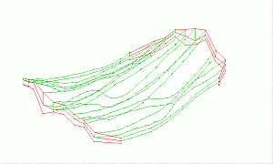
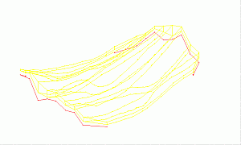
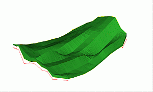
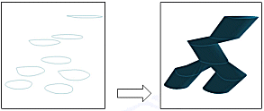

# Link Multiple Strings

To access this screen:

  * Run [link-multiple-strings](<../command_help/link-multiple-strings.md>).

  * Structure ribbon >> Create >> Link Multiple >> Auto Link Multiple.

  * **Explicit** ribbon >> Create >> Link Multiple >> Auto Link Multiple.

  * Using the **[command line](<Command_Toolbar.md>)** , enter "link-multiple-strings"

  * Use the quick key combination "lms".

  * Display the **[Find Command](<findcommand.md>)** screen, locate **link-multiple-strings** and click **Run**.

Link Multiple Strings is used to define parameters required to link strings together to form a wireframe volume. This function can be guided by **[tag strings](<Wireframe_Tag_Strings.md>)**.

Note: Perimeters to be linked should be selected before running this command.

This method relies on the [3D Solid](<Project%20Settings_%20Wireframe%20Linking.md>) string linking algorithm.

  * If no selected strings are found, a message is displayed, and the command will need to be restarted after the required strings have been selected.
  * The links take their colour from the first string of each string-pair used for the linking.
  * Tag strings can be used to control linking, see [use-tag-switch](<../command_help/use-tag-switch.md>).

The example below shows how perimeters and their relevant tag strings are selected prior to using this command. In this case, the upper mineralization zone perimeters (green 5) and tag strings (red 2) have been filtered (filter:COLOUR=2 OR COLOUR=5) before linking.

The perimeters and tag strings are filtered using [filter-strings](<../command_help/filter-strings.md>):

The upper zone perimeters and their relevant tag strings are selected i.e. only the upper two tag strings are selected:

The resultant closed wireframe volume has been generated using only the selected strings:

**Note** :The default values for most of this screen's options are specified using [Project Settings: Wireframe Linking](<Project%20Settings_%20Wireframe%20Linking.md>), specifically, the 3D Solid Linking area.

Use this linking method :

  * when joining a sequence of perimeters and generating end caps e.g. a series of geological section perimeters or underground mining excavation profiles.

  * as a quicker alternative to using a combination of [link-strings](<../command_help/link-strings.md>) and [end-link](<../command_help/end-link.md>) for generating a wireframe volume.

  * when creating reating a wireframe volume with bifurcated structures e.g., a typical [trouser leg problem](<3D%20Solid%20Linking%20Method.md#ex1>):  
  

Note: This command uses the **Maximum Segment Length** value (if greater than zero), as specified in **[Wireframe Linking Settings](<Project%20Settings_%20Wireframe%20Linking.md>)** to limit the generated segment length of generated wireframe triangles.

Activity Steps:

  1. Set **Collation Options** to determine how sets of strings are determined. Each set of strings is linked to string data in an adjacent set:

     * **Collate by distance** : define the distance between each calculated average plane within which strings are grouped together. That is, strings are grouped together based on their relative distances (a search is made for the average plane of these strings and sets of strings are detected based on whether they lie within the distance parameter on either side of this average plane or not.   
  
Grouped strings will not be linked together and will only be linked to strings in adjacent groups - these sets allow the linking algorithm to wireframe multiple strings at the same time. This can be useful when attempting to link multiple strings that are not coplanar and which should not be linked. This state can also be toggled using****[link-3dsolid-collate-switch](<../command_help/link-3dsolid-collate-switch.md>) .

     * Use current view plane: sort selected strings into groups according to their depth in current view coordinates. This state can also be toggled using [link-3dsolid-view-plane-switch](<../command_help/link-3dsolid-view-plane-switch.md>) .

  2. Would you like to perform **Link Crossover Checking** during linking? If so, any link that would cause a crossover is automatically rejected.  

  3. If you are using tag strings to control linking, indicate this with **Use tag strings**. You can also enable **Align strings** to create automatic virtual tag lines, which control how the strings are linked together.

  4. Choose if you wish to use **Uniform Interpolation** or not. If enabled, this applies a unit length parameterization to the string segments between tag strings. That is, the vertices from one string are imprinted onto the other (vice versa) as if one cut each string, stretched both out to the same length, imprinted temporary vertices and formed connections; finally restoring the original string shapes. The wireframe is generated using both the temporary and original string vertices.

  5. Select **Grouping Options** to control how strings are batched before linking:

     * Do not group: if active, all selected strings to the linking algorithm, which will then use Collate by Distance and Use current view plane settings to determine how to interconnect strings.

     * Group by field: if active, strings are divided into groups of identical values for the specified field (e.g. group by COLOUR), and send those groups individually to linking algorithm. There is no interlinking between different groups.  
  
Grouping by field allows you to select strings to be processed together, based on the values in the chosen field. Therefore, only those strings whose grouping field have the same value are sent to the linking algorithm for wireframing. By default, these wireframes get added to the one wireframe object unless you choose to **Create multiple wireframes**. If creating a single object, a _LINK_ attribute is appended for each distinct wireframe group.

Related topics and activities

  * [link-multiple-strings ("lms")](<../command_help/link-multiple-strings.md>) (command)