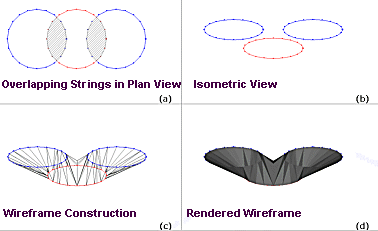
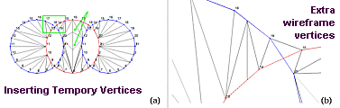
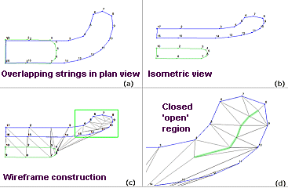
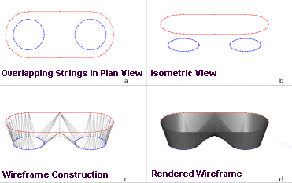
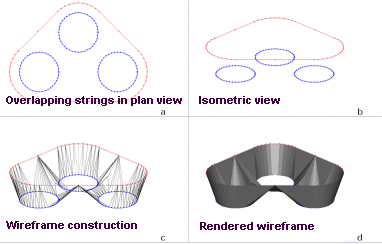
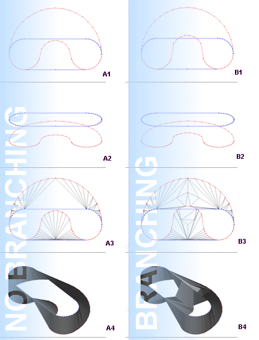
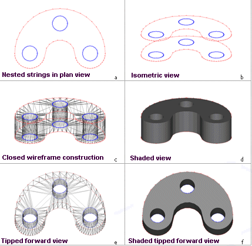

# 3D Solid Linking

The 3D Solid approach to wireframe linking can help overcome problems associated with bifurcated wireframe generation (see [Trouser Leg Problem](<../command_help/link-boundary.md>)).

This method relies on either temporary (one operation) settings made using [Link Multiple Strings](<3D%20Solid%20Dialog.md>) or default values as defined as 3D Solid Options of your [Wireframe Linking Settings](<Project%20Settings_%20Wireframe%20Linking.md>).

## Open and Closed Regions

The [3D Solid](<Project%20Settings_%20Wireframe%20Linking.md>) method of linking strings to produce wireframe volumes defines a series of regions for each string as either open or closed based on whether neighbouring strings overlap when looking in the direction of wireframing. When a string contains two or more closed regions, a branch is included in the wireframe.

For example, the image below shows three horizontal circular strings that overlap when looking in the vertical direction (the direction of wireframing). The shaded areas are the closed regions of the red or lower string formed by the overlap of the blue or upper strings. The unshaded area is the open region where no overlap occurs:

To maintain a consistent wireframe surface at the branch, extra vertices are temporarily inserted into the strings where the strings cross as determined in the direction of wireframing. The image below left shows the strings with their points numbered, together with the resultant wireframe construction. The area enclosed by the green box is expanded in the image below right and has been rotated into an isometric view. 

Note the extra wireframe vertices that do not coincide with numbered string points. These have been created using the inserted vertices:

## Closing Isolated Open Regions

If an open region of a string cannot be connected to a neighbouring string the 3D Solid algorithm will attempt to close it by linearly interpolating a series of points with varying height values between the neighbouring planes. The effect is to generate a more realistic appearing wireframe surface. Image a) and b) below give an example of such a string as viewed from both plan and isometric views. In the vertical (plan) direction the green or lower string is almost entirely overlapped by the blue or upper string. The area of overlap is the closed region. The area of no overlap is the open region. 

When the wireframe is constructed the right most part of upper string that forms the open region cannot be connected to the lower string. Therefore the wireframe will form a closed surface by linearly interpolating points between the two string planes - Image c). The green box has been expanded to show more detail in Image d). The green line highlights the wireframe edges that lie on the interpolated vertices.

This same linear interpolation also occurs at the join where two branches meet.

## Examples

The following examples demonstrate some of the capabilities of the 3D Solid method:

### Example 1: Simple Branch (Trouser Leg)

The image below shows a simple branch where the red or upper string is to be connected to the two blue or lower strings. This is the classic trouser leg example. Notice how vertices have been interpolated at the crotch (continuing the pants analogy) to provide a more realistic wireframe surface:

### Example 2: Three-legged Branch

The image continues the above example with a slightly more complex branch - a three legged branch:

### Example 3: To Branch or not to Branch

The image below represents two similar situations, one which results in a branch, and one which does not.

In the strings on the left only one edge of the red string lies outside the blue string - see Image a1). In this situation a continuous wireframe is constructed which maintains the relative edge connectivity. That is the same sides of the strings are connected to each other. The result is a wireframe surface that bulges but does not branch. See Images a2), a3) and a4).

In the right column of images, both edges of the red string lie partly outside the blue string. This creates the multiple closed regions necessary for the formation of a branch. See images b1), b2), b3) and b4).

Note the extra vertices that have been created at the intersections of the strings seen in Image b3).

### Example 4: Holes

In this example, the blue strings are nested within the red strings resulting in a situation that will form holes in the wireframe:

**Note** : if additional red strings were added 'above' and 'below', the resulting wireframe would include internal holes.