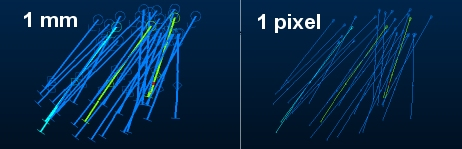

# 3D Window Drawing Units

To display items at the correct and consistent scale for all items on display, it is necessary to establish a measurement unit.

Traditionally, this unit has been a screen pixel, meaning the magnitude of a formatting option is described in pixels.

You can also set a millimetre measurement unit to determine the size of 3D view items

Pixel vs. Millimeter Scaling

Data rendered in projects with different view scaling settings may render differently. 

For example, if a project has pixel scaling set, and a set of drillholes loaded set to be 1 millimetre wide, the holes are drawn 1 millimetre wide on any monitor. If pixel scaling was implemented, they would render as 1 pixel wide, e.g.:

The underlying data in each case is identical; only the rendering method has been changed.

With millimetre-based scaling, data will be rendered to the same dimensions on different monitors.

**Note** : Regardless of the drawing unit specification for a 3D window (or window collection), your graphics card imposes an [upper limit of line width](<3D%20Window%20OpenGL%20Constraints.md>).

To change a 3D Windows scaling unit:

The unit used for determining the scale of 3D window item properties is the same for all items within a 3D window.

To change the unit used by each 3D window in your application, you can use the [Sheets](<Sheets%20Control%20Bar%20Overview.md>) and [Properties](<properties%20control%20bar%20overview.md>) control bars.

  1. In the Sheets control bar, left click any **3D** view item.
  2. In the [Properties](<properties%20control%20bar%20overview.md>) control bar, set Drawing Units to either _Pixels_ or _Millimetres_. The 3D window will update automatically.
  3. **Save** your project to save this setting.

**Tip: Drawing Units** is stored within each project, so can be transferred to other Studio users that load the same project.

To set drawing units in "managed task" windows

Sometimes your product needs to utilize (or even create) a special type of 3D window to display data relating to a particular managed task. Studio OPs automated pit design tools, for example are contained in a series of managed tasks that use a managed 3D window. These tasks generate and display data based on activities performed and may set a custom measurement unit setting (pixels or millimetres) if appropriate.

Related topics and activitites

  * [About 3D Windows](<../VR_Help/VR_Introduction.md>)

  * [Design and Visualization](<../VR_Help/Designing_in_VR.md>)

  * [3D Window OpenGL Constraints](<3D%20Window%20OpenGL%20Constraints.md>)