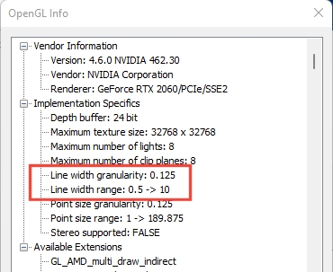

# 3D Line Width Constraints

Regardless of the **[drawing unit](<3D%20Window%20Drawing%20Units.md>)** specification for a 3D window (or window collection), your graphics card imposes an upper limit on line width. This varies from card to card, but you can find the limit for your configuration using the Studio **Help** menus **About** dialog:

Selecting OpenGL Info lists the manufacturers parameter specification for your hardware, for example:

   

In the above case (an Nvidia GeForce RTX 2060 graphics card), you can visualize changes in line width (within the accepted range) for line widths varying by 0.125 or greater (Line width granularity) and will able to render a line using values in the 0.5 to 10 range only. Any value above 10 pixels, say (or the millimetre equivalent) will not be applied.

**Note** : Datamine recommends NVidia Quadro and GeForce cards. You can see the latest [graphics card recommendations](<https://datamine.freshdesk.com/en/support/solutions/articles/19000045479-studio-products-graphics-cards-recommendations>) on our knowledge base (Internet connection and login required).

 |  Related Topics  
---|---  
|  [3D String Properties](<../VR_Help/Traces%20Properties%20Dialog%20\(Edge%20Visual\).md>) [About 3D Windows](<../VR_Help/VR_Introduction.md>) [Design and Visualization](<../VR_Help/Designing_in_VR.md>) [3D Window Drawing Units](<3D%20Window%20Drawing%20Units.md>)