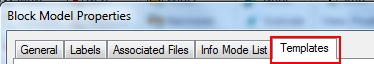

# 3D Window Templates  
  
To standardize the display of your data in the active 3D window on a per-object-type basis, 3D display templates can be a good option. Your product uses 3D window templates to:

  * capture the hard work you've done so far and retrieve it at a later date

  * synchronize your view formatting between projects

  * synchronize your view formatting between the 3D and Plots windows

  * create a default template that is applied when a particular object type is created/loaded

  * complete projects more rapidly than before

As with many 3D window functions, templates are accessible from any 3D window properties dialog, appearing as a tab that sits along the top of the dialog. For example, the Block Model Properties dialog looks like this:

The options available are the same for any of the visual object types (strings, drillholes, wireframes and so on).

Related topics and activities

  * [3D Display Templates](<../VR_Help/3D_Templates.md>)

  * [Export 3D Templates](<../VR_Help/3D_Templates_Export.md>)

  * [Import 3D Templates](<../VR_Help/3D_Templates_Import.md>)

  * [Plot Sheet Templates](<../PLOTS_LOGS/PLOTS_Plot%20Templates.md>)