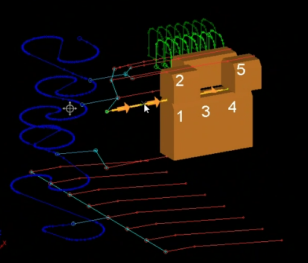
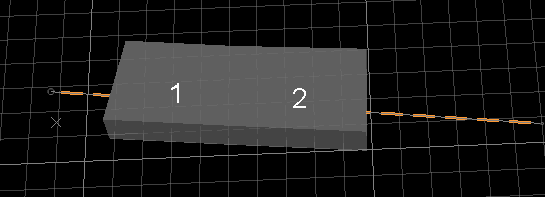
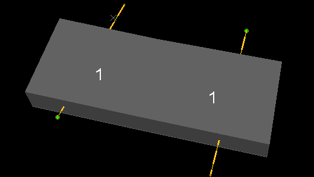
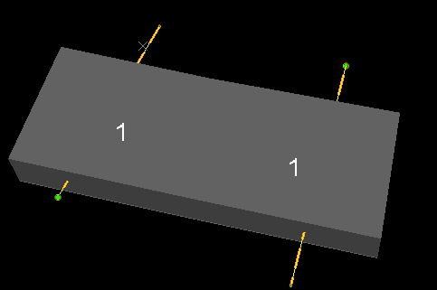
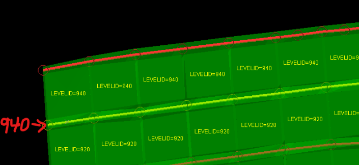

# Assign Attributes by Selection Order

To access this screen:

  * Using the **[Find Command](<findcommand.md>)** screen, locate **assign-attributes-by-selection-order** and choose **Run**.
  * Use the quick key combination "abso".
  * Enter "assign-attributes-by-selection-order" into the **[Command Line](<Command_Toolbar.md>)** and press <ENTER>.

It can be useful to define a series of numeric attributes in increasing order along a particular path. For example, assigning a stope index to wireframe volumes along the direction of development, assigning a blasthole row ID throughout a blast pattern and so on. A sequential index can also be useful to create spatial indices that can be used for dependency creation, control / guide schedule sequencing, mapping different areas of the reserve or mine and many other uses.

;>)

Stope volume attribute values added due to their presence in relation to a loaded string (shown in orange with arrows)

The **Assign Attributes by Selection Order** console lets you assign a label sequence to either an existing or new attribute within drillholes, string or wireframe objects. Each data type must be sequenced independently.

You can define the direction of the attribute sequence either by:

  * The order in which you manually select data in the 3D window (otherwise known as the "manual" approach, or;

  * The direction of a loaded open string object, which can be represented by one or more string traces.

You can assign incremental values to loaded data either by independent data entity (such as a string trace, a drillhole, a wireframe volume or surface) or assign multiple different values to the same data entity using another attribute to define unique object zones. For example, assign an incremental attribute value to each **ZONE** of a wireframe or for each **STOPEID** , for example. You do this using the **Group by** control.

If using an open string to determine the order in which data is attributed sequentially, the string is automatically projected orthogonally upwards or downwards in relation to the selected **Plane Orientation**. You can also choose if attribution occurs only where a projected string vertex intercepts target data, or if _any_ part of the string does so. 

**Tip** : Before you start, orient your 3D data using the **3D View** ribbon's **Align View** command to make sure your loaded string object will attribute your target data as expected. 

Tip: If updating an existing attribute, add labels to the displayed 3D overlay of that object first (linked to the target attribute). This lets you see the actual attribute value update during data selection, including (if specified) a prefix or suffix.

## Create Sequenced Attributes

To attribute loaded string, wireframe or drillhole data sequentially based on SELECTION ORDER:

  1. Load the data to be attributed into the **3D** window and ensure it is visible. This should be either string, wireframe or drillhole data.

**Tip** : If you are planning to attribute a subset of loaded data, consider filtering it in the **3D** window first. Attribution is only applied to visible data.

  2. Configure your data selection settings. For example, if you plan to choose wireframe data (either manually or by a selection string) make sure wireframe selection is active. See [Selecting 3D Data Interactively](<Selecting3DDataInteractively.md>).

  3. If you are using string data to define the direction of attribution, choose a Plane Orientation. This is used to project the string orthogonally upwards or downwards in relation to the defined plane. Only data that is intercepted by the projected string along its 'planar direction' is attributed. If it doesn't intercept data, it isn't attributed.

     * Pick a preset plane orientation from either **Horizontal** , **North-South** or East-West options. Selecting one of these automatically updates the **Azimuth** and **Inclination** fields (see below).

     * Use the current view direction to determine the projection direction, using **View Plane**. As above, this updates **Azimuth** and **Inclination** fields.

     * Use the definition of **[a 3D section](<../VR_Help/Sections.md>)** to determine the projection direction, also updating **Azimuth** and **Inclination** fields. Use the list provided to pick any loaded section object.

     * Manually enter the **Azimuth** and **Inclination** of a 2D plane.

  4. Choose the **Type** of data you wish to attribute; either _Drillholes_ , _Strings_ or _Wireframes_. 

Data types are only displayed if data of that type is already loaded.

**Note** : Wireframe data can be surfaces or volumes. String data can be open or closed.

  5. Optionally, use **Display Selection Order** to choose if the order screen data is attributed is shown on screen. This can be useful in checking the order in which stepped values are applied. 

Note that the numbering shown on screen doesn't relate to actual attribute values to be applied, the labelling will always start at 1 and increment by 1 to show the order in which data is attributed. 

For example, in the wireframe below, the two wireframe **ZONE** values (**Group by**) are attributed in the left-right order enforced by the direction of the orange string which also runs from left to right:

;>)

  6. If you want to change the order of attribution (either set manually or by a string - see below) check **Reverse Direction**. If unchecked, data is attributed incrementally based on either the order in which data is selected or the direction of the string from start to end.

  7. Next, define the way in which data is selected for attribution. There are two options:

     * **Manually, by interactively selecting data in the 3D window** , gradually adding to the selected 'pool'. To do this:

       1. Check **Manually**.

       2. Hold the <CTRL> key down.

       3. In the **3D** window, click data in the order in which the attribute sequence is to be applied.

**Tip** : If **Display Selection Order** is checked, the 1-2-3 order is displayed in real time as you select data in the 3D window.

       4. To remove data from the selection pool, with the <CTRL> key still held down, click it again (clicking just toggles selection on or off in this mode).

     * **By picking one or more loaded string traces** to define the attribution sequence order. To do this:

       1. Check **From string**.

       2. Check **Selected**.

       3. Pick an open string in the 3D window. If Display Selection Order is checked (recommended for this method), "1" appears over the selected data.

       4. Optionally, select another string with <CTRL> held down. If this passes through a separate element of target data, another "1" appears. This is because the attribution sequence is to be applied in parallel. For example, the wireframe below has two zones, each with a selection string passing through it:

;>)

       5. If using multiple strings and you wish for one sequence to begin where the other finished, check **Continue sequence**. Continuing the example above, this causes the attribution sequence to be adjusted like this (in this case, the right hand string was picked before the left hand one):

;>)

     * **By nominating a single string object** (containing one or more string traces) to define the attribution sequence. To do this:

       1. Check **From string**.

       2. Check **Object**.

       3. Expand the list and choose a loaded string **Object**. The attribution sequence is automatically set based on the order of the string(s) contained within the selected object.

  8. If you are using string data to control attribution sequencing, decide how this happens with the **Using** options.

     * Choose **Continuous** to trigger attribution where any part of a string intercepts target data via projection. 

     * Choose **Vertices** to only attribute data where a string vertex intercepts target data. This could be useful if a drive centreline string contained vertices that aligned with activity volumes in Studio UG, for example.

  9. If using string data, optionally choose to **Constrain selection by matching attribute**.

     * If **checked** , and a selection string attribute is picked from the list below, attribution is constrained to objects that have the same value as the selection string for the defined attribute. For example, if a string had **LEVELID** , you could set up an attribute sequence along development drive solids for that particular **LEVELID** (which also exists in the target wireframe data).

For example, the image below shows a group of adjacent solids (key-field = **STOPENUM**) and the strings are placed at its border, exactly between 2 different levels. In this case attribution would not be applied properly since stopes from both levels would end up being selected by each one of these strings. To handle this type of situation you could use a matching attribute, which means that each string would only select the solids that contain the same value for the **LEVELID** field:

;>)

     * If **unchecked** , attribution occurs wherever the nominated string intercepts data along the chosen plane's projection direction.

  10. Decide which type of attribute to create using Data Type:

     * A _Numeric_ attribute will store a sequence of numbers (only) and cannot be prefixed or suffixed (see below).

     * An _Alphanumeric_ attribute can store numbers or letters and can be prefixed, suffixed or both.

  11. Either pick an existing **Attribute** or enter a new attribute **Name**. This is the attribute in the target data that is either created or updated to contain the numeric sequence of attribute values as defined below.

  12. Choose the initial numeric attribute value using **Start from**. Negative values are permitted.

  13. Choose the gap between numeric values using **in steps of**. For example, a sequence starting at 50, rising in steps of 50 creates a 50, 100, 150.... sequence.

  14. If the **Data Type** is _Alphanumeric_ , check Prefix or Suffix (or both) to automatically apply custom characters to the start or end of the generated attribute value. For example, if the sequence is 1,2,3 and the **Prefix** is "Cubby_", the generated sequential attribute values as a result of data selection are "Cubby_1", "Cubby_2" and "Cubby_3".

Note: You cannot prefix or suffix numeric attributes.

Warning: If you are creating a new attribute with a **Prefix** or **Suffix** , the attribute is automatically assigned alphanumeric status (even if the additional characters are numeric). Similarly, if you are updated an existing attribute, it is converted to the alphanumeric type if was originally numeric - be careful doing this if downstream activities rely on a numeric attribute.

  15. Click **Apply** to update your target data with sequenced attribute values, based on either a manual selection order or loaded string data.

Related topics and activities

  * [assign-attributes-by-selection-order ("abso")](<../command_help/assign-attributes-by-selection-order.md>) (command)

  * [Attributes](<Attributes.md>)

  * [edit-attributes ("eat")](<../command_help/edit-attributes.md>)

  * [edit-dh-attributes ("ed")](<../command_help/edit-dh-attributes.md>)

  * [edit-wireframe-attributes ("ewa")](<../command_help/edit-wireframe-attributes.md>)

  * [Attribute Naming Convention](<Attribute_Naming_Convention.md>)

  * [Manage Object Attributes](<Attribute_Manager.md>)

  * [Edit Attribute Screen](<edit%20attributes%20pick%20dialog.md>)

  * [3D Section Planes](<../VR_Help/Sections.md>)