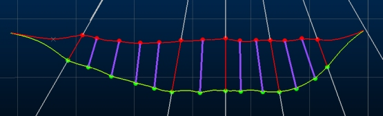
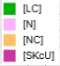
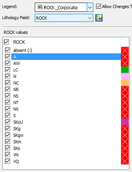
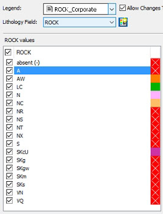
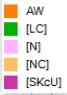
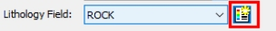
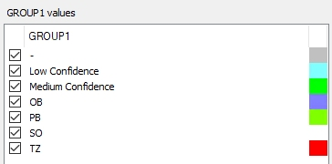

# Assign Lithology

To access this screen:

  * **Implicit** ribbon **> > Domain >> Assign**.

  * Using the **[command line](<Command_Toolbar.md>)** , enter "assign-lithology" and press ENTER.

  * Display the **[Find Command](<findcommand.md>)** screen, locate **assign-lithology** and click **Run**.

Interactively apply lithological values held within a drillhole object to displayed sample intervals. This command is commonly used in conjunction with [define-lithology](<../command_help/group-lithology.md>).

Lithologies can either be unique lithological values or****[grouped](<Define_Sample_Lithologies.md>) values. An existing drillholes object must be loaded, from which a lithological attribute is used to provide a selection of lithological values. These values can be applied to drillhole sample intervals.

Interval lengths and positions (FROM, TO, LENGTH) are not defined with this tool and cannot be altered; intervals are set according to raw survey information, the respective desurveying method and/or by other pre-processing of the drillholes data table. 

Tip: You can also use the **Assign Lithology** tool to create a new attribute and values, prior to assigning them to drillhole intervals.

Drillhole data should be displayed to use this command. You can display your data using the default legend for the selected **Lithology Field** , or you can use any other legend (and potentially edit it).

The basic procedure for using this tool is: Select your intervals first, then apply the lithology or lithological group.

Command settings will persist between dialog sessions; previous values will automatically be restored (within the same project session).

**Note** : Assignments made with this tool can be undone using <CTRL> and <Z> and re-done using <CTRL> and <Y>

### Implicit Modelling and Assign Lithologies

Implicit modelling tasks automatically format the view of loaded drillholes to highlight intercept positions such as hangingwall or footwall locations. For example, as red and green symbols below:

If you are using any implicit modelling task and are simultaneously coding drillhole data with the **Assign Lithologies** task, the intercept position indicators update automatically as changes are made to the underlying drillhole object. This lets you quickly see the impact of your assignment decisions.

### Paint Mode

Drillhole data attribution can be applied using one of two methods supported by this tool:

  * Select or create an attribute, then assign attribute values to drillhole segments, or;

  * Select the attribute, select the data, and assign an attribute value. If **Auto Apply** is checked, attribution occurs automatically.

This choice is governed by the status of **Paint** mode.

If **Paint** is **enabled** , the selected attribute can be applied interactively in any 3D window using any data selection method (point selection, rectangle or swipe selection - see [Selecting 3D Data Interactively](<Selecting3DDataInteractively.md>)).

If **Paint** is **disabled** , the second approach is used; first select the attribute to code, then select data in any 3D window (using any method) so it is highlighted, then click **Assign**. You can also **Unassign** attributes in this mode (meaning the selected data is assigned an absent attribute value).

**Note** : You can automatically select all data of the currently selected attribute in 3D windows using **Select All**. This can be useful to highlight a particular lithology, for example.

### Lithology Legends

When a new **Lithology Field** is chosen, a check is made to see if a default legend already exists for the selected attribute. If it does, it is automatically selected and appears in the **Legend** field. The list of field values will update to show, where possible, the appropriate colour for each legend item.

If you are using a default legend to colour your display, you can edit any of the lithology values and add or remove values which will automatically update the default legend as changes are made. 

In this situation, there will always be a 'match' between **Lithology Field** values and **Legend** items.

#### Non-default legends

If you select a legend that is not the default legend (i.e. one that has been created by a separate process), you can choose whether you can edit that legend using the **Assign Lithology** task. You may, for example, wish to use a standard (corporate) legend to colour your display of ROCK values, where you do not wish to edit the legend inadvertently. 

To protect your selected legend, disable Allow Changes to Legend. This will prevent you from editing the colours displayed below and any additions to or removal from the list of values will not update the legend. Where a match cannot be made between a Lithology Field value and a **Legend** 'bin', the current fixed colour for the current overlay is used (as defined using the [Drillhole Properties](<../VR_Help/DHPropDialog_Segments.md>) dialog).

For example, the ROCK attribute is selected, which contains 17 unique values. These, plus an absent data item indicator are listed when the Lithology Field is set. In this example, Allow Changes to Legend is enabled, meaning edits to the legend are made automatically.

A corporate legend is selected, but it only contains three of the values found in the selected field, for example:  
  

Once the legend is selected, the list displays the 17 values, with four of them coloured using the legend:

All unmatched values are shown in the current fixed colour for the overlay (in this case, red), with a cross indicating a match can't be found. 

Editing [AW] (double-clicking the colour chip and changing it to orange) results in:

The legend is automatically updated, for example:  

If Allow Changes to Legend is unchecked, you can't edit the colours of the displayed items (whether there is a legend category match or otherwise).

You can reinstate the default legend at any time using the button to the right of the Lithology Field drop-down list:

### Assign Lithology Values

To assign a lithology to a loaded drillhole object 

  1. Open the **Assign LIthology** managed task:

  2. Select a Drillhole Table. All loaded drillhole objects are listed.
  3. Select a **Lithology Field**. This can be any field, but will commonly be either an attribute representing a lithology or rock type, or a **[grouping attribute](<Define_Sample_Lithologies.md>)**.

Unique attribute values are listed below. If you selected a group field, this list can include lithologies that have not been assigned to a group and group names in combination, for example:

In the above example, there is an absent (-) value indicator (always present), two group values representing confidence and a set of four distinct lithological values which have no grouping.

Note: Alternatively, click **New** to display the [Add Column](<AddColumn_Dialog.md>) screen and create a new drillhole attribute. You can add values to the new field later.  

  4. Double-click a label to edit the name of a listed lithology item or group
  5. **Warning** : Avoid using yellow to format lithologies as it is the selected 3D item colour in Studio and things could get confusing!
  6. Choose how you want the view of 3D window data to be updated using **Auto Look** at the bottom of the task:

     * If checked, the view of the active 3D window will automatically scale and orient so that it is looking directly at the enabled attribute values. The view is oriented to be orthogonal to a mean plane of the displayed samples.

     * If unchecked, no view adjustment is performed when changes are made in the attribute values table.

  7. Choose how you want data to be applied after task changes using **Auto Apply** :

     * If checked, 3D window data is automatically filtered to show only enabled attribute values. Non-active attribute values are hidden.

     * If unchecked, no 3D window changes are performed automatically after task edits.

  8. Choose if you wish to display samples of multiple attribute values in the 3D window during task usage, using **Unique** :

     1. If checked, only a single attribute value at a time can be selected.

     2. If unchecked, any number of attribute values can be selected.

  9. Select a Legend to colour the display of the drillholes, or accept the default legend that is specified.
  10. Use **Allow Changes to Legend** to determine if a non-default legend can be edited using the **Assign Lithology** tool:
     * If checked, you can choose a colour for a value that doesn't yet exist in the selected legend, then add it to the legend automatically.
     * If unchecked, legend items will not be editable. This can be useful if the legend is shared with others.
  11. What you do next depends on how you wish to code your drillholes. This depends on the current **Paint** mode.
     * If **Paint** is enabled:
       1. Select a (single) lithology value.
       2. Pick data in any 3D window, using any selection method (point, rectangle, swipe).

The selected attribute is applied to the selected drillhole data.

     * If **Paint** is disabled:
       1. Select a (single) lithology value.
       2. Pick data in any 3D window, using any selection method (point, rectangle, swipe).

       3. Click **Assign** to update the selected drillhole data.
  12. To update the physical file associated with the **Drillhole table** , click **Save File**. This operation cannot be undone automatically.

To add a new lithological value:

You can add a new lithological value by clicking New. 

New items are assigned a unique name, which can be edited. For alphanumerics, this is "New " followed by an index number, for numeric lithology field values, it is the next available number in sequence (starting from zero).

  * If you create a new lithology item and a default legend is in used, a new legend category is added to the default legend automatically. 
  * If a non-default legend is used and Allow Changes to Legend is checked, a new legend category is added to the non-default legend automatically.
  * If a non-default legend is used and the Allow Changes to Legend is unchecked, a new value will appear in the list, but is displayed with the current drillhole overlay's fixed colour (as defined using the [Drillhole Properties](<../VR_Help/DHPropDialog_Segments.md>) dialog). You will not be able to edit this colour.

To unassign a lithological value:

Any selected interval can be unassigned, meaning it is given an absent lithology value.

  1. Enable **Select Mode**.

  2. Select drillhole data in a 3D view.

  3. Click **Unassign**.

Currently selected drillhole samples are assigned an absent ("-") lithological value.

To delete a lithological value:

You can remove lithologies and groups from the displayed list.

  1. Select a value to remove from the list of available lithological values.

Note: The absent lithology item can't be deleted.

  2. Click **Delete**.

The lithology is removed from the list and an absent value is assigned to all drillhole intervals with the deleted value.

Tip: You can use undo to reinstate attribute values.

To rename a lithology or group:  

  1. Double click a lithological value in the list.

  2. Type in either a numeric or alphanumeric value and press <ENTER>.  
  
The value is updated, as will all values in the drillhole data object.

  3. If you wish to make your drillhole data changes permanent, **Save** your drillhole object.

You can rename any item in the displayed list providing: 

  * If the selected field is **[numeric](<Attributes.md>)** , the description of either the grouped or ungrouped is item is also numeric (with the exception of setting a name to "absent" or "-", both of which assign the absent data symbol. 

  * The name is unique, otherwise the previous value is reinstated.

  * For **[alphanumeric](<Attributes.md>)** data, the data definition of a saved samples file is automatically adjusted to ensure the longest description is accommodated.

To merge existing groups and ungrouped items

The [group-lithology](<Define_Sample_Lithologies.md>) command contains tools for grouping lithological values. However, you can also merge groups and ungrouped items interactively using the assign-lithology task:

  1. Select an attribute value to merge.

  2. Click Select All.

  3. Select the target attribute value to receive the new intervals.

  4. Click Assign

Related Information and Activities

  * [Group Lithology Values](<Define_Sample_Lithologies.md>)

  * **[assign-lithology command](<../command_help/assign-lithology.md>)**

  * [group-lithology command](<../command_help/group-lithology.md>)

  * [Selecting 3D Data](<Selecting3DDataInteractively.md>)

  * [Add an Attribute to an Object](<AddColumn_Dialog.md>)