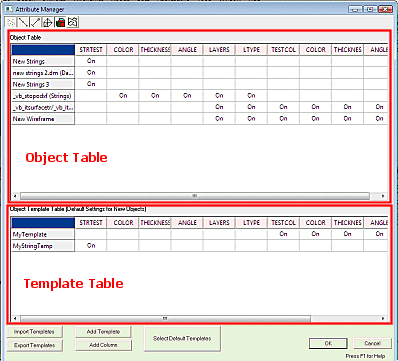
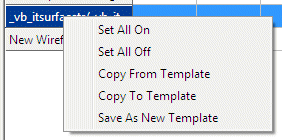
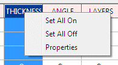

# Manage Object Attributes

To access this screen:

  * Using the Data ribbon, select Objects >> Manage Objects

  * Type 'att' in the 3D window.

In the context of Studio application data, an [attribute](<Attributes.md>) represents a collection of data values representing a specific file property. Datamine's proprietary data format is tabular, with data records represented as rows, and attributes as columns. Data attributes are synonymously referred to as _fields_. Throughout Datamine's technical literature (new and old), the following terms all represent these categorized collections of data values:

  * Attribute

  * Field

  * Column

  * Property

The phrase "value", however, is distinct; this specifically describes the integer or string that a particular attribute contains.

The Attribute Manager controls how loaded data attributes are displayed and enabled. It also manages how attributes in a loaded data object are defined and applied to other objects using object _templates_. Attributes are an important component of your data, in fact they provide structure to your data by categorization of values. 

Attributes can control the visual appearance of a loaded file or can be stored 'silently' within any data object as a means of storing non-visual data values. These values can be integers (numeric) or strings (alphanumeric).

**Note** : Modern Studio applications permit attribute names up to 24 characters in most cases. There are exceptions, such as where an attribute name is automatically prefixed or suffixed by another function, for example. See [**Attribute Naming Conventions**](<Attribute_Naming_Convention.md>). Older versions of Studio products were limited to attribute names up to 8 characters.

The Attribute Manager is used to add and remove attributes for a data object in memory. It can also be used to create attribute templates to specify default columns to be assigned to an object of a particular type upon creation.

When defining attributes for a particular data type, you can use an existing object of that type as a starting point, or you can create a new template.

The Attribute Manager lets you define templates or in-place fields for a _user_ attribute. A user attribute is a value that is mandatory for a data object type (wireframe, string etc.) but is instead used to store values representing the data scenario. So, whilst user attributes are inessential for data type recognition, they may be critical to ensure data is represented accurately in the system. For example, in a drillhole file, an attribute describing blastability index is not required for the system to detect it as a drillhole (BHID, FROM, TO and other fields, however, are). That said, if you are preparing a report for blasting, these data values are important.

## Attribute Manager Capabilities

The Attribute Manager can:

  * Create and manage templates that are adopted by all new objects created (on a type-by-type basis).

  * Define custom attributes and apply them to existing objects.

  * Define custom [virtual](<Attributes.md>) (evaluated) attributes and apply them to existing objects.

  * Disable or enable existing attributes for any object in memory.

  * Globally enable or disable attributes for all objects in memory.

  * Selectively view or hide objects of a specific data type from the attribute table.

  * Apply a predefined template to any existing object of a given type.

The following actions cannot be performed using the **Attribute Manager** :

  * Disable or edit mandatory fields that define a data type (essential fields, such as LSTYLE for strings, for example).

  * Create a template that is adopted by a non-visual table (only wireframe, block model, point, string and drillhole attributes can be controlled using templates).

  * Create a template to be used when importing non-Datamine files (fields present in the external data set will always be honoured).

  * Change the basic definition of an existing attribute (although you can define new ones, or view existing definitions without editing them).

## Attribute Manager Layout

The Attribute Manager is divided into two distinct areas; the top half of the screen indicates the status of objects in memory (with respect to their attributes) and the lower half contains information about any templates that may be set up for specific data types.

## Enabling and Disabling Attributes

The **Object Table** is used to manipulate the attributes of objects in memory (but only with regards to whether those attributes are shown or not - you will not be able to edit the definitions of those attributes - it is not possible, say, to change a numeric attribute to an alphanumeric attribute).

You can change the status of an attribute (to either 'on' or 'off') using the following methods:

  * Double-clicking a table cell.

  * Highlighting a table cell and pressing the <SPACE> bar.

  * Right-clicking a highlighted cell and selecting either Set Selection On or Set Selection Off.

You can also set all attributes on or off for a given object by right-clicking one of the vertical table cells (those representing an object description) and selecting either the Set All On or Set All Off options.

You can also globally set an attribute to be active or inactive for all objects in the Object Table (at least, those that are currently displayed - see "Filtering the Attribute Manager", below). To do this, you will need to right-click the horizontal table columns (those describing the attributes) and selecting the Set All On or Set All Off options

**Warning** : Be cautious when enabling and disabling attributes. If an attribute is disabled, the contents of that data column are lost from the object in memory. To prevent this situation, you should save the object(s) in memory to a physical file before editing - that way, you can recall the previous state of the object if required. Reintroducing an attribute with the same name as one previously deleted will not re-implement data values that were set beforehand.

## Understanding Attribute Templates

Attribute Templates serve two purposes:

  * Define default fields for new objects.

  * Modify current attributes stored by existing objects.

In either case, template creation is performed in advance using the same method (described in the step-by-step procedures below). Once a template has been created, it can be assigned to any data type. Remember that the essential attributes required by an object type (the 'mandatory' fields) will always be generated; it is the template that dictates the additional, optional attributes that you may wish to store.

For example, if part of your process requires a _CUEQ_ grade to store copper equivalent grade values generated by evaluation routines and calculations, a template could be created and assigned to the block model data type so that every model created within the current project from that point onwards would automatically include the field (populated with default values until required).

Any number of custom attributes can be applied to any data type on creation (or applied to any existing object in memory).

## Filtering the Attribute Manager

Determine which objects are shown in the top half of the Attribute Manager dialog using the toggle button toolbar shown in the top left of the screen:

You can enable or disable any of the data type buttons to automatically filter the view of objects in memory as shown in the top half of the Attribute Manager dialog. Note that the full list of templates will always be shown as these can be assigned to one or more data types.

## Activities

To enable and disable existing attributes:

If you have a loaded data object that is of the wireframe, point, block model, string or drillhole type, you can switch any of its non-critical attributes on or off as required (this procedure assumes that such data exists in memory):

  1. Open the Attribute Manager using one of the methods set at the start of this page. 

Each visual object is shown as a table row in the top half of the screen. Every non-critical attribute is shown as a column of data. For each column/object combination, the attribute cell is either blank (meaning that the attribute in question is not enabled) or [On], meaning it is either present, or is applied when OK is pressed.

  2. Double-click an attribute cell to enable or disable an attribute for an object - the status alternates between on and off (or vice versa).

  3. Click OK to update the selected object(s). Attributes that have been disabled will no longer appear in the **Loaded Data** control bar (or the Data Object Manager) and any newly-enabled attributes are added to the object.

To create an attribute template:

A powerful feature of the Attribute Manager is the ability to create a 'template' of user attributes that are applied to each object of a particular data type automatically when it is created. You can also apply attribute templates to existing objects in memory, replacing all user attributes with those specified in the template. This procedure outlines the template creation process only - subsequent procedures detail template usage:

  1. Open the Attribute Manager using one of the methods set at the start of this page.

  2. The lower half of the dialog is dedicated to the setup of templates. Click Add Template.

  3. In the Add New Template dialog, enter a name for your new attribute template.

  4. Click OK and a new row is added to the Template Table.

  5. If not already selected, click the newly-added cell and then click Add Column

The [Add Column](<AddColumn_Dialog.md>) screen displays . 

  6. Enter the details that are relevant to the new attribute and click **OK**. See [Add an Attribute to an Object](<AddColumn_Dialog.md>).

The new attribute is added as a column to the **Template Table**. By default, this attribute is set to [On] meaning it is added if the template is assigned to a data type, and a new object of that type is created.

To assign an attribute template to a data type (for automatic attribute creation):

When a template has been defined, it can either be assigned to an existing object in memory (see below) or it can be used to created user attributes for every object that is created for a given object type. This procedure shows you how to assign a template to an object type so that each new object that is created, the defined user attributes will be added. This procedure assumes that an attribute template has already been created (see above):

  1. Open the Attribute Manager using one of the methods set at the start of this page.

  2. The lower half of the dialog is dedicated to the setup of templates.

  3. Assuming that an attribute template already exists (as indicated by the presence of a table row in the Template Table section), left-click a cell in a template table row to activate it, and click Select Default Templates.

  4. Using the Select Default Templates screen, select the drop-down list next to the data type to which you wish to assign a template.

  5. All attribute templates are available for all visual table types, so select the template you wish to assign.

**Note** : You can assign the same template to more than one data type.

  6. Click OK.

  7. Click OK on the Attribute Manager screen to dismiss it.

To apply an attribute template to an existing object:

When a template has been defined, you can use it to update the attributes held by any object in memory (providing that object is a 'visual' table).

**Warning** : When you apply an attribute template to an existing data object, any user attributes that currently exist within that object that are not specified in the template is lost. Also, if you apply a template to an object that contains attributes that already exist within the 'receiving' object - that object's attributes and corresponding data values are preserved.

This procedure assumes that an attribute template has already been created (see above) and that at least one visual table exists in memory:

  1. Open the Attribute Manager using one of the methods set at the start of this page.

  2. Right click the initial row cell for an object in memory (as shown in the top half of the dialog).

  3. Select Copy from Template.

The Select Template dialog displays, listing all predefined templates.

  4. Select the template containing the attributes you wish to apply.

  5. Click OK and the Object Table updates to show all active ('On') attributes that are applied when the changes are committed.

  6. Click OK and the attributes for that object are updated.

To create a new attribute template from an existing object:

You can use an existing attribute configuration to create a new attribute template, for application to other objects. 

  1. Open the Attribute Manager using one of the methods set at the start of this page.

  2. Right click the initial row cell for an object in memory (as shown in the top half of the dialog).

  3. Select Save as New Template.

  4. Enter the name for the template you wish to create and click OK.

  5. A new row is added to the Template Table in the bottom half of the screen.

To update an existing attribute template based on a loaded data object:  

If an object in memory contains user attributes that you wish to apply to another object, it may be pertinent to create an attribute template:

  1. Open the Attribute Manager using one of the methods set at the start of this page.

  2. Right-click the initial row cell for an object in memory (as shown in the top half of the dialog).

  3. Select Copy to Template.

  4. Select the template you wish to overwrite and click OK.

  5. The selected template is updated to reflect the user attributes of the source object.

Related topics and activities

  * [Add Column Dialog](<AddColumn_Dialog.md>)

  * [Datamine File Descriptions](<filetype.md>)

  * [Attribute Naming Convention](<Attribute_Naming_Convention.md>)

  * [Attributes](<Attributes.md>)