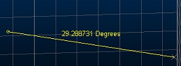
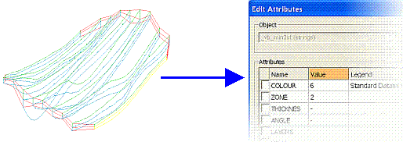

# Attributes

Attributes (also referred to as fields and columns) are either;

  * **System Attributes** : these have fixed names and can be used by your product to 'recognise' a specific data type. Some system attributes are expected by particular functions in Studio products, or;
  * **Custom Attributes** : these are the ones you can add to data objects. All data objects can be appended with user-defined attributes.

System attributes can be very specific, such as those added during Studio RM's implicit modelling commands to record the command from which the data was created. Others are more general and occur in a wide range of data objects by default, such as the ubiquitous **COLOUR** attribute. System and user-defined fields are added as an aid to a wide range of your products functions, including geological modeling, grade estimation, mine design, mine planning and scheduling processes, and can also be used to enhance presentation and reporting outputs.

Custom (also referred to as "User") attribute fields include, for example, ZONE (a numeric mineralization zone number) DESC (a text description) and LEVEL (a numeric mining level identifier). Data can be recognized as being a particular type (a drillhole, a string, a model and so on) with or without custom attributes.

Regardless of whether an attribute is a system or custom, an attribute can be **numeric** or **alphanumeric**.

**Note** : Modern Studio applications permit attribute names up to 24 characters in most cases. There are exceptions, such as where an attribute name is automatically prefixed or suffixed by another function, for example. See [**Attribute Naming Conventions**](<Attribute_Naming_Convention.md>). Older versions of Studio products were limited to attribute names up to 8 characters.

## Virtual Attributes

Attributes can be either of a 'fixed-value' type, meaning attribute values are a fixed property of the loaded data object until a function of your product commits new data to the object. For example, the grade values of a block model remain unchanged until another function, such as the **ESTIMA** process, calculates and inserts interpolated grade values as a result of grade estimation.

In addition to these 'fixed-value' attributes, Studio products can also contain **virtual attributes**. These are attributes that added to data objects but instead of containing fixed values. their values are calculated dynamically as the object is modified. For example, a string can contain, for each string edge a gradient or dip attribute that stores and updates its values automatically, as the string is modified in a 3D window. 

**Virtual attributes** are added in the same way as custom attributes; using the [Add Column](<AddColumn_Dialog.md>) screen.

The following virtual attributes are available in Studio products:

Type | Attribute Name | Description  
---|---|---  
Area | _AREA | The area of a closed string.  
Azimuth | _AZIMUTH | The azimuth of a string segment (edge), drillhole segment or wireframe triangle edge.  
Dip | _DIP | The dip value of a string segment in degrees, wireframe edge or drillhole segment. A positive down dip convention is used.  
Gradient | _GRAD | The gradient of data in whatever the current gradient convention is. See [Gradient Convention](<GradientConvention_Dialog.md>).  
Gradient (Degrees) | _GRADDEG | The gradient of data in degrees.  
Gradient (Percent) | _GRADPER | The gradient of data as a percentage.  
Gradient (Ratio) | _GRADRAT | The gradient of data as a ratio.  
Length | _LENGTH | The length of the target data segment.  
Plane Dip | _PDIP | The dip angle of the best fit plane through the data object. Always a positive value (measured from horizontal plane downward).  
Plane Dip Direction | PDIPDIR | The dip direction angle of the best fit plane through the data object.  
  
Virtual attributes do not appear when [editing attributes](<edit%20attributes%20pick%20dialog.md>). These fields are calculated according to data geometry and can't be directly edited. Values can be seen using the [Data Object Manager](<Data%20Manager%20Dialog.md>) or querying data using [dynamic information mode](<../VR_Help/vr_navigation_information.md>).

Note: Virtual attribute values are saved to a file - however - they are automatically recalculated if the file is loaded and edited, meaning, whilst it is possible, it isn't recommended to edit virtual values directly within a Datamine table (say, using the Table Editor).

Once a virtual field has been assigned to a data object, it is no longer available for selection for that object.

**Note** : Virtual attributes can be included in [attribute templates](<Attribute_Manager.md>).

## Using Attributes

Attributes can be used for a range of uses, including:

  * **Formatting** data in conjunction with colour and texture [Legends](<../formatlegendsdialog.md>).

  * As a way of storing important **metadata** within your data files.

  * **Filtering** objects in the various viewing windows.

  * For selecting particular 3D objects in a 3D window. 

  * As **Retrieval Criteria** i.e. as a record selection filter, when running **[Processes](<Studio%203%20Commands%20and%20Processes.md>)**.

  * As controlling properties of processes, such as **ZONE** attribute to constrain desurveying, for example.

Attributes can be added to 3D objects in many ways, including:

  * As a result of running a process or command.

  * Directly to a file, using the **Table Editor**.

  * Directly to objects, using a range of context menus in your product, plus the **Data Object Manager**.

  * Interactively within a 3D window by using one of several attribute editing commands (such as **[edit-attributes](<../command_help/edit-attributes.md>)** , for example).

Attribute names have the following characteristics:

  * An attribute name is restricted to a maximum of 24 characters.

  * Attributes are either alphanumeric, numeric or virtual.

  * Prefixed by an underscore, if a virtual field (such as _LENGTH, _AZIMUTH and so on).

  * Attribute names must be unique with a data object or saved file.

Attributes must use the naming convention described below:

  * They must not start with the following characters: "*", "&", "@", "!", "?", ".".

  * They must not contain spaces, or the following characters: ",", "!", " :", "*", "&", "=", "()".

Here are some guidelines that may help you get to grips with attributes:

  * Add attributes to point and string data before using it as input to wireframing commands. In most instances they are automatically transferred to the wireframes \- this will save you the trouble of having to add these attributes to the wireframes at a later stage e.g. before block modeling. 
  * Add sufficient custom attributes to allow data to be efficiently filtered, colored, annotated and selected.

  * Add a mineralization zone field to allow grade estimation control by zone (default field name ZONE) when using **GRADE** or **ESTIMATE**.

  * Add sufficient attributes to mine planning outlines or mining block outlines for evaluation, scheduling, display and reporting purposes.

  * Use virtual attributes to label your data in a **3D** window \- when your data changes, values and labels are updated dynamically - useful when modifying 3D data interactively.

## Editing Attributes Interactively

Once 3D data objects have been loaded or created in a 3D window, their attributes can be edited using the [Edit Attributes](<edit%20attributes%20pick%20dialog.md>) screen.

The general procedure for interactively editing an object's attributes is as follows:

  1. In the 3D window, select an object(s) or part of an object e.g. one or more strings. Selected objects are highlighted yellow.

  2. Run an attribute editing command, such as **edit-attributes**.

  3. Pick the visible data you wish to edit with the mouse or stylus.

  4. Edit and apply attributes using the tools provided.

  5. If required, save your attribute changes to source data by saving the appropriate file, or saving the project and choosing the same.

## Attributing Files Using Processes

Some processes can be used to add or set attribute fields in files. Some of the more commonly used ones are listed below:

  * [EXTRA](<../Process_Help_XML/extra.md>)

  * [SETVAL](<../Process_Help_XML/setval.md>)

## The Attribute Manager

In addition to being used to control the display of attributes for all objects in memory, the Attribute Manager is also used to add attributes to existing or new objects by means of Object Templates. [See Attribute Manager](<Attribute_Manager.md>).